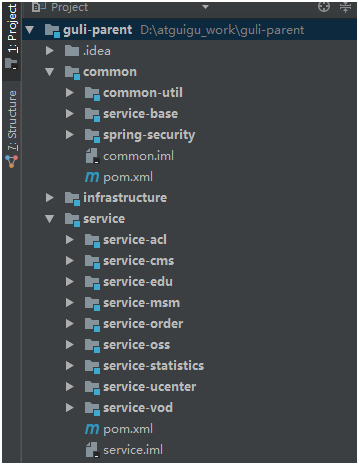
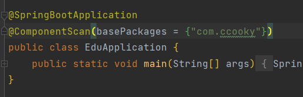
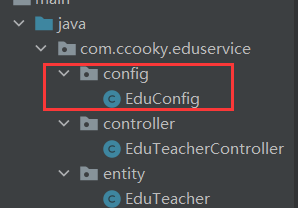
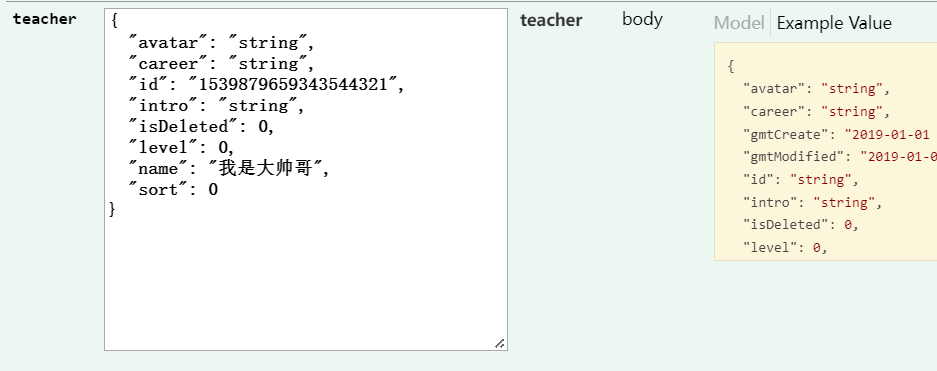
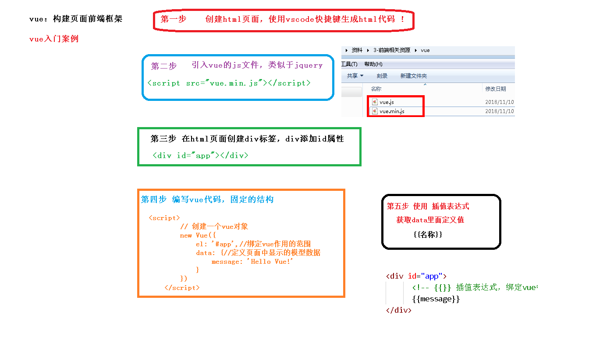

八种商业模式

 **1、C2C模式（Consumer To Consumer 平台模式 ）**

用户到用户，这种模式本质是将自己的流量或者用户转卖给视频或者直播的内容提供者，通过出售内容分成获利。

平台模式避开了非常沉重的内容和服务，扩张迅速，但实际这种模式也有缺陷，在线教育这两年的发展使内容迅速贬值，比较难带来更免费用户和流量。

代表网站：

51cto http://edu.51cto.com/

腾讯课堂 https://ke.qq.com/

 **2、B2C模式（Business To Customer 会员模式）**

商家到用户，这种模式是自己制作大量自有版权的视频，放在自有平台上，让用户按月付费或者按年付费。 这种模式简单，快速，只要专心录制大量视频即可快速发展，其曾因为 lynda 的天价融资而 大热。但在中国由于版权保护意识不强，教育内容易于复制，有海量的免费资源的竞争对手众多等原因，难以取得像样的现金流。

代表网站：

lynda https://www.lynda.com/ 

慕课网 https://www.imooc.com/

谷粒学院 http://www.gulixueyuan.com/

**3、B2B2C（商家到商家到用户）**

平台链接第三方教育机构和用户，平台一般不直接提供课程内容，而是更多承担教育的互联网载体角色，为教学过程各个环节提供全方位支持和服务。

代表网站：

51cto http://edu.51cto.com/

腾讯课堂 https://ke.qq.com/

 **4、垂直领域**

这种模式需要糅合录播，直播，帮助服务等多种手段，对学生学习某一项内容负责。这种模式收费高，有较强的壁垒。这种产品一旦形成口碑，会有稳定的用户群和收入，但产品非常复杂，难度大，门槛高，即使单独一个项目都会耗费大量的人力物力，因此发展速度较慢。

代表网站：

51cto的微职位 http://edu.51cto.com/

网易云课堂的微专业 https://study.163.com/

**5、直播、互动**

这种模式将传统课堂上的反馈，交互，答疑搬到线上。让用户容易接受，只要服务贴心，用 户就愿意买单，因此有丰富现金流。但缺陷是只能通过平台吸引用户，造成了竞争门槛过低， 模式雷同，对手众多，收益的永远是拥有流量或者用户的大平台。

代表网站：

腾讯课堂： https://ke.qq.com/

学而思 https://www.xueersi.com

**6、1 对 1**

让一个讲师在一定时间内对一个学员进行辅导，学生按照时间支付费用。这种模式收费容易， 现金流好，产品难度不大，市场空间大，但是人力资源的获取消耗却是巨大的，如果师资上控制不好，比如优秀的讲师留不住，或者整体成本太大，都会导致 1 对 1 模式难以发展。

代表网站：

VIPKID https://www.vipkid.com.cn/

学而思 https://www.xueersi.com

 **7、O2O 模式（Online To Offline 线上到线下）**

就是通过免费内容或者运营，让线上平台获取用户和流量，将用户吸引到线下开课，或 者让学员到加盟的线下机构上课。这种模式形式简单，收益高，只要把控用户需求，吸引到用户，收费不成问题，而且符合传统的消费习惯。

代表网站:

启德教育 https://www.eic.org.cn/

**8、freemium（免费增值）**

Freemium最早由AVC的Fred Wilson在2006年提出, 指的是用免费服务吸引用户，然后通过增值服务，将部分免费用户转化为收费用户，实现变现。Freemium模式中有“二八定律”的因素，即一小部分对价格不敏感的高端用户，愿意为一些额 外的功能付费，为服务提供者带来大部分收入。

代表网站

中国大学慕课 http://www.icourse163.org 

通过免费的名校课程和高校建立合作，吸引用户。提供考研专栏和学校云增值服务

学堂在线 http://www.xuetangx.com/ 

课程免费，如果希望得到课程的认证证书则要缴纳相应的费用

# 谷粒学院项目简介

## 一、功能简介

谷粒学院，是一个B2C模式的职业技能在线教育系统，分为前台用户系统和后台运营平台。

## 二、系统模块


## 三、系统架构

**架构设计需要考虑的几个方面：**

- **性能：**主要考虑访问频率，每个用户每天的访问次数。项目初始阶段用户的访问量并不大，如果考虑做运营推广，可能会迎来服务器访问量骤增，因此要考虑**分布式部署，引入缓存**
- **可扩展性：**系统功能会随着用户量的增加以及多变的互联网用户需求不断地扩展，因此考虑到系统的可扩展性的要求需要**使用微服务架构，引入消息中间件**
- **高可用：**系统一旦宕机，将会带来不可挽回的损失，因此必须做负载均衡，甚至是异地多活这类复杂的方案。如果数据丢失，修复将会非常麻烦，只能靠人工逐条修复，这个很难接受，因此需要考虑存储高可靠。我们需要考虑多种异常情况：机器故障、机房故障，针对机器故障，我们需要设计 MySQL 同机房主备方案；针对机房故障，我们需要设计 MySQL 跨机房同步方案。
- **安全性：**系统的信息有一定的隐私性，例如用户的个人身份信息，不包含强隐私（例如玉照、情感）的信息，因此使用账号密码管理、数据库访问权限控制即可。
- **成本：**视频类网站的主要成本在于服务器成本、流量成本、存储成本、流媒体研发成本，中小型公司可以考虑使用云服务器和云服务。


# 具体模块与技术


# 前后端分离开发概念


# 数据库表设计规范

以下规约只针对本模块，更全面的文档参考《阿里巴巴Java开发手册》：五、MySQL数据库

1、库名与应用名称尽量一致

2、表名、字段名必须使用小写字母或数字，禁止出现数字开头，

3、表名不使用复数名词

4、表的命名最好是加上“业务名称_表的作用”。如，edu_teacher

5、**表必备三字段：id, gmt_create, gmt_modified**

说明：

其中 id 必为主键，类型为 bigint unsigned、单表时自增、步长为 1。

（如果使用分库分表集群部署，则id类型为verchar，非自增，业务中使用分布式id生成器）

gmt_create, gmt_modified 的类型均为 datetime 类型，前者现在时表示主动创建，后者过去分词表示被动更新。

6、单表行数超过 500 万行或者单表容量超过 2GB，才推荐进行分库分表。 说明：如果预计三年后的数据量根本达不到这个级别，请不要在创建表时就分库分表。 

7、表达是与否概念的字段，必须使用 is_xxx 的方式命名，数据类型是 unsigned tinyint （1 表示是，0 表示否）。 

说明：任何字段如果为非负数，必须是 unsigned。 

注意：POJO 类中的任何布尔类型的变量，都不要加 is 前缀。数据库表示是与否的值，使用 tinyint 类型，坚持 is_xxx 的 命名方式是为了明确其取值含义与取值范围。 

正例：表达逻辑删除的字段名 is_deleted，1 表示删除，0 表示未删除。 


8、小数类型为 decimal，禁止使用 float 和 double。 说明：float 和 double 在存储的时候，存在精度损失的问题，很可能在值的比较时，得到不 正确的结果。如果存储的数据范围超过 decimal 的范围，建议将数据拆成整数和小数分开存储。

9、**如果存储的字符串长度几乎相等，使用 char 定长字符串类型。** 

10、**varchar 是可变长字符串**，不预先分配存储空间，长度不要超过 5000，如果存储长度大于此值，定义字段类型为 text，独立出来一张表，用主键来对应，避免影响其它字段索 引效率。


11、唯一索引名为 uk_字段名；普通索引名则为 idx_字段名。

说明：uk_ 即 unique key；idx_ 即 index 的简称


12、不得使用外键与级联，一切外键概念必须在应用层解决。外键与级联更新适用于单机低并发，不适合分布式、高并发集群；级联更新是强阻塞，存在数据库更新风暴的风险；外键影响数据库的插入速度。 


# 总体项目结构设计

采用父工程+子工程的形式进行设计，如下：


最后项目写完之后的IDEA目录结构如下：



**各个模块说明：**

**guli-parent：在线教学根目录（父工程），管理四个子模块：**

 	 **canal-client**：canal数据库表同步模块（统计同步数据）
 	
 	**common**：公共模块父节点
 	
 		 common-util：工具类模块，所有模块都可以依赖于它
 	
 		 service-base：service服务的base包，包含service服务的公共配置类，所有service模块依赖于它
 	
 	 	 spring-security：认证与授权模块，需要认证授权的service服务依赖于它

​	  **infrastructure**：基础服务模块父节点

​    		api-gateway：api网关服务

​	  **service**：api接口服务父节点

> > > service-acl：用户权限管理api接口服务（用户管理、角色管理和权限管理等）
>
> > > service-cms：cms api接口服务
>
> > > service-edu：教学相关api接口服务
>
> > > service-msm：短信api接口服务
>
> > > service-order：订单相关api接口服务
>
> > > service-oss：阿里云oss api接口服务
>
> > > service-statistics：统计报表api接口服务
>
> > > service-ucenter：会员api接口服务
>
> > > service-vod：视频点播api接口服务

## 创建父工程

**1. sprigboot工程guli-parent**（new 一个新的project）注意是project哦


 **2. 删除 src 目录**


 **3、配置 pom.xml**

<artifactId> 节点后面添加  pom类型, 将打包类型设置为pom


**4、在pom.xml中添加依赖的版本**

**删除pom.xml中的<dependencies>内容**

```xml
<!-- 以下内容删除 -->
<dependencies>
    <dependency>
        <groupId>org.springframework.boot</groupId>
        <artifactId>spring-boot-starter</artifactId>
    </dependency>
    <dependency>
        <groupId>org.springframework.boot</groupId>
        <artifactId>spring-boot-starter-test</artifactId>
        <scope>test</scope>
    </dependency>
</dependencies>
```

**添加 <properties>确定依赖的版本**

```xml
<properties>
    <java.version>1.8</java.version>
    <guli.version>0.0.1-SNAPSHOT</guli.version>
    <mybatis-plus.version>3.0.5</mybatis-plus.version>
    <velocity.version>2.0</velocity.version>
    <swagger.version>2.7.0</swagger.version>
    <aliyun.oss.version>2.8.3</aliyun.oss.version>
    <jodatime.version>2.10.1</jodatime.version>
    <poi.version>3.17</poi.version>
    <commons-fileupload.version>1.3.1</commons-fileupload.version>
    <commons-io.version>2.6</commons-io.version>
    <httpclient.version>4.5.1</httpclient.version>
    <jwt.version>0.7.0</jwt.version>
    <aliyun-java-sdk-core.version>4.3.3</aliyun-java-sdk-core.version>
    <aliyun-sdk-oss.version>3.1.0</aliyun-sdk-oss.version>
    <aliyun-java-sdk-vod.version>2.15.2</aliyun-java-sdk-vod.version>
    <aliyun-java-vod-upload.version>1.4.11</aliyun-java-vod-upload.version>
    <aliyun-sdk-vod-upload.version>1.4.11</aliyun-sdk-vod-upload.version>
    <fastjson.version>1.2.28</fastjson.version>
    <gson.version>2.8.2</gson.version>
    <json.version>20170516</json.version>
    <commons-dbutils.version>1.7</commons-dbutils.version>
    <canal.client.version>1.1.0</canal.client.version>
    <docker.image.prefix>zx</docker.image.prefix>
    <cloud-alibaba.version>0.2.2.RELEASE</cloud-alibaba.version>
</properties>
```

**配置 <dependencyManagement> 锁定依赖的版本**

```xml
<dependencyManagement>
    <dependencies>
        <!--Spring Cloud-->
        <dependency>
            <groupId>org.springframework.cloud</groupId>
            <artifactId>spring-cloud-dependencies</artifactId>
            <version>Hoxton.RELEASE</version>
            <type>pom</type>
            <scope>import</scope>
        </dependency>
        <dependency>
            <groupId>org.springframework.cloud</groupId>
            <artifactId>spring-cloud-alibaba-dependencies</artifactId>
            <version>${cloud-alibaba.version}</version>
            <type>pom</type>
            <scope>import</scope>
        </dependency>
        <!--mybatis-plus 持久层-->
        <dependency>
            <groupId>com.baomidou</groupId>
            <artifactId>mybatis-plus-boot-starter</artifactId>
            <version>${mybatis-plus.version}</version>
        </dependency>
        <!-- velocity 模板引擎, Mybatis Plus 代码生成器需要 -->
        <dependency>
            <groupId>org.apache.velocity</groupId>
            <artifactId>velocity-engine-core</artifactId>
            <version>${velocity.version}</version>
        </dependency>
        <!--swagger-->
        <dependency>
            <groupId>io.springfox</groupId>
            <artifactId>springfox-swagger2</artifactId>
            <version>${swagger.version}</version>
        </dependency>
        <!--swagger ui-->
        <dependency>
            <groupId>io.springfox</groupId>
            <artifactId>springfox-swagger-ui</artifactId>
            <version>${swagger.version}</version>
        </dependency>
        <!--aliyunOSS-->
        <dependency>
            <groupId>com.aliyun.oss</groupId>
            <artifactId>aliyun-sdk-oss</artifactId>
            <version>${aliyun.oss.version}</version>
        </dependency>
        <!--日期时间工具-->
        <dependency>
            <groupId>joda-time</groupId>
            <artifactId>joda-time</artifactId>
            <version>${jodatime.version}</version>
        </dependency>
        <!--xls-->
        <dependency>
            <groupId>org.apache.poi</groupId>
            <artifactId>poi</artifactId>
            <version>${poi.version}</version>
        </dependency>
        <!--xlsx-->
        <dependency>
            <groupId>org.apache.poi</groupId>
            <artifactId>poi-ooxml</artifactId>
            <version>${poi.version}</version>
        </dependency>
        <!--文件上传-->
        <dependency>
            <groupId>commons-fileupload</groupId>
            <artifactId>commons-fileupload</artifactId>
            <version>${commons-fileupload.version}</version>
        </dependency>
        <!--commons-io-->
        <dependency>
            <groupId>commons-io</groupId>
            <artifactId>commons-io</artifactId>
            <version>${commons-io.version}</version>
        </dependency>
        <!--httpclient-->
        <dependency>
            <groupId>org.apache.httpcomponents</groupId>
            <artifactId>httpclient</artifactId>
            <version>${httpclient.version}</version>
        </dependency>
        <dependency>
            <groupId>com.google.code.gson</groupId>
            <artifactId>gson</artifactId>
            <version>${gson.version}</version>
        </dependency>
        <!-- JWT -->
        <dependency>
            <groupId>io.jsonwebtoken</groupId>
            <artifactId>jjwt</artifactId>
            <version>${jwt.version}</version>
        </dependency>
        <!--aliyun-->
        <dependency>
            <groupId>com.aliyun</groupId>
            <artifactId>aliyun-java-sdk-core</artifactId>
            <version>${aliyun-java-sdk-core.version}</version>
        </dependency>
        <dependency>
            <groupId>com.aliyun.oss</groupId>
            <artifactId>aliyun-sdk-oss</artifactId>
            <version>${aliyun-sdk-oss.version}</version>
        </dependency>
        <dependency>
            <groupId>com.aliyun</groupId>
            <artifactId>aliyun-java-sdk-vod</artifactId>
            <version>${aliyun-java-sdk-vod.version}</version>
        </dependency>
        <dependency>
            <groupId>com.aliyun</groupId>
            <artifactId>aliyun-java-vod-upload</artifactId>
            <version>${aliyun-java-vod-upload.version}</version>
        </dependency>
        <dependency>
            <groupId>com.aliyun</groupId>
            <artifactId>aliyun-sdk-vod-upload</artifactId>
            <version>${aliyun-sdk-vod-upload.version}</version>
        </dependency>
        <dependency>
            <groupId>com.alibaba</groupId>
            <artifactId>fastjson</artifactId>
            <version>${fastjson.version}</version>
        </dependency>
        <dependency>
            <groupId>org.json</groupId>
            <artifactId>json</artifactId>
            <version>${json.version}</version>
        </dependency>
        <dependency>
            <groupId>commons-dbutils</groupId>
            <artifactId>commons-dbutils</artifactId>
            <version>${commons-dbutils.version}</version>
        </dependency>
        <dependency>
            <groupId>com.alibaba.otter</groupId>
            <artifactId>canal.client</artifactId>
            <version>${canal.client.version}</version>
        </dependency>
    </dependencies>
</dependencyManagement>
```

注意到，这里pom文件会爆红，没有关系不用管，因为依赖只有被引用的时候才会去仓库下载，等后面子模块使用这些依赖了，就会自动解决。


## 搭建子模块service

==创建空的maven工程，并且不用Spring initialize的原因在于，我们采用的是父子模块的形式，子模块会去继承父模块的依赖等信息，现在的子模块主要为了代码书写/引入依赖。==（这里这个就仅仅是为了引入依赖）

**1. 注意新建的是一个Module哦**，父工程是project（springboot）


**选择 maven类型，普通的maven工程，不需要用模板，点击下一步**


**输入模块名称 service，下一步完成创建**


 **2、添加模块类型是pom**

< artifactId> 节点后面添加  pom类型, 将打包类型设置为pom。

因为这只是一个子模块，用来导入项目的依赖的，不是具体写代码，他的下面还有具体的子子模块。


删除src目录


**3、添加模块需要的依赖**

前面父工程指定了依赖的版本，这里就不用指定了。

```xml
<dependencies>
<!--        下面几个现在用不到，先注释掉，不然会报错-->
    <!--        <dependency>-->
<!--            <groupId>org.springframework.cloud</groupId>-->
<!--            <artifactId>spring-cloud-starter-netflix-ribbon</artifactId>-->
<!--        </dependency>-->
<!--        &lt;!&ndash;hystrix依赖，主要是用  @HystrixCommand &ndash;&gt;-->
<!--        <dependency>-->
<!--            <groupId>org.springframework.cloud</groupId>-->
<!--            <artifactId>spring-cloud-starter-netflix-hystrix</artifactId>-->
<!--        </dependency>-->
<!--        &lt;!&ndash;服务注册&ndash;&gt;-->
<!--        <dependency>-->
<!--            <groupId>org.springframework.cloud</groupId>-->
<!--            <artifactId>spring-cloud-starter-alibaba-nacos-discovery</artifactId>-->
<!--        </dependency>-->
<!--        &lt;!&ndash;服务调用&ndash;&gt;-->
<!--        <dependency>-->
<!--            <groupId>org.springframework.cloud</groupId>-->
<!--            <artifactId>spring-cloud-starter-openfeign</artifactId>-->
<!--        </dependency>-->
    
    <dependency>
        <groupId>org.springframework.boot</groupId>
        <artifactId>spring-boot-starter-web</artifactId>
    </dependency>
    <!--mybatis-plus-->
    <dependency>
        <groupId>com.baomidou</groupId>
        <artifactId>mybatis-plus-boot-starter</artifactId>
    </dependency>
    <!--mysql-->
    <dependency>
        <groupId>mysql</groupId>
        <artifactId>mysql-connector-java</artifactId>
    </dependency>
    <!-- velocity 模板引擎, Mybatis Plus 代码生成器需要 -->
    <dependency>
        <groupId>org.apache.velocity</groupId>
        <artifactId>velocity-engine-core</artifactId>
    </dependency>
    <!--swagger-->
    <dependency>
        <groupId>io.springfox</groupId>
        <artifactId>springfox-swagger2</artifactId>
    </dependency>
    <dependency>
        <groupId>io.springfox</groupId>
        <artifactId>springfox-swagger-ui</artifactId>
    </dependency>
    <!--lombok用来简化实体类：需要安装lombok插件-->
    <dependency>
        <groupId>org.projectlombok</groupId>
        <artifactId>lombok</artifactId>
    </dependency>
    <!--xls-->
    <dependency>
        <groupId>org.apache.poi</groupId>
        <artifactId>poi</artifactId>
    </dependency>
    <dependency>
        <groupId>org.apache.poi</groupId>
        <artifactId>poi-ooxml</artifactId>
    </dependency>
    <dependency>
        <groupId>commons-fileupload</groupId>
        <artifactId>commons-fileupload</artifactId>
    </dependency>
    <!--httpclient-->
    <dependency>
        <groupId>org.apache.httpcomponents</groupId>
        <artifactId>httpclient</artifactId>
    </dependency>
    <!--commons-io-->
    <dependency>
        <groupId>commons-io</groupId>
        <artifactId>commons-io</artifactId>
    </dependency>
    <!--gson-->
    <dependency>
        <groupId>com.google.code.gson</groupId>
        <artifactId>gson</artifactId>
    </dependency>
    <dependency>
        <groupId>junit</groupId>
        <artifactId>junit</artifactId>
        <version>4.12</version>
    </dependency>
</dependencies>
```


# Swagger2接口测试

前后端分离开发模式中，api文档是最好的沟通方式。**Swagger可以生成在线接口文档，666.**

Swagger 是一个规范和完整的框架，用于生成、描述、调用和可视化 RESTful 风格的 Web 服务。

1. **及时性** (接口变更后，能够及时准确地通知相关前后端开发人员)
2. **规范性** (并且保证接口的规范性，如接口的地址，请求方式，参数及响应格式和错误信息)
3. **一致性** (接口信息一致，不会出现因开发人员拿到的文档版本不一致，而出现分歧)
4. **可测性** (直接在接口文档上进行测试，以方便理解业务)

==为了，让所有模块都可以进行使用，我们在parent下创建公共模块来整合swagger。==


和前面一样，删除src文件，然后修改pom文件。


**在common中引入相关依赖**

```xml
 <dependencies>
        <dependency>
            <groupId>org.springframework.boot</groupId>
            <artifactId>spring-boot-starter-web</artifactId>
            <scope>provided </scope>
        </dependency>
        <!--mybatis-plus-->
        <dependency>
            <groupId>com.baomidou</groupId>
            <artifactId>mybatis-plus-boot-starter</artifactId>
            <scope>provided </scope>
        </dependency>
        <!--lombok用来简化实体类：需要安装lombok插件-->
        <dependency>
            <groupId>org.projectlombok</groupId>
            <artifactId>lombok</artifactId>
            <scope>provided </scope>
        </dependency>
        <!--swagger-->
        <dependency>
            <groupId>io.springfox</groupId>
            <artifactId>springfox-swagger2</artifactId>
            <scope>provided </scope>
        </dependency>
        <dependency>
            <groupId>io.springfox</groupId>
            <artifactId>springfox-swagger-ui</artifactId>
            <scope>provided </scope>
        </dependency>
        <!-- redis -->
        <dependency>
            <groupId>org.springframework.boot</groupId>
            <artifactId>spring-boot-starter-data-redis</artifactId>
        </dependency>
        <!-- spring2.X集成redis所需common-pool2
        <dependency>
            <groupId>org.apache.commons</groupId>
            <artifactId>commons-pool2</artifactId>
            <version>2.6.0</version>
        </dependency>-->
    </dependencies>
```

## 配置Swagger

**在common下面创建子模块service-base，这个是具体写代码的**


**在模块service-base中，创建swagger的配置类**

​		创建包com.ccooky.servicebase.config，创建类SwaggerConfig


```java
@Configuration
@EnableSwagger2
public class SwaggerConfig {
    @Bean
    public Docket webApiConfig(){
        return new Docket(DocumentationType.SWAGGER_2)
                .groupName("webApi")
                .apiInfo(webApiInfo())
                .select()
                .paths(Predicates.not(PathSelectors.regex("/admin/.*")))
                .paths(Predicates.not(PathSelectors.regex("/error.*")))
                .build();
    }
    
    private ApiInfo webApiInfo(){
        return new ApiInfoBuilder()
                .title("网站-课程中心API文档")
                .description("本文档描述了课程中心微服务接口定义")
                .version("1.0")
                .contact(new Contact("Helen", "http://atguigu.com", "55317332@qq.com"))
                .build();
    }
}
```

## 引入Swagger

**在模块service模块中引入service-base**

```xml
<dependency>
    <groupId>com.atguigu</groupId>
    <artifactId>service-base</artifactId>
    <version>0.0.1-SNAPSHOT</version>
</dependency>
```

**在service-edu启动类上添加注解**



添加这个注解的原因，在于我们的启动类只会默认扫描本包及其子包下所有配置类，想要扫描到其他包的配置类，就需要改变启动类的扫描范围。==现在的范围：Project下所有的com.ccooky.*==

**降低Springboot的版本**

Swagger2无法兼容高版本的SP。真的是无语了妈的


**测试**

http://localhost:8001/swagger-ui.html


点击接口，就会弹出接口的具体使用信息，点击try out即测试接口。


##  **API注释**

这个API注释的作用就是，将我们接口文档的内容可以看的懂！！！不然全部都是英文，前端程序员怎么看得懂呢。

**定义接口说明和参数说明（主要用在controller上）**

定义在类上：@Api

定义在方法上：@ApiOperation

定义在参数上：@ApiParam

```java
@Api(tags = "讲师管理")
@RestController
@RequestMapping("/eduservice/teacher")
public class EduTeacherController {

    @Autowired
    private EduTeacherService eduTeacherService;

    @ApiOperation(value = "获取所有讲师列表")
    @GetMapping("/findAll")
    public List<EduTeacher> findAll(){
        return eduTeacherService.list(null);
    }

    @ApiOperation(value = "根据id删除讲师")
    @DeleteMapping("delete/{id}")
    public boolean removeById(@ApiParam(name = "id", value = "讲师ID", required = true) @PathVariable String id){
        return eduTeacherService.removeById(id);
    }
}
```

这样之后，我们再打开文档，就会发现，太棒了！！！


**定义样例数据**

主要用于，样例数据与我们真实返回值出现不统一的情况


可以看到，我们这个获取所有讲师信息的，她会给一个返回值的样例，告诉前端我的返回对象长出什么样子，但在里面gmtCreate和gmtModified有问题，还是之前那个老的情况，但我们在后台已经更改了返回时间的json格式：


所以我们在实体类属性，进行更改即可。

```java
@ApiModelProperty(value = "创建时间", example = "2019-01-01 8:00:00")
@TableField(fill = FieldFill.INSERT)
private Date gmtCreate;
@ApiModelProperty(value = "更新时间", example = "2019-01-01 8:00:00")
@TableField(fill = FieldFill.INSERT_UPDATE)
private Date gmtModified;
```


# 统一返回数据格式

项目中我们会将响应封装成json返回，一般我们会将所有接口的数据格式统一， 使前端(iOS Android, Web)对数据的操作更一致、轻松。

一般情况下，统一返回数据格式没有固定的格式，只要能描述清楚返回的数据状态以及要返回的具体数据就可以。但是一般会包含状态码、返回消息、数据这几部分内容

例如，我们的系统要求返回的基本数据格式如下：

**列表：**

```java
{
  "success": true,
  "code": 20000,
  "message": "成功",
  "data": {
    "items": [
      {
        "id": "1",
        "name": "刘德华",
        "intro": "毕业于师范大学数学系，热爱教育事业，执教数学思维6年有余"
      }
    ]
  }
}
```

**分页：**

```java
{
  "success": true,
  "code": 20000,
  "message": "成功",
  "data": {
    "total": 17,
    "rows": [
      {
        "id": "1",
        "name": "刘德华",
        "intro": "毕业于师范大学数学系，热爱教育事业，执教数学思维6年有余"
      }
    ]
  }
}
```

**没有返回数据：**

```java
{
  "success": true,
  "code": 20000,
  "message": "成功",
  "data": {}
}
```

**失败：**

```java
{
  "success": false,
  "code": 20001,
  "message": "失败",
  "data": {}
}
```

因此，我们定义统一结果

```java
{
  "success": 布尔, //响应是否成功
  "code": 数字, //响应码
  "message": 字符串, //返回消息
  "data": HashMap //返回数据，放在键值对中
}
```

## **创建结果类R**

这是所有模块都需要的东西，所以我们放在common模块下！！！

 **1、在common模块下创建子模块common-utils**


**2、创建接口，定义返回码**

**创建包com.ccooky.commonutils，创建接口 ResultCode.java**

```java
public interface ResultCode {
    public static Integer SUCCESS = 20000;
    public static Integer ERROR = 20001;
}
```

 **3、创建结果类R.java**

```java
@Data
public class R {

    @ApiModelProperty("返回成功标志")
    private Boolean success;

    @ApiModelProperty("状态码")
    private Integer code;

    @ApiModelProperty("状态码表示的内容")
    private String message;

    @ApiModelProperty("返回数据")
    private Map<String, Object> data = new HashMap<>();

    // 构造方法私有（不能对外创建对象，只能在这个类内部创建）
    private R(){}


    // 成功的静态方法
    public static R ok(){
        R r = new R();
        r.setCode(ResultCode.SUCCESS);
        r.setSuccess(true);
        r.setMessage("成功了");
        return r;
    }

    // 失败的静态方法
    public static R error(){
        R r = new R();
        r.setCode(ResultCode.ERROR);
        r.setSuccess(true);
        r.setMessage("失败了");
        return r;
    }

    // R.ok().code().message()
    // return this就是谁调用我们这个方法就返回那个调用的对象！！当前对象
    public R success(Boolean success){
        this.setSuccess(success);
        return this;
    }
    public R message(String message){
        this.setMessage(message);
        return this;
    }
    public R code(Integer code){
        this.setCode(code);
        return this;
    }
    public R data(String key, Object value){
        this.data.put(key, value);
        return this;
    }
    public R data(Map<String, Object> map){
        this.setData(map);
        return this;
    }
}

```

## 使用结果类R

 **1、在service模块中添加common_utils依赖**

```xml
<!--        引入Swagger的配置-->
        <dependency>
            <groupId>com.CCooky</groupId>
            <artifactId>service_base</artifactId>
            <version>0.0.1-SNAPSHOT</version>
        </dependency>
<!--        引入统一的结果对象-->
        <dependency>
            <groupId>com.CCooky</groupId>
            <artifactId>common_utils</artifactId>
            <version>0.0.1-SNAPSHOT</version>
        </dependency>
```

 **2、修改Controller中的返回结果**

列表

```java
    @ApiOperation(value = "获取所有讲师列表")
    @GetMapping("/findAll")
    public R findAll(){
        List<EduTeacher> list = eduTeacherService.list(null);
        return R.ok().data("items",list);
    }
```

删除

```java
    @ApiOperation(value = "根据id删除讲师")
    @DeleteMapping("delete/{id}")
    public R removeById(@ApiParam(name = "id", value = "讲师ID", required = true)
                            @PathVariable String id){
        boolean flag = eduTeacherService.removeById(id);
        return (flag) ? R.ok():R.error();
    }
```

**用Swagger测试**


# 异常处理

## 统一异常处理

后台出现异常时，会返回500等，这个是不能直接给前端的，所以我们要对异常进行统一的处理。在springboot详细讲过。


所以说我们还要对错误的操作数据格式做同样的格式处理！！！！必须将这些消息处理成之前发送的格式。

**处理方法：**采用SpringMVC的异常处理器，拦截所有的异常，统一进行处理。并且之前讲过，我们所有的异常统一抛出到controller层，然后再抛出，这样异常处理器就会拿到这个异常进行处理。

**1. 新建全局异常处理类，在service_base那个handler下**


```java
// @ControllerAdvice
// @ResponseBody  // 不跳转+返回数据

// 作为springMVC的异常处理器
@RestControllerAdvice
public class GlobalExceptionHandler {

    @ExceptionHandler(Exception.class) // 指定任何异常时都执行
    public R error(Exception e){
        e.printStackTrace();
        return R.error().message("全局异常处理，请联系管理员");
    }
}
```

**2. 解决依赖传递问题**

这里我们在service_base用到了common_utils里面的东西结果类R，这两个模块都是在common子模块下，然后现在是异常处理器是没有R的，因为没有引入common_utils的依赖撒。


service_base引入common_utils依赖


然后，新的问题出现在我们的service模块下，因为我们service模块同时引入了service_base+common_utils模块。而现在service_base内已经引入了common_utils，所以说我们在service下就去掉common_utils的引入。


**测试**


## **指定异常处理**

很简单，就在前面全局异常类GlobalExceptionHandler，加方法就行了。

处理器内部处理机制顺序为：特定异常 > 全局异常。

```java
// 作为springMVC的异常处理器
// @ControllerAdvice
// @ResponseBody  // 不跳转+返回数据
@RestControllerAdvice
public class GlobalExceptionHandler {
    
    // 指定任何异常时都执行
    @ExceptionHandler(Exception.class)
    public R error(Exception e){
        e.printStackTrace();
        return R.error().message("全局异常处理，请联系管理员");
    }

    // 特定异常时处理
    @ExceptionHandler(ArithmeticException.class)
    public R error(ArithmeticException e){
        e.printStackTrace();
        return R.error().message("执行了ArithmeticException异常");
    }

}
```

**测试**


## 自定义异常处理

 **1、创建自定义异常类**


```java
@Data
@AllArgsConstructor
@NoArgsConstructor
public class GuliException extends RuntimeException{
    
    private Integer code; // 状态码

    private String msg; // 异常信息
}
```

 **2、添加异常处理方法**

就在前面的GlobalExceptionHandler.java中添加

```java
// 作为springMVC的异常处理器
// @ControllerAdvice
// @ResponseBody  // 不跳转+返回数据
@RestControllerAdvice
public class GlobalExceptionHandler {

    // 指定任何异常时都执行
    @ExceptionHandler(Exception.class)
    public R error(Exception e){
        e.printStackTrace();
        return R.error().message("全局异常处理，请联系管理员");
    }

    // 特定异常时处理
    @ExceptionHandler(ArithmeticException.class)
    public R error(ArithmeticException e){
        e.printStackTrace();
        return R.error().message("执行了ArithmeticException异常");
    }

    // 自定义异常
    @ExceptionHandler(GuliException.class)
    public R error(GuliException e){
        e.printStackTrace();
        return R.error().code(e.getCode()).message(e.getMsg()); // 这里注意哦
    }
}
```

 **3、业务中需要的位置手动抛出GuliException**

注意是手动哦，因为这个异常系统是不会自动识别的。

```java
    @ApiOperation(value = "获取所有讲师列表")
    @GetMapping("/findAll")
    public R findAll() {
        List<EduTeacher> list = teacherService.list(null);
        
        try {
            int a = 4 / 0;
        }catch (Exception e){
            throw new GuliException(110110,"执行了自定义异常处理");
        }
        
        return R.ok().data("items", list);
    }
```

**测试**


# 日志处理


- **日志规范：**一些接口，提供给日志的实现框架设计的标准。

- **日志框架：**牛人或者第三方公司已经做好的日志记录实现代码，后来者直接可以拿去使用。

因为对Commons Logging的接口不满意，有人就搞了SLF4J。因为对Log4j的性能不满意，有人就搞了**Logback**。重点学习这个。

**1. 日志级别设置: < root>**

可以通过设置日志的输出级别来控制哪些日志信息输出或者不输出。

级别程度依次是：**TRACE < DEBUG < INFO < WARN < ERROR**  ; 默认级别是debug（忽略大小写），对应其方法。作用：用于控制系统中哪些日志级别是可以输出的，只输出级别不低于设定级别的日志信息。

**ALL  和 OFF**分别是打印全部级别的全部日志信息，及关闭全部日志信息。

```yml
# 设置日志级别
logging:
  level:
    root: warn
```

然后这种方式只能将日志打印在控制台上。


## Logback日志

spring boot内部使用Logback作为日志实现的框架。

Logback和log4j非常相似，如果你对log4j很熟悉，那对logback很快就会得心应手。logback相对于log4j的一些优点：https://blog.csdn.net/caisini_vc/article/details/48551287

**1、配置logback日志**

1. 删除application.properties中的日志配置，包括mybatisplus的日志；

   

安装idea彩色日志插件：grep-console；

2. resources 中创建 logback-spring.xml（固定名字不要改） ；

```xml
<?xml version="1.0" encoding="UTF-8"?>
<configuration  scan="true" scanPeriod="10 seconds">
    <!-- 日志级别从低到高分为TRACE < DEBUG < INFO < WARN < ERROR < FATAL，如果设置为WARN，则低于WARN的信息都不会输出 -->
    <!-- scan:当此属性设置为true时，配置文件如果发生改变，将会被重新加载，默认值为true -->
    <!-- scanPeriod:设置监测配置文件是否有修改的时间间隔，如果没有给出时间单位，默认单位是毫秒。当scan为true时，此属性生效。默认的时间间隔为1分钟。 -->
    <!-- debug:当此属性设置为true时，将打印出logback内部日志信息，实时查看logback运行状态。默认值为false。 -->
    <contextName>logback</contextName>
    <!-- name的值是变量的名称，value的值时变量定义的值。通过定义的值会被插入到logger上下文中。定义变量后，可以使“${}”来使用变量。 -->
    <property name="log.path" value="D:/guli_log/edu" />
    <!-- 彩色日志 -->
    <!-- 配置格式变量：CONSOLE_LOG_PATTERN 彩色日志格式 -->
    <!-- magenta:洋红 -->
    <!-- boldMagenta:粗红-->
    <!-- cyan:青色 -->
    <!-- white:白色 -->
    <!-- magenta:洋红 -->
    <property name="CONSOLE_LOG_PATTERN"
              value="%yellow(%date{yyyy-MM-dd HH:mm:ss}) |%highlight(%-5level) |%blue(%thread) |%blue(%file:%line) |%green(%logger) |%cyan(%msg%n)"/>
    <!--输出到控制台-->
    <appender name="CONSOLE" class="ch.qos.logback.core.ConsoleAppender">
        <!--此日志appender是为开发使用，只配置最底级别，控制台输出的日志级别是大于或等于此级别的日志信息-->
        <!-- 例如：如果此处配置了INFO级别，则后面其他位置即使配置了DEBUG级别的日志，也不会被输出 -->
        <filter class="ch.qos.logback.classic.filter.ThresholdFilter">
            <level>INFO</level>
        </filter>
        <encoder>
            <Pattern>${CONSOLE_LOG_PATTERN}</Pattern>
            <!-- 设置字符集 -->
            <charset>UTF-8</charset>
        </encoder>
    </appender>
    <!--输出到文件-->
    <!-- 时间滚动输出 level为 INFO 日志 -->
    <appender name="INFO_FILE" class="ch.qos.logback.core.rolling.RollingFileAppender">
        <!-- 正在记录的日志文件的路径及文件名 -->
        <file>${log.path}/log_info.log</file>
        <!--日志文件输出格式-->
        <encoder>
            <pattern>%d{yyyy-MM-dd HH:mm:ss.SSS} [%thread] %-5level %logger{50} - %msg%n</pattern>
            <charset>UTF-8</charset>
        </encoder>
        <!-- 日志记录器的滚动策略，按日期，按大小记录 -->
        <rollingPolicy class="ch.qos.logback.core.rolling.TimeBasedRollingPolicy">
            <!-- 每天日志归档路径以及格式 -->
            <fileNamePattern>${log.path}/info/log-info-%d{yyyy-MM-dd}.%i.log</fileNamePattern>
            <timeBasedFileNamingAndTriggeringPolicy class="ch.qos.logback.core.rolling.SizeAndTimeBasedFNATP">
                <maxFileSize>100MB</maxFileSize>
            </timeBasedFileNamingAndTriggeringPolicy>
            <!--日志文件保留天数-->
            <maxHistory>15</maxHistory>
        </rollingPolicy>
        <!-- 此日志文件只记录info级别的 -->
        <filter class="ch.qos.logback.classic.filter.LevelFilter">
            <level>INFO</level>
            <onMatch>ACCEPT</onMatch>
            <onMismatch>DENY</onMismatch>
        </filter>
    </appender>
    <!-- 时间滚动输出 level为 WARN 日志 -->
    <appender name="WARN_FILE" class="ch.qos.logback.core.rolling.RollingFileAppender">
        <!-- 正在记录的日志文件的路径及文件名 -->
        <file>${log.path}/log_warn.log</file>
        <!--日志文件输出格式-->
        <encoder>
            <pattern>%d{yyyy-MM-dd HH:mm:ss.SSS} [%thread] %-5level %logger{50} - %msg%n</pattern>
            <charset>UTF-8</charset> <!-- 此处设置字符集 -->
        </encoder>
        <!-- 日志记录器的滚动策略，按日期，按大小记录 -->
        <rollingPolicy class="ch.qos.logback.core.rolling.TimeBasedRollingPolicy">
            <fileNamePattern>${log.path}/warn/log-warn-%d{yyyy-MM-dd}.%i.log</fileNamePattern>
            <timeBasedFileNamingAndTriggeringPolicy class="ch.qos.logback.core.rolling.SizeAndTimeBasedFNATP">
                <maxFileSize>100MB</maxFileSize>
            </timeBasedFileNamingAndTriggeringPolicy>
            <!--日志文件保留天数-->
            <maxHistory>15</maxHistory>
        </rollingPolicy>
        <!-- 此日志文件只记录warn级别的 -->
        <filter class="ch.qos.logback.classic.filter.LevelFilter">
            <level>warn</level>
            <onMatch>ACCEPT</onMatch>
            <onMismatch>DENY</onMismatch>
        </filter>
    </appender>
    <!-- 时间滚动输出 level为 ERROR 日志 -->
    <appender name="ERROR_FILE" class="ch.qos.logback.core.rolling.RollingFileAppender">
        <!-- 正在记录的日志文件的路径及文件名 -->
        <file>${log.path}/log_error.log</file>
        <!--日志文件输出格式-->
        <encoder>
            <pattern>%d{yyyy-MM-dd HH:mm:ss.SSS} [%thread] %-5level %logger{50} - %msg%n</pattern>
            <charset>UTF-8</charset> <!-- 此处设置字符集 -->
        </encoder>
        <!-- 日志记录器的滚动策略，按日期，按大小记录 -->
        <rollingPolicy class="ch.qos.logback.core.rolling.TimeBasedRollingPolicy">
            <fileNamePattern>${log.path}/error/log-error-%d{yyyy-MM-dd}.%i.log</fileNamePattern>
            <timeBasedFileNamingAndTriggeringPolicy class="ch.qos.logback.core.rolling.SizeAndTimeBasedFNATP">
                <maxFileSize>100MB</maxFileSize>
            </timeBasedFileNamingAndTriggeringPolicy>
            <!--日志文件保留天数-->
            <maxHistory>15</maxHistory>
        </rollingPolicy>
        <!-- 此日志文件只记录ERROR级别的 -->
        <filter class="ch.qos.logback.classic.filter.LevelFilter">
            <level>ERROR</level>
            <onMatch>ACCEPT</onMatch>
            <onMismatch>DENY</onMismatch>
        </filter>
    </appender>
    <!--
        <logger>用来设置某一个包或者具体的某一个类的日志打印级别、以及指定<appender>。
        <logger>仅有一个name属性，
        一个可选的level和一个可选的addtivity属性。
        name:用来指定受此logger约束的某一个包或者具体的某一个类。
        level:用来设置打印级别，大小写无关：TRACE, DEBUG, INFO, WARN, ERROR, ALL 和 OFF，
              如果未设置此属性，那么当前logger将会继承上级的级别。
    -->
    <!--
        使用mybatis的时候，sql语句是debug下才会打印，而这里我们只配置了info，所以想要查看sql语句的话，有以下两种操作：
        第一种把<root level="INFO">改成<root level="DEBUG">这样就会打印sql，不过这样日志那边会出现很多其他消息
        第二种就是单独给mapper下目录配置DEBUG模式，代码如下，这样配置sql语句会打印，其他还是正常DEBUG级别：
     -->
    <!--开发环境:打印控制台-->
    <springProfile name="dev">
        <!--可以输出项目中的debug日志，包括mybatis的sql日志-->
        <logger name="com.guli" level="INFO" />
        <!--
            root节点是必选节点，用来指定最基础的日志输出级别，只有一个level属性
            level:用来设置打印级别，大小写无关：TRACE, DEBUG, INFO, WARN, ERROR, ALL 和 OFF，默认是DEBUG
            可以包含零个或多个appender元素。
        -->
        <root level="INFO">
            <appender-ref ref="CONSOLE" />
            <appender-ref ref="INFO_FILE" />
            <appender-ref ref="WARN_FILE" />
            <appender-ref ref="ERROR_FILE" />
        </root>
    </springProfile>
    <!--生产环境:输出到文件-->
    <springProfile name="pro">
        <root level="INFO">
            <appender-ref ref="CONSOLE" />
            <appender-ref ref="DEBUG_FILE" />
            <appender-ref ref="INFO_FILE" />
            <appender-ref ref="ERROR_FILE" />
            <appender-ref ref="WARN_FILE" />
        </root>
    </springProfile>
</configuration>
```

然后启动项目，可以看到控制台输出和log输出文件路径输出：


 **2、将异常信息日志输出到文件**

就是吧我们项目运行时，出现的异常也输出到文件里面去。

很简单，找到我们前面写的异常处理类GlobalExceptionHandler ，在类上面加一个注解 `@Slf4j`，如下；


然后在异常处理方法中，加上异常输出语句，就可以吧这个异常输出到log文件

```java
 log.error(e.getMessage());
```


 但是这里呢，你会发现他只输出了一句话，就是很简单的，这个看不懂任何的细节错误信息，假如我们想吧控制台打印的那么多异常信息都输出，就要按照下面这个操作。

**3、将日志堆栈信息输出到文件**

定义工具类。创建ExceptionUtil.java工具类。


```java
package com.guli.common.util;
public class ExceptionUtil {
    public static String getMessage(Exception e) {
        StringWriter sw = null;
        PrintWriter pw = null;
        try {
            sw = new StringWriter();
            pw = new PrintWriter(sw);
            // 将出错的栈信息输出到printWriter中
            e.printStackTrace(pw);
            pw.flush();
            sw.flush();
        } finally {
            if (sw != null) {
                try {
                    sw.close();
                } catch (IOException e1) {
                    e1.printStackTrace();
                }
            }
            if (pw != null) {
                pw.close();
            }
        }
        return sw.toString();
    }
}
```

然后再按照这种方式调用

```java
log.error(ExceptionUtil.getMessage(e));
```

# 一、讲师管理模块

## 1. 数据库表

```sql
#
# Structure for table "edu_teacher"
#

CREATE TABLE `edu_teacher` (
  `id` char(19) NOT NULL COMMENT '讲师ID',
  `name` varchar(20) NOT NULL COMMENT '讲师姓名',
  `intro` varchar(500) NOT NULL DEFAULT '' COMMENT '讲师简介',
  `career` varchar(500) DEFAULT NULL COMMENT '讲师资历,一句话说明讲师',
  `level` int(10) unsigned NOT NULL COMMENT '头衔 1高级讲师 2首席讲师',
  `avatar` varchar(255) DEFAULT NULL COMMENT '讲师头像',
  `sort` int(10) unsigned NOT NULL DEFAULT '0' COMMENT '排序',
  `is_deleted` tinyint(1) unsigned NOT NULL DEFAULT '0' COMMENT '逻辑删除 1（true）已删除， 0（false）未删除',
  `gmt_create` datetime NOT NULL COMMENT '创建时间',
  `gmt_modified` datetime NOT NULL COMMENT '更新时间',
  PRIMARY KEY (`id`),
  UNIQUE KEY `uk_name` (`name`)
) ENGINE=InnoDB DEFAULT CHARSET=utf8mb4 COMMENT='讲师';

#
# Data for table "edu_teacher"
#

INSERT INTO `edu_teacher` VALUES ('1','张三','近年主持国家自然科学基金（6项）、江苏省重大科技成果转化项目（5项）、江苏省产学研前瞻性联合研究项目（3项）、省工业科技支撑、省高技术、省自然科学基金等省部级及其企业的主要科研项目40多个，多个项目在企业成功转化，产生了较好的经济、社会和环境效益。积极开展产学研科技合作，并与省内16家企业建立了江苏省研究生工作站，其中6家为江苏省优秀研究生工作站','高级',1,'https://guli-file-190513.oss-cn-beijing.aliyuncs.com/avatar/default.jpg',0,0,'2019-10-30 14:18:46','2019-11-12 13:36:36'),('1189389726308478977','晴天','高级讲师简介','高级讲师资历',2,'https://online-teach-file.oss-cn-beijing.aliyuncs.com/teacher/2019/10/30/de47ee9b-7fec-43c5-8173-13c5f7f689b2.png',1,0,'2019-10-30 11:53:03','2019-10-30 11:53:03'),('1189390295668469762','李刚','高级讲师简介','高级讲师',2,'https://online-teach-file.oss-cn-beijing.aliyuncs.com/teacher/2019/10/30/b8aa36a2-db50-4eca-a6e3-cc6e608355e0.png',2,0,'2019-10-30 11:55:19','2019-11-12 13:37:52'),('1189426437876985857','王二','高级讲师简介','高级讲师',1,'https://online-teach-file.oss-cn-beijing.aliyuncs.com/teacher/2019/11/08/e44a2e92-2421-4ea3-bb49-46f2ec96ef88.png',0,0,'2019-10-30 14:18:56','2019-11-12 13:37:35'),('1189426464967995393','王五','高级讲师简介','高级讲师',1,'https://online-teach-file.oss-cn-beijing.aliyuncs.com/teacher/2019/10/30/65423f14-49a9-4092-baf5-6d0ef9686a85.png',0,0,'2019-10-30 14:19:02','2019-11-12 13:37:18'),('1192249914833055746','李四','高级讲师简介','高级讲师',1,'https://online-teach-file.oss-cn-beijing.aliyuncs.com/teacher/2019/11/07/91871e25-fd83-4af6-845f-ea8d471d825d.png',0,0,'2019-11-07 09:18:25','2019-11-12 13:37:01'),('1192327476087115778','1222-12-12','1111','11',1,'https://online-teach-file.oss-cn-beijing.aliyuncs.com/teacher/2019/11/08/5805c6cd-c8ad-4a77-aafd-d2e083bfd8a4.png',0,1,'2019-11-07 14:26:37','2019-11-11 16:26:26'),('1195337453429129218','test','sdfsdf','sdfdf',1,'https://guli-file-190513.oss-cn-beijing.aliyuncs.com/avatar/default.jpg',0,1,'2019-11-15 21:47:12','2019-11-15 21:47:27');
```

## 2. 模块建立

这个代码模块在子模块service下建立，为**service_edu**。空的干净的Maven模块。


最后目录结构：、


## 3. 讲师管理模块配置

**1、在service下面service-edu模块中创建配置文件**


**resources目录下创建文件 application.yml**

```yml
# 服务端口
server:
  port: 8001

spring:
  # 服务名
  application:
    name: service-edu
  # 环境设置：dev、test、prod
  profiles:
    active: dev
  # mysql数据库连接
  datasource:
    driver-class-name: com.mysql.cj.jdbc.Driver
    url: jdbc:mysql://localhost:3306/guli?useSSL=false&serverTimezone=GMT%2B8
    username: root
    password: 5240zhouquan

#mybatis日志
mybatis-plus:
  configuration:
    log-impl: org.apache.ibatis.logging.stdout.StdOutImpl
```

**2、创建MP代码生成器**


```java
public class MPCodeGenerator {
    public static void main(String[] args) {
        // 1、创建代码生成器
        AutoGenerator mpg = new AutoGenerator();

        // 2、全局配置
        GlobalConfig gc = new GlobalConfig();
        String projectPath = System.getProperty("user.dir");
        System.out.println(projectPath);
        gc.setOutputDir(projectPath + "/service/service_edu/src/main/java");
        gc.setAuthor("ccooky");
        gc.setOpen(false); //生成后是否打开资源管理器
        gc.setFileOverride(false); //重新生成时文件是否覆盖

        /*
         * mp生成service层代码，默认接口名称第一个字母有 I
         * UcenterService
         * */
        gc.setServiceName("%sService");	//去掉Service接口的首字母I
        gc.setIdType(IdType.ID_WORKER_STR); //主键策略
        gc.setDateType(DateType.ONLY_DATE);//定义生成的实体类中日期类型
        gc.setSwagger2(true);//开启Swagger2模式

        mpg.setGlobalConfig(gc);

        // 3、数据源配置
        DataSourceConfig dsc = new DataSourceConfig();
        dsc.setUrl("jdbc:mysql://localhost:3306/guli?useSSL=false&serverTimezone=GMT%2B8");
        dsc.setDriverName("com.mysql.cj.jdbc.Driver");
        dsc.setUsername("root");
        dsc.setPassword("5240zhouquan");
        dsc.setDbType(DbType.MYSQL);
        mpg.setDataSource(dsc);

        // 4、包配置
        PackageConfig pc = new PackageConfig();

        // 包 com.ccooky.eduservice
        pc.setParent("com.ccooky");
        pc.setModuleName("eduservice"); //模块名

        // 包 com.ccooky.eduservice.controller
        pc.setController("controller");
        pc.setEntity("entity");
        pc.setService("service");
        pc.setMapper("mapper");
        mpg.setPackageInfo(pc);

        // 5、策略配置
        StrategyConfig strategy = new StrategyConfig();
        strategy.setInclude("edu_teacher"); //确定代码对应数据库里面的表名，可以多个
        strategy.setNaming(NamingStrategy.underline_to_camel);//数据库表映射到实体的命名策略
        strategy.setTablePrefix(pc.getModuleName() + "_"); //生成实体时去掉表前缀

        strategy.setColumnNaming(NamingStrategy.underline_to_camel);//数据库表字段映射到实体的命名策略
        strategy.setEntityLombokModel(true); // lombok 模型 @Accessors(chain = true) setter链式操作

        strategy.setRestControllerStyle(true); //restful api风格控制器
        strategy.setControllerMappingHyphenStyle(true); //url中驼峰转连字符

        mpg.setStrategy(strategy);

        // 6、执行
        mpg.execute();
    }
}

```

运行，对应数据库产生代码：


## 4.编写后台管理api接口

**1、编写controller代码**

```java
 @Autowired
    private EduTeacherService eduTeacherService;

    @GetMapping("/findAll")
    public List<EduTeacher> findAll(){
        return eduTeacherService.list(null);
    }
```

**2、创建SpringBoot配置类，扫描Mapper接口**



```java
@Configuration
@MapperScan("com.ccooky.eduservice.mapper")
public class EduConfig {
}
```

**3、配置SQL执行性能分析插件**（MP的）

```java
@Configuration
@MapperScan("com.ccooky.eduservice.mapper")
public class EduConfig {
    /**
     * SQL 执行性能分析插件
     * 开发环境使用，线上不推荐。 maxTime 指的是 sql 最大执行时长
     */
    @Bean
    @Profile({"dev","test"})// 设置 dev test 环境开启
    public PerformanceInterceptor performanceInterceptor() {
        PerformanceInterceptor performanceInterceptor = new PerformanceInterceptor();
        performanceInterceptor.setMaxTime(1000);//ms，超过此处设置的ms则sql不执行
        performanceInterceptor.setFormat(true);
        return performanceInterceptor;
    }
}
```

 **4、创建SpringBoot启动类**

在该讲师模块下，创建启动类。


```java
@SpringBootApplication
public class EduApplication {
    public static void main(String[] args) {
       SpringApplication.run(EduApplication.class, args);
    }
}
```

 **5、运行启动类**

访问http://localhost:8001/eduservice/teacher/findAll

得到json数据, 


 **6、统一返回的json时间格式**

默认情况下json时间格式带有时区，并且是世界标准时间，和我们的时间差了八个小时

在application.yml中设置

```yml
# 服务端口
server:
  port: 8001

spring:
  # 服务名
  application:
    name: service-edu
  # 环境设置：dev、test、prod
  profiles:
    active: dev
  # mysql数据库连接
  datasource:
    driver-class-name: com.mysql.cj.jdbc.Driver
    url: jdbc:mysql://localhost:3306/guli?useSSL=false&serverTimezone=GMT%2B8
    username: root
    password: 5240zhouquan
  #返回json的全局时间格式
  jackson:
    date-format: yyyy-MM-dd HH:mm:ss
    time-zone: GMT+8

#mybatis日志
mybatis-plus:
  configuration:
    log-impl: org.apache.ibatis.logging.stdout.StdOutImpl
```

## 5. 讲师逻辑删除功能

**1、EduTeacherController添加删除方法**

```java
@DeleteMapping("delete/{id}")
public boolean removeById(@PathVariable String id){
    return teacherService.removeById(id);
}
```

 **2、配置逻辑删除插件，还在在前面那个MP的配置文件**

```java
@Configuration
@MapperScan("com.ccooky.eduservice.mapper")
public class EduConfig {
    /**
     * SQL 执行性能分析插件
     * 开发环境使用，线上不推荐。 maxTime 指的是 sql 最大执行时长
     */
    @Bean
    @Profile({"dev","test"})// 设置 dev test 环境开启
    public PerformanceInterceptor performanceInterceptor() {
        PerformanceInterceptor performanceInterceptor = new PerformanceInterceptor();
        performanceInterceptor.setMaxTime(1000);//ms，超过此处设置的ms则sql不执行
        performanceInterceptor.setFormat(true);
        return performanceInterceptor;
    }

    /**
     * 逻辑删除插件
     */
    @Bean
    public ISqlInjector sqlInjector() {
        return new LogicSqlInjector();
    }
}
```

**3.实体类字段注释 @TableLogic**


**4.使用postman测试删除**


测试结果：数据库中的is_deleted字段被修改为1。

###  跨域配置

 1、什么是跨域

浏览器从一个域名的网页去请求另一个域名的资源时，域名、端口、协议任一不同，都是跨域 。前后端分离开发中，需要考虑ajax跨域的问题。

这里我们可以从服务端解决这个问题

 2、配置

在Controller类上添加注解

```
@CrossOrigin //跨域
```

## 6. 条件分页

**1、MyBatisPlusConfig中配置分页插件**

```java
/**
 * 分页插件
 */
@Bean
public PaginationInterceptor paginationInterceptor() {
    return new PaginationInterceptor();
}
```

 **2、简单分页Controller方法**

EduTeacherController中添加分页方法。这现在是简单的不带条件。

```java
@ApiOperation(value = "分页条件查询讲师")
    @GetMapping("getByPage/{current}/{pageSize}")
    public R getByPage(@ApiParam(name = "current",value = "查询当前页",required = true)
                           @PathVariable Long current,
                       @ApiParam(name = "pageSize",value = "页面显示条数",required = true)
                       @PathVariable Long pageSize){
        //创建分页对象Ipage
        IPage<EduTeacher> page = new Page<>(current,pageSize);
        // 创建条件对象
        QueryWrapper<EduTeacher> qw = new QueryWrapper<>();
        // 调用分页方法，最后的分页数据会直接封装到传入的这个page对象中。
        eduTeacherService.page(page,qw);
        // 获取查询分页的数据
        long total = page.getTotal();
        System.out.println(total);
        List<EduTeacher> records = page.getRecords();
        return R.ok().data("total",total).data("rows",records);
    }
```

**3、添加条件**


被查询的条件：讲师名称name，讲师头衔level、讲师入驻时间gmt_create。

**如何去接受并且使用这个条件值呢？**

我们之前也学过，SSM里面，用一个vo对象来接收值！vo——ValueObject的意思，他只是一个名词而已，并不是一个真正的对象。

 **1、创建vo对象**

在entity包下，新建一个vo包，下面存放我们需要建立的查询对象TeacherQuery。


```java
@Data
public class TeacherQuery {

    @ApiModelProperty(value = "教师名称,模糊查询")
    private String name;

    @ApiModelProperty(value = "头衔 1高级讲师 2首席讲师")
    private Integer level;

    @ApiModelProperty(value = "查询开始时间", example = "2019-01-01 10:10:10")
    private String begin;//注意，这里使用的是String类型，前端传过来的数据无需进行类型转换

    @ApiModelProperty(value = "查询结束时间", example = "2019-12-01 10:10:10")
    private String end;
}
```

**2. 在controller里面接受条件值，并且添加条件**。注意哦，这里要改成Post请求。因为Get请求不能携带请求体数据的。

```java
@ApiOperation(value = "分页条件查询讲师")
@PostMapping("getByPage/{current}/{pageSize}")
public R getByPage(@ApiParam(name = "current",value = "查询当前页",required = true)
                   @PathVariable Long current,

                   @ApiParam(name = "pageSize",value = "页面显示条数",required = true)
                   @PathVariable Long pageSize,

                   @ApiParam(name = "teacherQuery",value = "查询对象",required = false)
                   @RequestBody(required = false) TeacherQuery teacherQuery){
    //创建分页对象Ipage
    IPage<EduTeacher> page = new Page<>(current,pageSize);
    // 创建条件对象
    QueryWrapper<EduTeacher> qw = new QueryWrapper<>();
    // 添加条件，一定要有非空验证
    qw.like(!StringUtils.isEmpty(teacherQuery.getName()), "name",teacherQuery.getName());
    qw.eq(!StringUtils.isEmpty(teacherQuery.getLevel()),"level",teacherQuery.getLevel());
    qw.ge(!StringUtils.isEmpty(teacherQuery.getBegin()),"gmt_create",teacherQuery.getBegin());
    qw.le(!StringUtils.isEmpty(teacherQuery.getEnd()),"gmt_create",teacherQuery.getEnd());
    // 调用分页方法，最后的分页数据会直接封装到传入的这个page对象中。
    eduTeacherService.page(page,qw);
    // 获取查询分页的数据
    long total = page.getTotal();
    System.out.println(total);
    List<EduTeacher> records = page.getRecords();
    return R.ok().data("total",total).data("rows",records);
}
```

**测试成功**


## **7. 增/改讲师**

### **7.1 实现字段自动填充**

这里主要就是新增/修改的时候，把那个**创建时间+更新时间**自动填充一下。

1. **实体类的两个时间属性，加上注解**

   ```java
   @ApiModelProperty(value = "创建时间", example = "2019-01-01 8:00:00")
   @TableField(fill = FieldFill.INSERT)
   private Date gmtCreate;
   
   @ApiModelProperty(value = "更新时间", example = "2019-01-01 8:00:00")
   @TableField(fill = FieldFill.INSERT_UPDATE)
   private Date gmtModified;
   ```

2. **实现元对象处理器接口，记得交给Spring容器管理**

   ==因为这个处理器是所有服务都会用到的，所以说我们把他放到service-base模块中。当前模块引入了service-base模块，就会拥有里面的对象==

   创建包handler，创建自动填充类 MyMetaObjectHandler。

   

```java
@Component
public class MyMetaObjectHandler implements MetaObjectHandler {
    @Override
    public void insertFill(MetaObject metaObject) {
        this.setFieldValByName("gmtCreate",new Date(),metaObject);
        this.setFieldValByName("gmtModified",new Date(),metaObject);
    }

    @Override
    public void updateFill(MetaObject metaObject) {
        this.setFieldValByName("gmtModified",new Date(),metaObject);

    }
}
```

### 7.2 添加讲师

```java
@ApiOperation("讲师添加功能")
@PostMapping("/addTeacher")
public R addTeacher(@RequestBody EduTeacher teacher){
    boolean flag = eduTeacherService.save(teacher);
    return (flag)? R.ok():R.error();
}
```

测试：注意添加不要给id、gmtCreate、gmtUpdate三个值哦。


### 7.3 修改讲师

修改功能是由两部分组成的哦，数据回显+修改。简单说，就是先根据id查询讲师，吧数据显示到前端，然后前端确认的时候，再调用修改接口。

```java
@ApiOperation("id查询讲师")
@GetMapping("/getTeacherById/{id}")
public R getTeacherById(@PathVariable String id){
    EduTeacher teacher = teacherService.getById(id);
    return R.ok().data("items",teacher);
}
```

很简单还是。注意一点：==一定要传id，两个时间参数依然不传==。

```java
@ApiOperation("修改讲师")
@PostMapping("/updateTeacher")
public R updateTeacher(@RequestBody EduTeacher teacher){
    boolean flag = teacherService.updateById(teacher);
    return (flag)? R.ok():R.error();
}
```



# 二、前端开发

## 1. VsCode

下载VSCode，安装很多插件。看安装笔记。

**1、创建项目**

vscode本身没有新建项目的选项，所以要先创建一个空的文件夹，如guli_front。


然后打开vscode，再在vscode里面选择 File -> Open Folder 打开文件夹，这样才可以创建项目。但这里还是一个文件夹的形式撒，并不是工作区，我们需要在工作区内部进行开发。


 **2、保存工作区**

打开文件夹后，选择“文件 -> 将工作区另存为...”，为工作区文件起一个名字，存储在刚才的文件夹下即可.


vscode就会多一个文件出来，如下：


**3、新建文件夹和网页**


 **4、预览网页**

​	**以文件路径方式打开网页预览**

​			需要安装“open in browser”插件：

​			文件右键 -> Open In Default Browser

​	**以服务器方式打开网页预览**

​			需要安装“Live Server”插件：

​			文件右键 -> Open with Live Server

**5、设置字体大小**

左边栏Manage -> settings -> 搜索 “font” -> Font size

 **6、开启完整的Emmet语法支持**

设置中搜索 Emmet：启用如下选项，必要时重启vs


## 2. ES6入门

ECMAScript 6.0（以下简称 ES6）是 JavaScript 语言的下一代标准，已经在 2015 年 6 月正式发布了。它的目标，是使得 JavaScript 语言可以用来编写复杂的大型应用程序，成为企业级开发语言。

**ECMAScript 和 JavaScript 的关系**

要讲清楚这个问题，需要回顾历史。1996 年 11 月，JavaScript 的创造者 Netscape 公司，决定将 JavaScript 提交给标准化组织 ECMA，希望这种语言能够成为国际标准。次年，ECMA 发布 262 号标准文件（ECMA-262）的第一版，规定了浏览器脚本语言的标准，并将这种语言称为 ECMAScript，这个版本就是 1.0 版。

因此，ECMAScript 和 JavaScript 的关系是，前者是后者的规格，后者是前者的一种实现（另外的 ECMAScript 方言还有 Jscript 和 ActionScript）

 **ES6 与 ECMAScript 2015 的关系**

ECMAScript 2015（简称 ES2015）这个词，也是经常可以看到的。它与 ES6 是什么关系呢？

2011 年，ECMAScript 5.1 版发布后，就开始制定 6.0 版了。因此，ES6 这个词的原意，就是指 JavaScript 语言的下一个版本。

ES6 的第一个版本，在 2015 年 6 月发布，正式名称是《ECMAScript 2015 标准》（简称 ES2015）。

2016 年 6 月，小幅修订的《ECMAScript 2016 标准》（简称 ES2016）如期发布，这个版本可以看作是 ES6.1 版，因为两者的差异非常小，基本上是同一个标准。根据计划，2017 年 6 月发布 ES2017 标准。

==因此，ES6 既是一个历史名词，也是一个泛指，含义是 5.1 版以后的 JavaScript 的下一代标准==，涵盖了 ES2015、ES2016、ES2017 等等，而 ES2015 则是正式名称，特指该年发布的正式版本的语言标准。本书中提到 ES6 的地方，一般是指 ES2015 标准，但有时也是泛指“下一代 JavaScript 语言”。


## 3.基本语法

ES标准中不包含 DOM 和 BOM的定义，只涵盖基本数据类型、关键字、语句、运算符、内建对象、内建函数等通用语法。

本部分只学习前端开发中ES6的最少必要知识，方便后面项目开发中对代码的理解。

### 1. let声明变量

创建 let.html

```
es6定义变量的方式与特点：
	js的定义：var a = 1；
	es6新增定义变量写法：let b = 10；
```

```js
// var 声明的变量没有局部作用域
// let 声明的变量  有局部作用域
{
var a = 0
let b = 1
}
console.log(a)  // 0
console.log(b)  // ReferenceError: b is not defined
```

```js
// var 可以声明多次
// let 只能声明一次
var m = 1
var m = 2
let n = 3
let n = 4
console.log(m)  // 2
console.log(n)  // Identifier 'n' has already been declared
```

### **2、const声明常量**

创建 const.html（只读变量）

```js
// 1、声明之后不允许改变    
const PI = "3.1415926"
PI = 3  // TypeError: Assignment to constant variable.
```

```js
// 2、一但声明必须初始化，否则会报错
const MY_AGE  // SyntaxError: Missing initializer in const declaration
```

### 3、**解构赋值**

创建 解构赋值.html

解构赋值是对赋值运算符的扩展。他是一种针对==数组或者对象==进行模式匹配，然后对其中的变量进行赋值。在代码书写上简洁且易读，语义更加清晰明了；也方便了复杂对象中数据字段获取。

```js
//1、数组解构
// 传统
let a = 1, b = 2, c = 3
console.log(a, b, c)
// ES6
let [x, y, z] = [1, 2, 3]
console.log(x, y, z) 
```

```js
//2、对象解构
let user = {name: 'Helen', age: 18}

// 传统
let name1 = user.name
let age1 = user.age
console.log(name1, age1)
// ES6
let { name, age } =  user//注意：结构的变量必须是user中的属性
console.log(name, age)
```

### 4、模板字符串

创建 模板字符串.html

模板字符串相当于加强版的字符串，**用反引号 `**,  除了作为普通字符串，还可以用来定义多行字符串，还可以在字符串中加入变量和表达式。

```js
// 1、多行字符串
let string1 =  `Hey,
can you stop angry now?`
console.log(string1)
// Hey,
// can you stop angry now? 
```

```js
// 2、在` `表达式中获取获取变量值。
// 变量名写在 ${} 中，${} 中可以放入 JavaScript 表达式。
let name = "Mike"
let age = 27
let info = `My Name is ${name},I am ${age+1} years old next year.`
console.log(info)
// My Name is Mike,I am 28 years old next year. 
```

```js
// 3、` `表达式中调用函数
function f(){
    return "have fun!"
}
let string2 = `Game start,${f()}`
console.log(string2);  // Game start,have fun!
```

### 5、声明对象简写

创建 声明对象简写.html

```js
const age = 12
const name = "Amy"
// 传统
const person1 = {age: age, name: name}
console.log(person1)
// ES6
const person2 = {age, name}
console.log(person2) //{age: 12, name: "Amy"}
```

### 6、定义方法简写

创建 定义方法简写.html。**对象中的方法。**

```js
// 传统
const person1 = {
    sayHi:function(){
        console.log("Hi")
    }
}
person1.sayHi();//"Hi"
// ES6
const person2 = {
    sayHi(){
        console.log("Hi")
    }
}
person2.sayHi()  //"Hi"
```

### 7、对象拓展运算符

创建 对象拓展运算符.html

拓展运算符（...）用于取出参数对象所有可遍历属性然后拷贝到当前对象。

```js
// 1、拷贝对象
let person1 = {name: "Amy", age: 15}
let someone = { ...person1 }
console.log(someone)  //{name: "Amy", age: 15}
```

```js
// 2、合并对象
let age = {age: 15}
let name = {name: "Amy"}
let person2 = {...age, ...name}
console.log(person2)  //{age: 15, name: "Amy"}
```

### **8、箭头函数**

创建 箭头函数.html。

箭头函数提供了一种更加简洁的函数书写方式。基本语法是：参数 => 函数体。==就很像我们java里面的Lambda表达式，为了简化方法的书写。==

```js
// 传统创建方法
var f1 = function(a){
    return a
}
console.log(f1(1))
// ES6创建方法
var f2 = a => a
console.log(f2(1))
```

```js
// 当箭头函数没有参数或者有多个参数，要用 () 括起来。
// 当箭头函数函数体有多行语句，用 {} 包裹起来，表示代码块，
// 当只有一行语句，并且需要返回结果时，可以省略 {} , 结果会自动返回。
var f3 = (a,b) => {
    let result = a+b
    return result
}
console.log(f3(6,2))  // 8
// 前面代码相当于：
var f4 = (a,b) => a+b
```

箭头函数多用于匿名函数的定义

## 4. Vue

Vue (读音 /vjuː/，类似于 view) 是一套用于构建用户界面的渐进式框架。

Vue 的核心库只关注视图层，不仅易于上手，还便于与第三方库或既有项目整合。另一方面，当与现代化的工具链以及各种支持类库结合使用时，Vue 也完全能够为复杂的单页应用提供驱动。

官方网站：https://cn.vuejs.org

### 1、初始Vue.js



创建 demo.html，使用vscode快捷键！生成页面。


```js
<!DOCTYPE html>
<html lang="en">

<head>
    <meta charset="UTF-8">
    <meta http-equiv="X-UA-Compatible" content="IE=edge">
    <meta name="viewport" content="width=device-width, initial-scale=1.0">
    <title>Document</title>
</head>

<body>

    <!-- id标识vue作用的范围 -->
    <div id="app">
        <!-- {{}} 插值表达式，绑定vue中的data数据 -->
        {{ message }}
    </div>

    <!-- 引入Vue -->
    <script src="vue.min.js"></script>
    <script>
        // 创建一个vue对象
        new Vue({
            el: '#app',//绑定vue作用的范围
            data: {//定义页面中显示的模型数据
                message: 'Hello Vue!'
            }
        })
    </script>

</body>
</html>
```

**这就是声明式渲染**：Vue.js 的核心是一个允许采用简洁的模板语法来声明式地将数据渲染进 DOM 的系统。

这里的核心思想就是没有繁琐的DOM操作，例如jQuery中，我们需要先找到div节点，获取到DOM对象，然后进行一系列的节点操作

### **2、抽取vue代码片段**

就是生成一个代码模板，类似于我们的！生成一个html的页面一样。

文件 =>  首选项 => 用户代码片段 => 新建全局代码片段/或文件夹代码片段：vue-html.code-snippets

然后吧下面这个写好的复制过去，后面新建的时候写vue-html就会有了！

```js
{
    "vue htm": {
        "scope": "html",
        "prefix": "vuehtml",
        "body": [
            "<!DOCTYPE html>",
            "<html lang=\"en\">",
            "",
            "<head>",
            "    <meta charset=\"UTF-8\">",
            "    <meta name=\"viewport\" content=\"width=device-width, initial-scale=1.0\">",
            "    <meta http-equiv=\"X-UA-Compatible\" content=\"ie=edge\">",
            "    <title>Document</title>",
            "</head>",
            "",
            "<body>",
            "    <div id=\"app\">",
            "",
            "    </div>",
            "    <script src=\"vue.min.js\"></script>",
            "    <script>",
            "        new Vue({",
            "            el: '#app',",
            "            data: {",
            "                $1",
            "            }",
            "        })",
            "    </script>",
            "</body>",
            "",
            "</html>",
        ],
        "description": "my vue template in html"
    }
}
```

**注意：制作代码片段的时候，字符串中如果包含文件中复制过来的“Tab”键的空格，要换成“空格键”的空格**


### 3、基本语法

你看到的 **v-bind** 特性被称为指令。指令带有前缀 **v-** 

#### 1.基本数据渲染v-bind

创建 01-基本数据渲染和指令.html

除了使用插值表达式{{ }}进行数据渲染，也可以使用 **v-bind**指令绑定属性，它的简写的形式就是一个**冒号（:）**

```js
data: {
    content: '我是标题',
    message: '页面加载于 ' + new Date().toLocaleString()
}
```

```js
<!-- 如果要将模型数据绑定在html属性-title中，则使用 v-bind 指令
     此时title中显示的是模型数据
-->
     
<h1 v-bind:title="message">
    {{content}}
</h1>

<!-- v-bind 指令的简写形式： 冒号（:） -->
<h1 :title="message">
    {{content}}
</h1>
```


#### 2.双向数据绑定v-model

创建 02-双向数据绑定.html

双向数据绑定和单向数据绑定：使用 **v-model** 进行双向数据绑定。

```js
data: {
    searchMap:{
        keyWord: '尚硅谷'
    }
} 
```

```js
<!-- v-bind:value只能进行单向的数据渲染 -->
<input type="text" v-bind:value="searchMap.keyWord">
    
<!-- v-model 可以进行双向的数据绑定  -->
<input type="text" v-model="searchMap.keyWord">
    
<p>您要查询的是：{{searchMap.keyWord}}</p>
```

#### 3.事件v-on

创建 03-事件.html

**需求：**点击查询按钮，按照输入框中输入的内容查找公司相关信息

在前面的例子基础上，data节点中增加 result，增加 methods节点 并定义 search方法

```js
data: {
     searchMap:{
         keyWord: '尚硅谷'
     },
     //查询结果
     result: {}
},
methods:{
    search(){// 可以定义多个方法
        console.log('search')
        //TODO
    }
}
```

使用 v-on 进行事件处理，**v-on:click** 表示处理鼠标点击事件，事件调用的方法定义在 vue 对象声明的 methods 节点中。==可以看到绑定方法时，加不加（）都可以==

```js
<!-- v-on 指令绑定事件，click指定绑定的事件类型，事件发生时调用vue中methods节点中定义的方法 -->
<button v-on:click="search()">查询</button>

<!-- v-on 指令的简写形式 @ -->
<button @click="search()">查询2</button>


<p>您要查询的是：{{searchMap.keyWord}}</p>
<p>
  <a v-bind:href="result.site" target="_blank">
    {{result.title}}
  </a>
</p>
```

最后完善search方法

```js
search(){
    console.log('search');
    this.result = {
        "title":"尚硅谷",
        "site":"http://www.atguigu.com"
    }
}
```

#### 4.修饰符

创建 04-修饰符.html

修饰符 (Modifiers) 是以半角句号**（.）**指明的特殊后缀，用于指出一个指令应该以特殊方式绑定。

例如，.prevent 修饰符告诉 v-on 指令对于触发的事件调用 event.preventDefault( )：即阻止事件原本的默认行为，来执行我们写的方法。

==简单说：就是阻止标签属性默认的行为，让她去执行我们写的方法==

```js
data: {
    user: {}
}
```

```js
<!-- 修饰符用于指出一个指令应该以特殊方式绑定。
     这里的 .prevent 修饰符告诉 v-on 指令对于触发的事件调用js的 event.preventDefault()：即阻止表单提交的默认行为 -->

        <form action="save" v-on:submit.prevent="onSubmit">
            <input type="text" id="name" v-model="user.username" />
            <button type=" submit">保存</button>
        </form>
```

```js
methods: {
    onSubmit() {
        if (this.user.username) {
            console.log('提交表单')
        } else {
            alert('请输入用户名')
        }
    }
}
```

#### 5.条件渲染v-if-show

创建 05-条件渲染.html

**v-if：**条件指令

```js
data: {
    ok: false
}
```

注意：单个复选框绑定到布尔值

```js
<input type="checkbox" v-model="ok">同意许可协议
<!-- v:if条件指令：还有v-else、v-else-if 切换开销大 -->
<h1 v-if="ok">if：Lorem ipsum dolor sit amet.</h1>
<h1 v-else>no</h1>
```

**v-show：**条件指令

使用v-show完成和上面相同的功能

```js
<!-- v:show 条件指令 初始渲染开销大 -->
<h1 v-show="ok">show：Lorem ipsum dolor sit amet.</h1>
<h1 v-show="!ok">no</h1>
```

- `v-if` 是“真正”的条件渲染，因为它会确保在切换过程中条件块内的事件监听器和子组件适当地被销毁和重建。
- `v-if` 也是**惰性的**：如果在初始渲染时条件为假，则什么也不做——直到条件第一次变为真时，才会开始渲染条件块。
- 相比之下，`v-show` 就简单得多——不管初始条件是什么，元素总是会被渲染，并且只是简单地基于 CSS 进行切换。
- 一般来说，`v-if` 有更高的切换开销，而 `v-show` 有更高的初始渲染开销。因此，如果需要非常频繁地切换，则使用 `v-show` 较好；如果在运行时条件很少改变，则使用 `v-if` 较好。

#### 6.列表渲染v-for

创建 06-列表渲染.html

**v-for：**列表循环指令

**例1：简单的列表渲染**

```js
<!-- 1、简单的列表渲染 -->
<ul>
    <li v-for="n in 10">{{ n }} </li>
</ul>
<ul>
    <!-- 如果想获取索引，则使用index关键字，注意，圆括号中的index必须放在后面 -->
    <li v-for="(n, index) in 5">{{ n }} - {{ index }} </li>
</ul>
```

**例2：遍历数据列表**

```js
data: {
    userList: [
        { id: 1, username: 'helen', age: 18 },
        { id: 2, username: 'peter', age: 28 },
        { id: 3, username: 'andy', age: 38 }
    ]
} 
```

```js
<!-- 2、遍历数据列表 -->
<table border="1">
    <!-- <tr v-for="item in userList"></tr> -->
    <tr v-for="(item, index) in userList">
        <td>{{index}}</td>
        <td>{{item.id}}</td>
        <td>{{item.username}}</td>
        <td>{{item.age}}</td>
    </tr>
</table>
```
