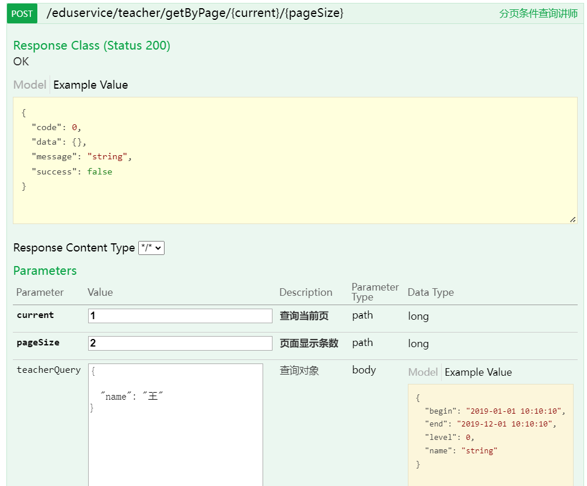
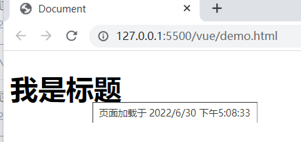
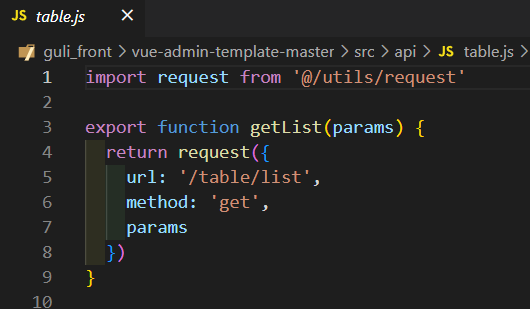
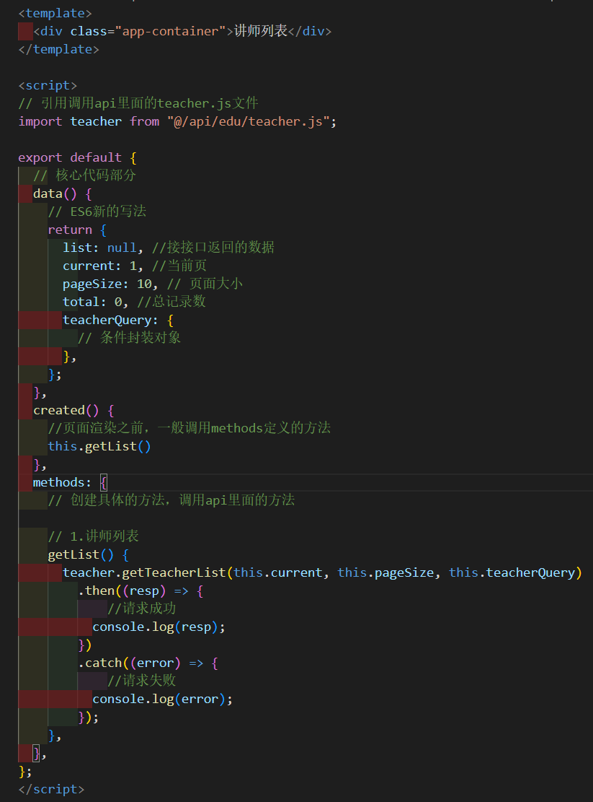
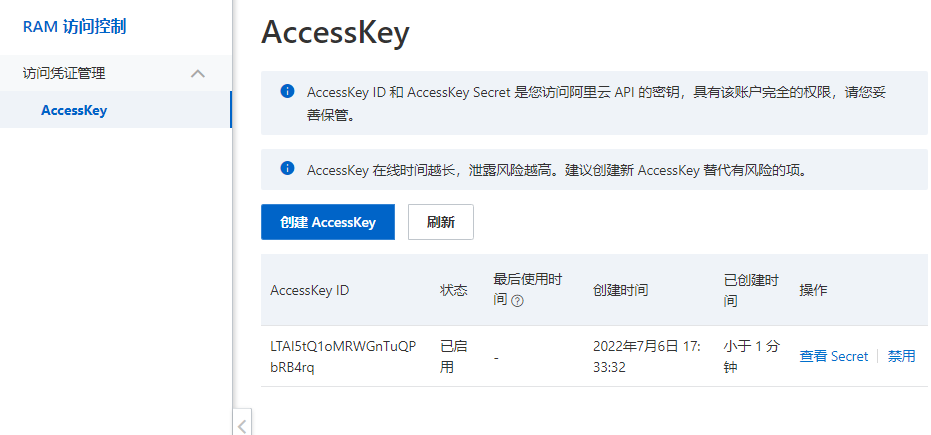
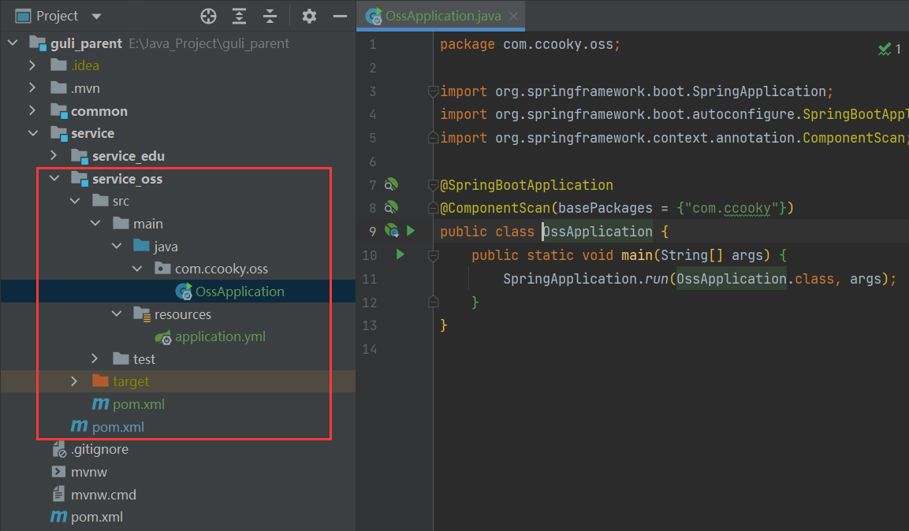

八种商业模式

 **1、C2C模式（Consumer To Consumer 平台模式 ）**

用户到用户，这种模式本质是将自己的流量或者用户转卖给视频或者直播的内容提供者，通过出售内容分成获利。

平台模式避开了非常沉重的内容和服务，扩张迅速，但实际这种模式也有缺陷，在线教育这两年的发展使内容迅速贬值，比较难带来更免费用户和流量。

代表网站：

51cto http://edu.51cto.com/

腾讯课堂 https://ke.qq.com/

 **2、B2C模式（Business To Customer 会员模式）**

商家到用户，这种模式是自己制作大量自有版权的视频，放在自有平台上，让用户按月付费或者按年付费。 这种模式简单，快速，只要专心录制大量视频即可快速发展，其曾因为 lynda 的天价融资而 大热。但在中国由于版权保护意识不强，教育内容易于复制，有海量的免费资源的竞争对手众多等原因，难以取得像样的现金流。

代表网站：

lynda https://www.lynda.com/ 

慕课网 https://www.imooc.com/

谷粒学院 http://www.gulixueyuan.com/

**3、B2B2C（商家到商家到用户）**

平台链接第三方教育机构和用户，平台一般不直接提供课程内容，而是更多承担教育的互联网载体角色，为教学过程各个环节提供全方位支持和服务。

代表网站：

51cto http://edu.51cto.com/

腾讯课堂 https://ke.qq.com/

 **4、垂直领域**

这种模式需要糅合录播，直播，帮助服务等多种手段，对学生学习某一项内容负责。这种模式收费高，有较强的壁垒。这种产品一旦形成口碑，会有稳定的用户群和收入，但产品非常复杂，难度大，门槛高，即使单独一个项目都会耗费大量的人力物力，因此发展速度较慢。

代表网站：

51cto的微职位 http://edu.51cto.com/

网易云课堂的微专业 https://study.163.com/

**5、直播、互动**

这种模式将传统课堂上的反馈，交互，答疑搬到线上。让用户容易接受，只要服务贴心，用 户就愿意买单，因此有丰富现金流。但缺陷是只能通过平台吸引用户，造成了竞争门槛过低， 模式雷同，对手众多，收益的永远是拥有流量或者用户的大平台。

代表网站：

腾讯课堂： https://ke.qq.com/

学而思 https://www.xueersi.com

**6、1 对 1**

让一个讲师在一定时间内对一个学员进行辅导，学生按照时间支付费用。这种模式收费容易， 现金流好，产品难度不大，市场空间大，但是人力资源的获取消耗却是巨大的，如果师资上控制不好，比如优秀的讲师留不住，或者整体成本太大，都会导致 1 对 1 模式难以发展。

代表网站：

VIPKID https://www.vipkid.com.cn/

学而思 https://www.xueersi.com

 **7、O2O 模式（Online To Offline 线上到线下）**

就是通过免费内容或者运营，让线上平台获取用户和流量，将用户吸引到线下开课，或 者让学员到加盟的线下机构上课。这种模式形式简单，收益高，只要把控用户需求，吸引到用户，收费不成问题，而且符合传统的消费习惯。

代表网站:

启德教育 https://www.eic.org.cn/

**8、freemium（免费增值）**

Freemium最早由AVC的Fred Wilson在2006年提出, 指的是用免费服务吸引用户，然后通过增值服务，将部分免费用户转化为收费用户，实现变现。Freemium模式中有“二八定律”的因素，即一小部分对价格不敏感的高端用户，愿意为一些额 外的功能付费，为服务提供者带来大部分收入。

代表网站

中国大学慕课 http://www.icourse163.org 

通过免费的名校课程和高校建立合作，吸引用户。提供考研专栏和学校云增值服务

学堂在线 http://www.xuetangx.com/ 

课程免费，如果希望得到课程的认证证书则要缴纳相应的费用

# 谷粒学院项目简介

## 一、功能简介

谷粒学院，是一个B2C模式的职业技能在线教育系统，分为前台用户系统和后台运营平台。

## 二、系统模块


## 三、系统架构

**架构设计需要考虑的几个方面：**

- **性能：**主要考虑访问频率，每个用户每天的访问次数。项目初始阶段用户的访问量并不大，如果考虑做运营推广，可能会迎来服务器访问量骤增，因此要考虑**分布式部署，引入缓存**
- **可扩展性：**系统功能会随着用户量的增加以及多变的互联网用户需求不断地扩展，因此考虑到系统的可扩展性的要求需要**使用微服务架构，引入消息中间件**
- **高可用：**系统一旦宕机，将会带来不可挽回的损失，因此必须做负载均衡，甚至是异地多活这类复杂的方案。如果数据丢失，修复将会非常麻烦，只能靠人工逐条修复，这个很难接受，因此需要考虑存储高可靠。我们需要考虑多种异常情况：机器故障、机房故障，针对机器故障，我们需要设计 MySQL 同机房主备方案；针对机房故障，我们需要设计 MySQL 跨机房同步方案。
- **安全性：**系统的信息有一定的隐私性，例如用户的个人身份信息，不包含强隐私（例如玉照、情感）的信息，因此使用账号密码管理、数据库访问权限控制即可。
- **成本：**视频类网站的主要成本在于服务器成本、流量成本、存储成本、流媒体研发成本，中小型公司可以考虑使用云服务器和云服务。


# 具体模块与技术


# 前后端分离开发概念


# 数据库表设计规范

以下规约只针对本模块，更全面的文档参考《阿里巴巴Java开发手册》：五、MySQL数据库

1、库名与应用名称尽量一致

2、表名、字段名必须使用小写字母或数字，禁止出现数字开头，

3、表名不使用复数名词

4、表的命名最好是加上“业务名称_表的作用”。如，edu_teacher

5、**表必备三字段：id, gmt_create, gmt_modified**

说明：

其中 id 必为主键，类型为 bigint unsigned、单表时自增、步长为 1。

（如果使用分库分表集群部署，则id类型为verchar，非自增，业务中使用分布式id生成器）

gmt_create, gmt_modified 的类型均为 datetime 类型，前者现在时表示主动创建，后者过去分词表示被动更新。

6、单表行数超过 500 万行或者单表容量超过 2GB，才推荐进行分库分表。 说明：如果预计三年后的数据量根本达不到这个级别，请不要在创建表时就分库分表。 

7、表达是与否概念的字段，必须使用 is_xxx 的方式命名，数据类型是 unsigned tinyint （1 表示是，0 表示否）。 

说明：任何字段如果为非负数，必须是 unsigned。 

注意：POJO 类中的任何布尔类型的变量，都不要加 is 前缀。数据库表示是与否的值，使用 tinyint 类型，坚持 is_xxx 的 命名方式是为了明确其取值含义与取值范围。 

正例：表达逻辑删除的字段名 is_deleted，1 表示删除，0 表示未删除。 


8、小数类型为 decimal，禁止使用 float 和 double。 说明：float 和 double 在存储的时候，存在精度损失的问题，很可能在值的比较时，得到不 正确的结果。如果存储的数据范围超过 decimal 的范围，建议将数据拆成整数和小数分开存储。

9、**如果存储的字符串长度几乎相等，使用 char 定长字符串类型。** 

10、**varchar 是可变长字符串**，不预先分配存储空间，长度不要超过 5000，如果存储长度大于此值，定义字段类型为 text，独立出来一张表，用主键来对应，避免影响其它字段索 引效率。


11、唯一索引名为 uk_字段名；普通索引名则为 idx_字段名。

说明：uk_ 即 unique key；idx_ 即 index 的简称


12、不得使用外键与级联，一切外键概念必须在应用层解决。外键与级联更新适用于单机低并发，不适合分布式、高并发集群；级联更新是强阻塞，存在数据库更新风暴的风险；外键影响数据库的插入速度。 


# 总体项目结构设计

采用父工程+子工程的形式进行设计，如下：


最后项目写完之后的IDEA目录结构如下：


**各个模块说明：**

**guli-parent：在线教学根目录（父工程），管理四个子模块：**

 	 **canal-client**：canal数据库表同步模块（统计同步数据）
 	
 	**common**：公共模块父节点
 	
 		 common-util：工具类模块，所有模块都可以依赖于它
 	
 		 service-base：service服务的base包，包含service服务的公共配置类，所有service模块依赖于它
 	
 	 	 spring-security：认证与授权模块，需要认证授权的service服务依赖于它

​	  **infrastructure**：基础服务模块父节点

​    		api-gateway：api网关服务

​	  **service**：api接口服务父节点

> > > service-acl：用户权限管理api接口服务（用户管理、角色管理和权限管理等）
>
> > > service-cms：cms api接口服务
>
> > > service-edu：教学相关api接口服务
>
> > > service-msm：短信api接口服务
>
> > > service-order：订单相关api接口服务
>
> > > service-oss：阿里云oss api接口服务
>
> > > service-statistics：统计报表api接口服务
>
> > > service-ucenter：会员api接口服务
>
> > > service-vod：视频点播api接口服务

## 创建父工程

**1. sprigboot工程guli-parent**（new 一个新的project）注意是project哦


 **2. 删除 src 目录**


 **3、配置 pom.xml**

<artifactId> 节点后面添加  pom类型, 将打包类型设置为pom


**4、在pom.xml中添加依赖的版本**

**删除pom.xml中的<dependencies>内容**

```xml
<!-- 以下内容删除 -->
<dependencies>
    <dependency>
        <groupId>org.springframework.boot</groupId>
        <artifactId>spring-boot-starter</artifactId>
    </dependency>
    <dependency>
        <groupId>org.springframework.boot</groupId>
        <artifactId>spring-boot-starter-test</artifactId>
        <scope>test</scope>
    </dependency>
</dependencies>
```

**添加 <properties>确定依赖的版本**

```xml
<properties>
    <java.version>1.8</java.version>
    <guli.version>0.0.1-SNAPSHOT</guli.version>
    <mybatis-plus.version>3.0.5</mybatis-plus.version>
    <velocity.version>2.0</velocity.version>
    <swagger.version>2.7.0</swagger.version>
    <aliyun.oss.version>2.8.3</aliyun.oss.version>
    <jodatime.version>2.10.1</jodatime.version>
    <poi.version>3.17</poi.version>
    <commons-fileupload.version>1.3.1</commons-fileupload.version>
    <commons-io.version>2.6</commons-io.version>
    <httpclient.version>4.5.1</httpclient.version>
    <jwt.version>0.7.0</jwt.version>
    <aliyun-java-sdk-core.version>4.3.3</aliyun-java-sdk-core.version>
    <aliyun-sdk-oss.version>3.1.0</aliyun-sdk-oss.version>
    <aliyun-java-sdk-vod.version>2.15.2</aliyun-java-sdk-vod.version>
    <aliyun-java-vod-upload.version>1.4.11</aliyun-java-vod-upload.version>
    <aliyun-sdk-vod-upload.version>1.4.11</aliyun-sdk-vod-upload.version>
    <fastjson.version>1.2.28</fastjson.version>
    <gson.version>2.8.2</gson.version>
    <json.version>20170516</json.version>
    <commons-dbutils.version>1.7</commons-dbutils.version>
    <canal.client.version>1.1.0</canal.client.version>
    <docker.image.prefix>zx</docker.image.prefix>
    <cloud-alibaba.version>0.2.2.RELEASE</cloud-alibaba.version>
</properties>
```

**配置 <dependencyManagement> 锁定依赖的版本**

```xml
<dependencyManagement>
    <dependencies>
        <!--Spring Cloud-->
        <dependency>
            <groupId>org.springframework.cloud</groupId>
            <artifactId>spring-cloud-dependencies</artifactId>
            <version>Hoxton.RELEASE</version>
            <type>pom</type>
            <scope>import</scope>
        </dependency>
        <dependency>
            <groupId>org.springframework.cloud</groupId>
            <artifactId>spring-cloud-alibaba-dependencies</artifactId>
            <version>${cloud-alibaba.version}</version>
            <type>pom</type>
            <scope>import</scope>
        </dependency>
        <!--mybatis-plus 持久层-->
        <dependency>
            <groupId>com.baomidou</groupId>
            <artifactId>mybatis-plus-boot-starter</artifactId>
            <version>${mybatis-plus.version}</version>
        </dependency>
        <!-- velocity 模板引擎, Mybatis Plus 代码生成器需要 -->
        <dependency>
            <groupId>org.apache.velocity</groupId>
            <artifactId>velocity-engine-core</artifactId>
            <version>${velocity.version}</version>
        </dependency>
        <!--swagger-->
        <dependency>
            <groupId>io.springfox</groupId>
            <artifactId>springfox-swagger2</artifactId>
            <version>${swagger.version}</version>
        </dependency>
        <!--swagger ui-->
        <dependency>
            <groupId>io.springfox</groupId>
            <artifactId>springfox-swagger-ui</artifactId>
            <version>${swagger.version}</version>
        </dependency>
        <!--aliyunOSS-->
        <dependency>
            <groupId>com.aliyun.oss</groupId>
            <artifactId>aliyun-sdk-oss</artifactId>
            <version>${aliyun.oss.version}</version>
        </dependency>
        <!--日期时间工具-->
        <dependency>
            <groupId>joda-time</groupId>
            <artifactId>joda-time</artifactId>
            <version>${jodatime.version}</version>
        </dependency>
        <!--xls-->
        <dependency>
            <groupId>org.apache.poi</groupId>
            <artifactId>poi</artifactId>
            <version>${poi.version}</version>
        </dependency>
        <!--xlsx-->
        <dependency>
            <groupId>org.apache.poi</groupId>
            <artifactId>poi-ooxml</artifactId>
            <version>${poi.version}</version>
        </dependency>
        <!--文件上传-->
        <dependency>
            <groupId>commons-fileupload</groupId>
            <artifactId>commons-fileupload</artifactId>
            <version>${commons-fileupload.version}</version>
        </dependency>
        <!--commons-io-->
        <dependency>
            <groupId>commons-io</groupId>
            <artifactId>commons-io</artifactId>
            <version>${commons-io.version}</version>
        </dependency>
        <!--httpclient-->
        <dependency>
            <groupId>org.apache.httpcomponents</groupId>
            <artifactId>httpclient</artifactId>
            <version>${httpclient.version}</version>
        </dependency>
        <dependency>
            <groupId>com.google.code.gson</groupId>
            <artifactId>gson</artifactId>
            <version>${gson.version}</version>
        </dependency>
        <!-- JWT -->
        <dependency>
            <groupId>io.jsonwebtoken</groupId>
            <artifactId>jjwt</artifactId>
            <version>${jwt.version}</version>
        </dependency>
        <!--aliyun-->
        <dependency>
            <groupId>com.aliyun</groupId>
            <artifactId>aliyun-java-sdk-core</artifactId>
            <version>${aliyun-java-sdk-core.version}</version>
        </dependency>
        <dependency>
            <groupId>com.aliyun.oss</groupId>
            <artifactId>aliyun-sdk-oss</artifactId>
            <version>${aliyun-sdk-oss.version}</version>
        </dependency>
        <dependency>
            <groupId>com.aliyun</groupId>
            <artifactId>aliyun-java-sdk-vod</artifactId>
            <version>${aliyun-java-sdk-vod.version}</version>
        </dependency>
        <dependency>
            <groupId>com.aliyun</groupId>
            <artifactId>aliyun-java-vod-upload</artifactId>
            <version>${aliyun-java-vod-upload.version}</version>
        </dependency>
        <dependency>
            <groupId>com.aliyun</groupId>
            <artifactId>aliyun-sdk-vod-upload</artifactId>
            <version>${aliyun-sdk-vod-upload.version}</version>
        </dependency>
        <dependency>
            <groupId>com.alibaba</groupId>
            <artifactId>fastjson</artifactId>
            <version>${fastjson.version}</version>
        </dependency>
        <dependency>
            <groupId>org.json</groupId>
            <artifactId>json</artifactId>
            <version>${json.version}</version>
        </dependency>
        <dependency>
            <groupId>commons-dbutils</groupId>
            <artifactId>commons-dbutils</artifactId>
            <version>${commons-dbutils.version}</version>
        </dependency>
        <dependency>
            <groupId>com.alibaba.otter</groupId>
            <artifactId>canal.client</artifactId>
            <version>${canal.client.version}</version>
        </dependency>
    </dependencies>
</dependencyManagement>
```

注意到，这里pom文件会爆红，没有关系不用管，因为依赖只有被引用的时候才会去仓库下载，等后面子模块使用这些依赖了，就会自动解决。


## 搭建子模块service

==创建空的maven工程，并且不用Spring initialize的原因在于，我们采用的是父子模块的形式，子模块会去继承父模块的依赖等信息，现在的子模块主要为了代码书写/引入依赖。==（这里这个就仅仅是为了引入依赖）

**1. 注意新建的是一个Module哦**，父工程是project（springboot）


**选择 maven类型，普通的maven工程，不需要用模板，点击下一步**


**输入模块名称 service，下一步完成创建**


 **2、添加模块类型是pom**

< artifactId> 节点后面添加  pom类型, 将打包类型设置为pom。

因为这只是一个子模块，用来导入项目的依赖的，不是具体写代码，他的下面还有具体的子子模块。


删除src目录


**3、添加模块需要的依赖**

前面父工程指定了依赖的版本，这里就不用指定了。

```xml
<dependencies>
<!--        下面几个现在用不到，先注释掉，不然会报错-->
    <!--        <dependency>-->
<!--            <groupId>org.springframework.cloud</groupId>-->
<!--            <artifactId>spring-cloud-starter-netflix-ribbon</artifactId>-->
<!--        </dependency>-->
<!--        &lt;!&ndash;hystrix依赖，主要是用  @HystrixCommand &ndash;&gt;-->
<!--        <dependency>-->
<!--            <groupId>org.springframework.cloud</groupId>-->
<!--            <artifactId>spring-cloud-starter-netflix-hystrix</artifactId>-->
<!--        </dependency>-->
<!--        &lt;!&ndash;服务注册&ndash;&gt;-->
<!--        <dependency>-->
<!--            <groupId>org.springframework.cloud</groupId>-->
<!--            <artifactId>spring-cloud-starter-alibaba-nacos-discovery</artifactId>-->
<!--        </dependency>-->
<!--        &lt;!&ndash;服务调用&ndash;&gt;-->
<!--        <dependency>-->
<!--            <groupId>org.springframework.cloud</groupId>-->
<!--            <artifactId>spring-cloud-starter-openfeign</artifactId>-->
<!--        </dependency>-->
    
    <dependency>
        <groupId>org.springframework.boot</groupId>
        <artifactId>spring-boot-starter-web</artifactId>
    </dependency>
    <!--mybatis-plus-->
    <dependency>
        <groupId>com.baomidou</groupId>
        <artifactId>mybatis-plus-boot-starter</artifactId>
    </dependency>
    <!--mysql-->
    <dependency>
        <groupId>mysql</groupId>
        <artifactId>mysql-connector-java</artifactId>
    </dependency>
    <!-- velocity 模板引擎, Mybatis Plus 代码生成器需要 -->
    <dependency>
        <groupId>org.apache.velocity</groupId>
        <artifactId>velocity-engine-core</artifactId>
    </dependency>
    <!--swagger-->
    <dependency>
        <groupId>io.springfox</groupId>
        <artifactId>springfox-swagger2</artifactId>
    </dependency>
    <dependency>
        <groupId>io.springfox</groupId>
        <artifactId>springfox-swagger-ui</artifactId>
    </dependency>
    <!--lombok用来简化实体类：需要安装lombok插件-->
    <dependency>
        <groupId>org.projectlombok</groupId>
        <artifactId>lombok</artifactId>
    </dependency>
    <!--xls-->
    <dependency>
        <groupId>org.apache.poi</groupId>
        <artifactId>poi</artifactId>
    </dependency>
    <dependency>
        <groupId>org.apache.poi</groupId>
        <artifactId>poi-ooxml</artifactId>
    </dependency>
    <dependency>
        <groupId>commons-fileupload</groupId>
        <artifactId>commons-fileupload</artifactId>
    </dependency>
    <!--httpclient-->
    <dependency>
        <groupId>org.apache.httpcomponents</groupId>
        <artifactId>httpclient</artifactId>
    </dependency>
    <!--commons-io-->
    <dependency>
        <groupId>commons-io</groupId>
        <artifactId>commons-io</artifactId>
    </dependency>
    <!--gson-->
    <dependency>
        <groupId>com.google.code.gson</groupId>
        <artifactId>gson</artifactId>
    </dependency>
    <dependency>
        <groupId>junit</groupId>
        <artifactId>junit</artifactId>
        <version>4.12</version>
    </dependency>
</dependencies>
```


# Swagger2接口测试

前后端分离开发模式中，api文档是最好的沟通方式。**Swagger可以生成在线接口文档，666.**

Swagger 是一个规范和完整的框架，用于生成、描述、调用和可视化 RESTful 风格的 Web 服务。

1. **及时性** (接口变更后，能够及时准确地通知相关前后端开发人员)
2. **规范性** (并且保证接口的规范性，如接口的地址，请求方式，参数及响应格式和错误信息)
3. **一致性** (接口信息一致，不会出现因开发人员拿到的文档版本不一致，而出现分歧)
4. **可测性** (直接在接口文档上进行测试，以方便理解业务)

==为了，让所有模块都可以进行使用，我们在parent下创建公共模块来整合swagger。==


和前面一样，删除src文件，然后修改pom文件。


**在common中引入相关依赖**

```xml
 <dependencies>
        <dependency>
            <groupId>org.springframework.boot</groupId>
            <artifactId>spring-boot-starter-web</artifactId>
            <scope>provided </scope>
        </dependency>
        <!--mybatis-plus-->
        <dependency>
            <groupId>com.baomidou</groupId>
            <artifactId>mybatis-plus-boot-starter</artifactId>
            <scope>provided </scope>
        </dependency>
        <!--lombok用来简化实体类：需要安装lombok插件-->
        <dependency>
            <groupId>org.projectlombok</groupId>
            <artifactId>lombok</artifactId>
            <scope>provided </scope>
        </dependency>
        <!--swagger-->
        <dependency>
            <groupId>io.springfox</groupId>
            <artifactId>springfox-swagger2</artifactId>
            <scope>provided </scope>
        </dependency>
        <dependency>
            <groupId>io.springfox</groupId>
            <artifactId>springfox-swagger-ui</artifactId>
            <scope>provided </scope>
        </dependency>
        <!-- redis -->
        <dependency>
            <groupId>org.springframework.boot</groupId>
            <artifactId>spring-boot-starter-data-redis</artifactId>
        </dependency>
        <!-- spring2.X集成redis所需common-pool2
        <dependency>
            <groupId>org.apache.commons</groupId>
            <artifactId>commons-pool2</artifactId>
            <version>2.6.0</version>
        </dependency>-->
    </dependencies>
```

## 配置Swagger

**在common下面创建子模块service-base，这个是具体写代码的**


**在模块service-base中，创建swagger的配置类**

​		创建包com.ccooky.servicebase.config，创建类SwaggerConfig


```java
@Configuration
@EnableSwagger2
public class SwaggerConfig {
    @Bean
    public Docket webApiConfig(){
        return new Docket(DocumentationType.SWAGGER_2)
                .groupName("webApi")
                .apiInfo(webApiInfo())
                .select()
                .paths(Predicates.not(PathSelectors.regex("/admin/.*")))
                .paths(Predicates.not(PathSelectors.regex("/error.*")))
                .build();
    }
    
    private ApiInfo webApiInfo(){
        return new ApiInfoBuilder()
                .title("网站-课程中心API文档")
                .description("本文档描述了课程中心微服务接口定义")
                .version("1.0")
                .contact(new Contact("Helen", "http://atguigu.com", "55317332@qq.com"))
                .build();
    }
}
```

## 引入Swagger

**在模块service模块中引入service-base**

```xml
<dependency>
    <groupId>com.atguigu</groupId>
    <artifactId>service-base</artifactId>
    <version>0.0.1-SNAPSHOT</version>
</dependency>
```

**在service-edu启动类上添加注解**


添加这个注解的原因，在于我们的启动类只会默认扫描本包及其子包下所有配置类，想要扫描到其他包的配置类，就需要改变启动类的扫描范围。==现在的范围：Project下所有的com.ccooky.*==

**降低Springboot的版本**

Swagger2无法兼容高版本的SP。真的是无语了妈的


**测试**

http://localhost:8001/swagger-ui.html


点击接口，就会弹出接口的具体使用信息，点击try out即测试接口。


##  **API注释**

这个API注释的作用就是，将我们接口文档的内容可以看的懂！！！不然全部都是英文，前端程序员怎么看得懂呢。

**定义接口说明和参数说明（主要用在controller上）**

定义在类上：@Api

定义在方法上：@ApiOperation

定义在参数上：@ApiParam

```java
@Api(tags = "讲师管理")
@RestController
@RequestMapping("/eduservice/teacher")
public class EduTeacherController {

    @Autowired
    private EduTeacherService eduTeacherService;

    @ApiOperation(value = "获取所有讲师列表")
    @GetMapping("/findAll")
    public List<EduTeacher> findAll(){
        return eduTeacherService.list(null);
    }

    @ApiOperation(value = "根据id删除讲师")
    @DeleteMapping("delete/{id}")
    public boolean removeById(@ApiParam(name = "id", value = "讲师ID", required = true) @PathVariable String id){
        return eduTeacherService.removeById(id);
    }
}
```

这样之后，我们再打开文档，就会发现，太棒了！！！


**定义样例数据**

主要用于，样例数据与我们真实返回值出现不统一的情况


可以看到，我们这个获取所有讲师信息的，她会给一个返回值的样例，告诉前端我的返回对象长出什么样子，但在里面gmtCreate和gmtModified有问题，还是之前那个老的情况，但我们在后台已经更改了返回时间的json格式：


所以我们在实体类属性，进行更改即可。

```java
@ApiModelProperty(value = "创建时间", example = "2019-01-01 8:00:00")
@TableField(fill = FieldFill.INSERT)
private Date gmtCreate;
@ApiModelProperty(value = "更新时间", example = "2019-01-01 8:00:00")
@TableField(fill = FieldFill.INSERT_UPDATE)
private Date gmtModified;
```


# 统一返回数据格式

项目中我们会将响应封装成json返回，一般我们会将所有接口的数据格式统一， 使前端(iOS Android, Web)对数据的操作更一致、轻松。

一般情况下，统一返回数据格式没有固定的格式，只要能描述清楚返回的数据状态以及要返回的具体数据就可以。但是一般会包含状态码、返回消息、数据这几部分内容

例如，我们的系统要求返回的基本数据格式如下：

**列表：**

```java
{
  "success": true,
  "code": 20000,
  "message": "成功",
  "data": {
    "items": [
      {
        "id": "1",
        "name": "刘德华",
        "intro": "毕业于师范大学数学系，热爱教育事业，执教数学思维6年有余"
      }
    ]
  }
}
```

**分页：**

```java
{
  "success": true,
  "code": 20000,
  "message": "成功",
  "data": {
    "total": 17,
    "rows": [
      {
        "id": "1",
        "name": "刘德华",
        "intro": "毕业于师范大学数学系，热爱教育事业，执教数学思维6年有余"
      }
    ]
  }
}
```

**没有返回数据：**

```java
{
  "success": true,
  "code": 20000,
  "message": "成功",
  "data": {}
}
```

**失败：**

```java
{
  "success": false,
  "code": 20001,
  "message": "失败",
  "data": {}
}
```

因此，我们定义统一结果

```java
{
  "success": 布尔, //响应是否成功
  "code": 数字, //响应码
  "message": 字符串, //返回消息
  "data": HashMap //返回数据，放在键值对中
}
```

## **创建结果类R**

这是所有模块都需要的东西，所以我们放在common模块下！！！

 **1、在common模块下创建子模块common-utils**


**2、创建接口，定义返回码**

**创建包com.ccooky.commonutils，创建接口 ResultCode.java**

```java
public interface ResultCode {
    public static Integer SUCCESS = 20000;
    public static Integer ERROR = 20001;
}
```

 **3、创建结果类R.java**

```java
@Data
public class R {

    @ApiModelProperty("返回成功标志")
    private Boolean success;

    @ApiModelProperty("状态码")
    private Integer code;

    @ApiModelProperty("状态码表示的内容")
    private String message;

    @ApiModelProperty("返回数据")
    private Map<String, Object> data = new HashMap<>();

    // 构造方法私有（不能对外创建对象，只能在这个类内部创建）
    private R(){}


    // 成功的静态方法
    public static R ok(){
        R r = new R();
        r.setCode(ResultCode.SUCCESS);
        r.setSuccess(true);
        r.setMessage("成功了");
        return r;
    }

    // 失败的静态方法
    public static R error(){
        R r = new R();
        r.setCode(ResultCode.ERROR);
        r.setSuccess(true);
        r.setMessage("失败了");
        return r;
    }

    // R.ok().code().message()
    // return this就是谁调用我们这个方法就返回那个调用的对象！！当前对象
    public R success(Boolean success){
        this.setSuccess(success);
        return this;
    }
    public R message(String message){
        this.setMessage(message);
        return this;
    }
    public R code(Integer code){
        this.setCode(code);
        return this;
    }
    public R data(String key, Object value){
        this.data.put(key, value);
        return this;
    }
    public R data(Map<String, Object> map){
        this.setData(map);
        return this;
    }
}

```

## 使用结果类R

 **1、在service模块中添加common_utils依赖**

```xml
<!--        引入Swagger的配置-->
        <dependency>
            <groupId>com.CCooky</groupId>
            <artifactId>service_base</artifactId>
            <version>0.0.1-SNAPSHOT</version>
        </dependency>
<!--        引入统一的结果对象-->
        <dependency>
            <groupId>com.CCooky</groupId>
            <artifactId>common_utils</artifactId>
            <version>0.0.1-SNAPSHOT</version>
        </dependency>
```

 **2、修改Controller中的返回结果**

列表

```java
    @ApiOperation(value = "获取所有讲师列表")
    @GetMapping("/findAll")
    public R findAll(){
        List<EduTeacher> list = eduTeacherService.list(null);
        return R.ok().data("items",list);
    }
```

删除

```java
    @ApiOperation(value = "根据id删除讲师")
    @DeleteMapping("delete/{id}")
    public R removeById(@ApiParam(name = "id", value = "讲师ID", required = true)
                            @PathVariable String id){
        boolean flag = eduTeacherService.removeById(id);
        return (flag) ? R.ok():R.error();
    }
```

**用Swagger测试**


# 异常处理

## 统一异常处理

后台出现异常时，会返回500等，这个是不能直接给前端的，所以我们要对异常进行统一的处理。在springboot详细讲过。


所以说我们还要对错误的操作数据格式做同样的格式处理！！！！必须将这些消息处理成之前发送的格式。

**处理方法：**采用SpringMVC的异常处理器，拦截所有的异常，统一进行处理。并且之前讲过，我们所有的异常统一抛出到controller层，然后再抛出，这样异常处理器就会拿到这个异常进行处理。

**1. 新建全局异常处理类，在service_base那个handler下**


```java
// @ControllerAdvice
// @ResponseBody  // 不跳转+返回数据

// 作为springMVC的异常处理器
@RestControllerAdvice
public class GlobalExceptionHandler {

    @ExceptionHandler(Exception.class) // 指定任何异常时都执行
    public R error(Exception e){
        e.printStackTrace();
        return R.error().message("全局异常处理，请联系管理员");
    }
}
```

**2. 解决依赖传递问题**

这里我们在service_base用到了common_utils里面的东西结果类R，这两个模块都是在common子模块下，然后现在是异常处理器是没有R的，因为没有引入common_utils的依赖撒。


service_base引入common_utils依赖


然后，新的问题出现在我们的service模块下，因为我们service模块同时引入了service_base+common_utils模块。而现在service_base内已经引入了common_utils，所以说我们在service下就去掉common_utils的引入。


**测试**


## **指定异常处理**

很简单，就在前面全局异常类GlobalExceptionHandler，加方法就行了。

处理器内部处理机制顺序为：特定异常 > 全局异常。

```java
// 作为springMVC的异常处理器
// @ControllerAdvice
// @ResponseBody  // 不跳转+返回数据
@RestControllerAdvice
public class GlobalExceptionHandler {
    
    // 指定任何异常时都执行
    @ExceptionHandler(Exception.class)
    public R error(Exception e){
        e.printStackTrace();
        return R.error().message("全局异常处理，请联系管理员");
    }

    // 特定异常时处理
    @ExceptionHandler(ArithmeticException.class)
    public R error(ArithmeticException e){
        e.printStackTrace();
        return R.error().message("执行了ArithmeticException异常");
    }

}
```

**测试**


## 自定义异常处理

 **1、创建自定义异常类**


```java
@Data
@AllArgsConstructor
@NoArgsConstructor
public class GuliException extends RuntimeException{
    
    private Integer code; // 状态码

    private String msg; // 异常信息
}
```

 **2、添加异常处理方法**

就在前面的GlobalExceptionHandler.java中添加

```java
// 作为springMVC的异常处理器
// @ControllerAdvice
// @ResponseBody  // 不跳转+返回数据
@RestControllerAdvice
public class GlobalExceptionHandler {

    // 指定任何异常时都执行
    @ExceptionHandler(Exception.class)
    public R error(Exception e){
        e.printStackTrace();
        return R.error().message("全局异常处理，请联系管理员");
    }

    // 特定异常时处理
    @ExceptionHandler(ArithmeticException.class)
    public R error(ArithmeticException e){
        e.printStackTrace();
        return R.error().message("执行了ArithmeticException异常");
    }

    // 自定义异常
    @ExceptionHandler(GuliException.class)
    public R error(GuliException e){
        e.printStackTrace();
        return R.error().code(e.getCode()).message(e.getMsg()); // 这里注意哦
    }
}
```

 **3、业务中需要的位置手动抛出GuliException**

注意是手动哦，因为这个异常系统是不会自动识别的。

```java
    @ApiOperation(value = "获取所有讲师列表")
    @GetMapping("/findAll")
    public R findAll() {
        List<EduTeacher> list = teacherService.list(null);
        
        try {
            int a = 4 / 0;
        }catch (Exception e){
            throw new GuliException(110110,"执行了自定义异常处理");
        }
        
        return R.ok().data("items", list);
    }
```

**测试**


# 日志处理


- **日志规范：**一些接口，提供给日志的实现框架设计的标准。

- **日志框架：**牛人或者第三方公司已经做好的日志记录实现代码，后来者直接可以拿去使用。

因为对Commons Logging的接口不满意，有人就搞了SLF4J。因为对Log4j的性能不满意，有人就搞了**Logback**。重点学习这个。

**1. 日志级别设置: < root>**

可以通过设置日志的输出级别来控制哪些日志信息输出或者不输出。

级别程度依次是：**TRACE < DEBUG < INFO < WARN < ERROR**  ; 默认级别是debug（忽略大小写），对应其方法。作用：用于控制系统中哪些日志级别是可以输出的，只输出级别不低于设定级别的日志信息。

**ALL  和 OFF**分别是打印全部级别的全部日志信息，及关闭全部日志信息。

```yml
# 设置日志级别
logging:
  level:
    root: warn
```

然后这种方式只能将日志打印在控制台上。


## Logback日志

spring boot内部使用Logback作为日志实现的框架。

Logback和log4j非常相似，如果你对log4j很熟悉，那对logback很快就会得心应手。logback相对于log4j的一些优点：https://blog.csdn.net/caisini_vc/article/details/48551287

**1、配置logback日志**

1. 删除application.properties中的日志配置，包括mybatisplus的日志；

   

安装idea彩色日志插件：grep-console；

2. resources 中创建 logback-spring.xml（固定名字不要改） ；

```xml
<?xml version="1.0" encoding="UTF-8"?>
<configuration  scan="true" scanPeriod="10 seconds">
    <!-- 日志级别从低到高分为TRACE < DEBUG < INFO < WARN < ERROR < FATAL，如果设置为WARN，则低于WARN的信息都不会输出 -->
    <!-- scan:当此属性设置为true时，配置文件如果发生改变，将会被重新加载，默认值为true -->
    <!-- scanPeriod:设置监测配置文件是否有修改的时间间隔，如果没有给出时间单位，默认单位是毫秒。当scan为true时，此属性生效。默认的时间间隔为1分钟。 -->
    <!-- debug:当此属性设置为true时，将打印出logback内部日志信息，实时查看logback运行状态。默认值为false。 -->
    <contextName>logback</contextName>
    <!-- name的值是变量的名称，value的值时变量定义的值。通过定义的值会被插入到logger上下文中。定义变量后，可以使“${}”来使用变量。 -->
    <property name="log.path" value="D:/guli_log/edu" />
    <!-- 彩色日志 -->
    <!-- 配置格式变量：CONSOLE_LOG_PATTERN 彩色日志格式 -->
    <!-- magenta:洋红 -->
    <!-- boldMagenta:粗红-->
    <!-- cyan:青色 -->
    <!-- white:白色 -->
    <!-- magenta:洋红 -->
    <property name="CONSOLE_LOG_PATTERN"
              value="%yellow(%date{yyyy-MM-dd HH:mm:ss}) |%highlight(%-5level) |%blue(%thread) |%blue(%file:%line) |%green(%logger) |%cyan(%msg%n)"/>
    <!--输出到控制台-->
    <appender name="CONSOLE" class="ch.qos.logback.core.ConsoleAppender">
        <!--此日志appender是为开发使用，只配置最底级别，控制台输出的日志级别是大于或等于此级别的日志信息-->
        <!-- 例如：如果此处配置了INFO级别，则后面其他位置即使配置了DEBUG级别的日志，也不会被输出 -->
        <filter class="ch.qos.logback.classic.filter.ThresholdFilter">
            <level>INFO</level>
        </filter>
        <encoder>
            <Pattern>${CONSOLE_LOG_PATTERN}</Pattern>
            <!-- 设置字符集 -->
            <charset>UTF-8</charset>
        </encoder>
    </appender>
    <!--输出到文件-->
    <!-- 时间滚动输出 level为 INFO 日志 -->
    <appender name="INFO_FILE" class="ch.qos.logback.core.rolling.RollingFileAppender">
        <!-- 正在记录的日志文件的路径及文件名 -->
        <file>${log.path}/log_info.log</file>
        <!--日志文件输出格式-->
        <encoder>
            <pattern>%d{yyyy-MM-dd HH:mm:ss.SSS} [%thread] %-5level %logger{50} - %msg%n</pattern>
            <charset>UTF-8</charset>
        </encoder>
        <!-- 日志记录器的滚动策略，按日期，按大小记录 -->
        <rollingPolicy class="ch.qos.logback.core.rolling.TimeBasedRollingPolicy">
            <!-- 每天日志归档路径以及格式 -->
            <fileNamePattern>${log.path}/info/log-info-%d{yyyy-MM-dd}.%i.log</fileNamePattern>
            <timeBasedFileNamingAndTriggeringPolicy class="ch.qos.logback.core.rolling.SizeAndTimeBasedFNATP">
                <maxFileSize>100MB</maxFileSize>
            </timeBasedFileNamingAndTriggeringPolicy>
            <!--日志文件保留天数-->
            <maxHistory>15</maxHistory>
        </rollingPolicy>
        <!-- 此日志文件只记录info级别的 -->
        <filter class="ch.qos.logback.classic.filter.LevelFilter">
            <level>INFO</level>
            <onMatch>ACCEPT</onMatch>
            <onMismatch>DENY</onMismatch>
        </filter>
    </appender>
    <!-- 时间滚动输出 level为 WARN 日志 -->
    <appender name="WARN_FILE" class="ch.qos.logback.core.rolling.RollingFileAppender">
        <!-- 正在记录的日志文件的路径及文件名 -->
        <file>${log.path}/log_warn.log</file>
        <!--日志文件输出格式-->
        <encoder>
            <pattern>%d{yyyy-MM-dd HH:mm:ss.SSS} [%thread] %-5level %logger{50} - %msg%n</pattern>
            <charset>UTF-8</charset> <!-- 此处设置字符集 -->
        </encoder>
        <!-- 日志记录器的滚动策略，按日期，按大小记录 -->
        <rollingPolicy class="ch.qos.logback.core.rolling.TimeBasedRollingPolicy">
            <fileNamePattern>${log.path}/warn/log-warn-%d{yyyy-MM-dd}.%i.log</fileNamePattern>
            <timeBasedFileNamingAndTriggeringPolicy class="ch.qos.logback.core.rolling.SizeAndTimeBasedFNATP">
                <maxFileSize>100MB</maxFileSize>
            </timeBasedFileNamingAndTriggeringPolicy>
            <!--日志文件保留天数-->
            <maxHistory>15</maxHistory>
        </rollingPolicy>
        <!-- 此日志文件只记录warn级别的 -->
        <filter class="ch.qos.logback.classic.filter.LevelFilter">
            <level>warn</level>
            <onMatch>ACCEPT</onMatch>
            <onMismatch>DENY</onMismatch>
        </filter>
    </appender>
    <!-- 时间滚动输出 level为 ERROR 日志 -->
    <appender name="ERROR_FILE" class="ch.qos.logback.core.rolling.RollingFileAppender">
        <!-- 正在记录的日志文件的路径及文件名 -->
        <file>${log.path}/log_error.log</file>
        <!--日志文件输出格式-->
        <encoder>
            <pattern>%d{yyyy-MM-dd HH:mm:ss.SSS} [%thread] %-5level %logger{50} - %msg%n</pattern>
            <charset>UTF-8</charset> <!-- 此处设置字符集 -->
        </encoder>
        <!-- 日志记录器的滚动策略，按日期，按大小记录 -->
        <rollingPolicy class="ch.qos.logback.core.rolling.TimeBasedRollingPolicy">
            <fileNamePattern>${log.path}/error/log-error-%d{yyyy-MM-dd}.%i.log</fileNamePattern>
            <timeBasedFileNamingAndTriggeringPolicy class="ch.qos.logback.core.rolling.SizeAndTimeBasedFNATP">
                <maxFileSize>100MB</maxFileSize>
            </timeBasedFileNamingAndTriggeringPolicy>
            <!--日志文件保留天数-->
            <maxHistory>15</maxHistory>
        </rollingPolicy>
        <!-- 此日志文件只记录ERROR级别的 -->
        <filter class="ch.qos.logback.classic.filter.LevelFilter">
            <level>ERROR</level>
            <onMatch>ACCEPT</onMatch>
            <onMismatch>DENY</onMismatch>
        </filter>
    </appender>
    <!--
        <logger>用来设置某一个包或者具体的某一个类的日志打印级别、以及指定<appender>。
        <logger>仅有一个name属性，
        一个可选的level和一个可选的addtivity属性。
        name:用来指定受此logger约束的某一个包或者具体的某一个类。
        level:用来设置打印级别，大小写无关：TRACE, DEBUG, INFO, WARN, ERROR, ALL 和 OFF，
              如果未设置此属性，那么当前logger将会继承上级的级别。
    -->
    <!--
        使用mybatis的时候，sql语句是debug下才会打印，而这里我们只配置了info，所以想要查看sql语句的话，有以下两种操作：
        第一种把<root level="INFO">改成<root level="DEBUG">这样就会打印sql，不过这样日志那边会出现很多其他消息
        第二种就是单独给mapper下目录配置DEBUG模式，代码如下，这样配置sql语句会打印，其他还是正常DEBUG级别：
     -->
    <!--开发环境:打印控制台-->
    <springProfile name="dev">
        <!--可以输出项目中的debug日志，包括mybatis的sql日志-->
        <logger name="com.guli" level="INFO" />
        <!--
            root节点是必选节点，用来指定最基础的日志输出级别，只有一个level属性
            level:用来设置打印级别，大小写无关：TRACE, DEBUG, INFO, WARN, ERROR, ALL 和 OFF，默认是DEBUG
            可以包含零个或多个appender元素。
        -->
        <root level="INFO">
            <appender-ref ref="CONSOLE" />
            <appender-ref ref="INFO_FILE" />
            <appender-ref ref="WARN_FILE" />
            <appender-ref ref="ERROR_FILE" />
        </root>
    </springProfile>
    <!--生产环境:输出到文件-->
    <springProfile name="pro">
        <root level="INFO">
            <appender-ref ref="CONSOLE" />
            <appender-ref ref="DEBUG_FILE" />
            <appender-ref ref="INFO_FILE" />
            <appender-ref ref="ERROR_FILE" />
            <appender-ref ref="WARN_FILE" />
        </root>
    </springProfile>
</configuration>
```

然后启动项目，可以看到控制台输出和log输出文件路径输出：


 **2、将异常信息日志输出到文件**

就是吧我们项目运行时，出现的异常也输出到文件里面去。

很简单，找到我们前面写的异常处理类GlobalExceptionHandler ，在类上面加一个注解 `@Slf4j`，如下；


然后在异常处理方法中，加上异常输出语句，就可以吧这个异常输出到log文件

```java
 log.error(e.getMessage());
```


 但是这里呢，你会发现他只输出了一句话，就是很简单的，这个看不懂任何的细节错误信息，假如我们想吧控制台打印的那么多异常信息都输出，就要按照下面这个操作。

**3、将日志堆栈信息输出到文件**

定义工具类。创建ExceptionUtil.java工具类。


```java
package com.guli.common.util;
public class ExceptionUtil {
    public static String getMessage(Exception e) {
        StringWriter sw = null;
        PrintWriter pw = null;
        try {
            sw = new StringWriter();
            pw = new PrintWriter(sw);
            // 将出错的栈信息输出到printWriter中
            e.printStackTrace(pw);
            pw.flush();
            sw.flush();
        } finally {
            if (sw != null) {
                try {
                    sw.close();
                } catch (IOException e1) {
                    e1.printStackTrace();
                }
            }
            if (pw != null) {
                pw.close();
            }
        }
        return sw.toString();
    }
}
```

然后再按照这种方式调用

```java
log.error(ExceptionUtil.getMessage(e));
```

# 一、讲师管理模块

## 1. 数据库表

```sql
#
# Structure for table "edu_teacher"
#

CREATE TABLE `edu_teacher` (
  `id` char(19) NOT NULL COMMENT '讲师ID',
  `name` varchar(20) NOT NULL COMMENT '讲师姓名',
  `intro` varchar(500) NOT NULL DEFAULT '' COMMENT '讲师简介',
  `career` varchar(500) DEFAULT NULL COMMENT '讲师资历,一句话说明讲师',
  `level` int(10) unsigned NOT NULL COMMENT '头衔 1高级讲师 2首席讲师',
  `avatar` varchar(255) DEFAULT NULL COMMENT '讲师头像',
  `sort` int(10) unsigned NOT NULL DEFAULT '0' COMMENT '排序',
  `is_deleted` tinyint(1) unsigned NOT NULL DEFAULT '0' COMMENT '逻辑删除 1（true）已删除， 0（false）未删除',
  `gmt_create` datetime NOT NULL COMMENT '创建时间',
  `gmt_modified` datetime NOT NULL COMMENT '更新时间',
  PRIMARY KEY (`id`),
  UNIQUE KEY `uk_name` (`name`)
) ENGINE=InnoDB DEFAULT CHARSET=utf8mb4 COMMENT='讲师';

#
# Data for table "edu_teacher"
#

INSERT INTO `edu_teacher` VALUES ('1','张三','近年主持国家自然科学基金（6项）、江苏省重大科技成果转化项目（5项）、江苏省产学研前瞻性联合研究项目（3项）、省工业科技支撑、省高技术、省自然科学基金等省部级及其企业的主要科研项目40多个，多个项目在企业成功转化，产生了较好的经济、社会和环境效益。积极开展产学研科技合作，并与省内16家企业建立了江苏省研究生工作站，其中6家为江苏省优秀研究生工作站','高级',1,'https://guli-file-190513.oss-cn-beijing.aliyuncs.com/avatar/default.jpg',0,0,'2019-10-30 14:18:46','2019-11-12 13:36:36'),('1189389726308478977','晴天','高级讲师简介','高级讲师资历',2,'https://online-teach-file.oss-cn-beijing.aliyuncs.com/teacher/2019/10/30/de47ee9b-7fec-43c5-8173-13c5f7f689b2.png',1,0,'2019-10-30 11:53:03','2019-10-30 11:53:03'),('1189390295668469762','李刚','高级讲师简介','高级讲师',2,'https://online-teach-file.oss-cn-beijing.aliyuncs.com/teacher/2019/10/30/b8aa36a2-db50-4eca-a6e3-cc6e608355e0.png',2,0,'2019-10-30 11:55:19','2019-11-12 13:37:52'),('1189426437876985857','王二','高级讲师简介','高级讲师',1,'https://online-teach-file.oss-cn-beijing.aliyuncs.com/teacher/2019/11/08/e44a2e92-2421-4ea3-bb49-46f2ec96ef88.png',0,0,'2019-10-30 14:18:56','2019-11-12 13:37:35'),('1189426464967995393','王五','高级讲师简介','高级讲师',1,'https://online-teach-file.oss-cn-beijing.aliyuncs.com/teacher/2019/10/30/65423f14-49a9-4092-baf5-6d0ef9686a85.png',0,0,'2019-10-30 14:19:02','2019-11-12 13:37:18'),('1192249914833055746','李四','高级讲师简介','高级讲师',1,'https://online-teach-file.oss-cn-beijing.aliyuncs.com/teacher/2019/11/07/91871e25-fd83-4af6-845f-ea8d471d825d.png',0,0,'2019-11-07 09:18:25','2019-11-12 13:37:01'),('1192327476087115778','1222-12-12','1111','11',1,'https://online-teach-file.oss-cn-beijing.aliyuncs.com/teacher/2019/11/08/5805c6cd-c8ad-4a77-aafd-d2e083bfd8a4.png',0,1,'2019-11-07 14:26:37','2019-11-11 16:26:26'),('1195337453429129218','test','sdfsdf','sdfdf',1,'https://guli-file-190513.oss-cn-beijing.aliyuncs.com/avatar/default.jpg',0,1,'2019-11-15 21:47:12','2019-11-15 21:47:27');
```

## 2. 模块建立

这个代码模块在子模块service下建立，为**service_edu**。空的干净的Maven模块。


最后目录结构：、


## 3. 讲师管理模块配置

**1、在service下面service-edu模块中创建配置文件**


**resources目录下创建文件 application.yml**

```yml
# 服务端口
server:
  port: 8001

spring:
  # 服务名
  application:
    name: service-edu
  # 环境设置：dev、test、prod
  profiles:
    active: dev
  # mysql数据库连接
  datasource:
    driver-class-name: com.mysql.cj.jdbc.Driver
    url: jdbc:mysql://localhost:3306/guli?useSSL=false&serverTimezone=GMT%2B8
    username: root
    password: 5240zhouquan

#mybatis日志
mybatis-plus:
  configuration:
    log-impl: org.apache.ibatis.logging.stdout.StdOutImpl
```

**2、创建MP代码生成器**


```java
public class MPCodeGenerator {
    public static void main(String[] args) {
        // 1、创建代码生成器
        AutoGenerator mpg = new AutoGenerator();

        // 2、全局配置
        GlobalConfig gc = new GlobalConfig();
        String projectPath = System.getProperty("user.dir");
        System.out.println(projectPath);
        gc.setOutputDir(projectPath + "/service/service_edu/src/main/java");
        gc.setAuthor("ccooky");
        gc.setOpen(false); //生成后是否打开资源管理器
        gc.setFileOverride(false); //重新生成时文件是否覆盖

        /*
         * mp生成service层代码，默认接口名称第一个字母有 I
         * UcenterService
         * */
        gc.setServiceName("%sService");	//去掉Service接口的首字母I
        gc.setIdType(IdType.ID_WORKER_STR); //主键策略
        gc.setDateType(DateType.ONLY_DATE);//定义生成的实体类中日期类型
        gc.setSwagger2(true);//开启Swagger2模式

        mpg.setGlobalConfig(gc);

        // 3、数据源配置
        DataSourceConfig dsc = new DataSourceConfig();
        dsc.setUrl("jdbc:mysql://localhost:3306/guli?useSSL=false&serverTimezone=GMT%2B8");
        dsc.setDriverName("com.mysql.cj.jdbc.Driver");
        dsc.setUsername("root");
        dsc.setPassword("5240zhouquan");
        dsc.setDbType(DbType.MYSQL);
        mpg.setDataSource(dsc);

        // 4、包配置
        PackageConfig pc = new PackageConfig();

        // 包 com.ccooky.eduservice
        pc.setParent("com.ccooky");
        pc.setModuleName("eduservice"); //模块名

        // 包 com.ccooky.eduservice.controller
        pc.setController("controller");
        pc.setEntity("entity");
        pc.setService("service");
        pc.setMapper("mapper");
        mpg.setPackageInfo(pc);

        // 5、策略配置
        StrategyConfig strategy = new StrategyConfig();
        strategy.setInclude("edu_teacher"); //确定代码对应数据库里面的表名，可以多个
        strategy.setNaming(NamingStrategy.underline_to_camel);//数据库表映射到实体的命名策略
        strategy.setTablePrefix(pc.getModuleName() + "_"); //生成实体时去掉表前缀

        strategy.setColumnNaming(NamingStrategy.underline_to_camel);//数据库表字段映射到实体的命名策略
        strategy.setEntityLombokModel(true); // lombok 模型 @Accessors(chain = true) setter链式操作

        strategy.setRestControllerStyle(true); //restful api风格控制器
        strategy.setControllerMappingHyphenStyle(true); //url中驼峰转连字符

        mpg.setStrategy(strategy);

        // 6、执行
        mpg.execute();
    }
}

```

运行，对应数据库产生代码：


## 4.编写后台管理api接口

**1、编写controller代码**

```java
 @Autowired
    private EduTeacherService eduTeacherService;

    @GetMapping("/findAll")
    public List<EduTeacher> findAll(){
        return eduTeacherService.list(null);
    }
```

**2、创建SpringBoot配置类，扫描Mapper接口**


```java
@Configuration
@MapperScan("com.ccooky.eduservice.mapper")
public class EduConfig {
}
```

**3、配置SQL执行性能分析插件**（MP的）

```java
@Configuration
@MapperScan("com.ccooky.eduservice.mapper")
public class EduConfig {
    /**
     * SQL 执行性能分析插件
     * 开发环境使用，线上不推荐。 maxTime 指的是 sql 最大执行时长
     */
    @Bean
    @Profile({"dev","test"})// 设置 dev test 环境开启
    public PerformanceInterceptor performanceInterceptor() {
        PerformanceInterceptor performanceInterceptor = new PerformanceInterceptor();
        performanceInterceptor.setMaxTime(1000);//ms，超过此处设置的ms则sql不执行
        performanceInterceptor.setFormat(true);
        return performanceInterceptor;
    }
}
```

 **4、创建SpringBoot启动类**

在该讲师模块下，创建启动类。


```java
@SpringBootApplication
public class EduApplication {
    public static void main(String[] args) {
       SpringApplication.run(EduApplication.class, args);
    }
}
```

 **5、运行启动类**

访问http://localhost:8001/eduservice/teacher/findAll

得到json数据, 


 **6、统一返回的json时间格式**

默认情况下json时间格式带有时区，并且是世界标准时间，和我们的时间差了八个小时

在application.yml中设置

```yml
# 服务端口
server:
  port: 8001

spring:
  # 服务名
  application:
    name: service-edu
  # 环境设置：dev、test、prod
  profiles:
    active: dev
  # mysql数据库连接
  datasource:
    driver-class-name: com.mysql.cj.jdbc.Driver
    url: jdbc:mysql://localhost:3306/guli?useSSL=false&serverTimezone=GMT%2B8
    username: root
    password: 5240zhouquan
  #返回json的全局时间格式
  jackson:
    date-format: yyyy-MM-dd HH:mm:ss
    time-zone: GMT+8

#mybatis日志
mybatis-plus:
  configuration:
    log-impl: org.apache.ibatis.logging.stdout.StdOutImpl
```

## 5. 讲师逻辑删除功能

**1、EduTeacherController添加删除方法**

```java
@DeleteMapping("delete/{id}")
public boolean removeById(@PathVariable String id){
    return teacherService.removeById(id);
}
```

 **2、配置逻辑删除插件，还在在前面那个MP的配置文件**

```java
@Configuration
@MapperScan("com.ccooky.eduservice.mapper")
public class EduConfig {
    /**
     * SQL 执行性能分析插件
     * 开发环境使用，线上不推荐。 maxTime 指的是 sql 最大执行时长
     */
    @Bean
    @Profile({"dev","test"})// 设置 dev test 环境开启
    public PerformanceInterceptor performanceInterceptor() {
        PerformanceInterceptor performanceInterceptor = new PerformanceInterceptor();
        performanceInterceptor.setMaxTime(1000);//ms，超过此处设置的ms则sql不执行
        performanceInterceptor.setFormat(true);
        return performanceInterceptor;
    }

    /**
     * 逻辑删除插件
     */
    @Bean
    public ISqlInjector sqlInjector() {
        return new LogicSqlInjector();
    }
}
```

**3.实体类字段注释 @TableLogic**


**4.使用postman测试删除**


测试结果：数据库中的is_deleted字段被修改为1。

###  跨域配置

 1、什么是跨域

浏览器从一个域名的网页去请求另一个域名的资源时，域名、端口、协议任一不同，都是跨域 。前后端分离开发中，需要考虑ajax跨域的问题。

这里我们可以从服务端解决这个问题

 2、配置

在Controller类上添加注解

```
@CrossOrigin //跨域
```

## 6. 条件分页

**1、MyBatisPlusConfig中配置分页插件**

```java
/**
 * 分页插件
 */
@Bean
public PaginationInterceptor paginationInterceptor() {
    return new PaginationInterceptor();
}
```

 **2、简单分页Controller方法**

EduTeacherController中添加分页方法。这现在是简单的不带条件。

```java
@ApiOperation(value = "分页条件查询讲师")
    @GetMapping("getByPage/{current}/{pageSize}")
    public R getByPage(@ApiParam(name = "current",value = "查询当前页",required = true)
                           @PathVariable Long current,
                       @ApiParam(name = "pageSize",value = "页面显示条数",required = true)
                       @PathVariable Long pageSize){
        //创建分页对象Ipage
        IPage<EduTeacher> page = new Page<>(current,pageSize);
        // 创建条件对象
        QueryWrapper<EduTeacher> qw = new QueryWrapper<>();
        // 调用分页方法，最后的分页数据会直接封装到传入的这个page对象中。
        eduTeacherService.page(page,qw);
        // 获取查询分页的数据
        long total = page.getTotal();
        System.out.println(total);
        List<EduTeacher> records = page.getRecords();
        return R.ok().data("total",total).data("rows",records);
    }
```

**3、添加条件**


被查询的条件：讲师名称name，讲师头衔level、讲师入驻时间gmt_create。

**如何去接受并且使用这个条件值呢？**

我们之前也学过，SSM里面，用一个vo对象来接收值！vo——ValueObject的意思，他只是一个名词而已，并不是一个真正的对象。

 **1、创建vo对象**

在entity包下，新建一个vo包，下面存放我们需要建立的查询对象TeacherQuery。


```java
@Data
public class TeacherQuery {

    @ApiModelProperty(value = "教师名称,模糊查询")
    private String name;

    @ApiModelProperty(value = "头衔 1高级讲师 2首席讲师")
    private Integer level;

    @ApiModelProperty(value = "查询开始时间", example = "2019-01-01 10:10:10")
    private String begin;//注意，这里使用的是String类型，前端传过来的数据无需进行类型转换

    @ApiModelProperty(value = "查询结束时间", example = "2019-12-01 10:10:10")
    private String end;
}
```

**2. 在controller里面接受条件值，并且添加条件**。注意哦，这里要改成Post请求。因为Get请求不能携带请求体数据的。

```java
@ApiOperation(value = "分页条件查询讲师")
@PostMapping("getByPage/{current}/{pageSize}")
public R getByPage(@ApiParam(name = "current",value = "查询当前页",required = true)
                   @PathVariable Long current,

                   @ApiParam(name = "pageSize",value = "页面显示条数",required = true)
                   @PathVariable Long pageSize,

                   @ApiParam(name = "teacherQuery",value = "查询对象",required = false)
                   @RequestBody(required = false) TeacherQuery teacherQuery){
    //创建分页对象Ipage
    IPage<EduTeacher> page = new Page<>(current,pageSize);
    // 创建条件对象
    QueryWrapper<EduTeacher> qw = new QueryWrapper<>();
    // 添加条件，一定要有非空验证
    qw.like(!StringUtils.isEmpty(teacherQuery.getName()), "name",teacherQuery.getName());
    qw.eq(!StringUtils.isEmpty(teacherQuery.getLevel()),"level",teacherQuery.getLevel());
    qw.ge(!StringUtils.isEmpty(teacherQuery.getBegin()),"gmt_create",teacherQuery.getBegin());
    qw.le(!StringUtils.isEmpty(teacherQuery.getEnd()),"gmt_create",teacherQuery.getEnd());
    // 调用分页方法，最后的分页数据会直接封装到传入的这个page对象中。
    eduTeacherService.page(page,qw);
    // 获取查询分页的数据
    long total = page.getTotal();
    System.out.println(total);
    List<EduTeacher> records = page.getRecords();
    return R.ok().data("total",total).data("rows",records);
}
```

**测试成功**



## **7. 增/改讲师**

### **7.1 实现字段自动填充**

这里主要就是新增/修改的时候，把那个**创建时间+更新时间**自动填充一下。

1. **实体类的两个时间属性，加上注解**

   ```java
   @ApiModelProperty(value = "创建时间", example = "2019-01-01 8:00:00")
   @TableField(fill = FieldFill.INSERT)
   private Date gmtCreate;
   
   @ApiModelProperty(value = "更新时间", example = "2019-01-01 8:00:00")
   @TableField(fill = FieldFill.INSERT_UPDATE)
   private Date gmtModified;
   ```

2. **实现元对象处理器接口，记得交给Spring容器管理**

   ==因为这个处理器是所有服务都会用到的，所以说我们把他放到service-base模块中。当前模块引入了service-base模块，就会拥有里面的对象==

   创建包handler，创建自动填充类 MyMetaObjectHandler。

   

```java
@Component
public class MyMetaObjectHandler implements MetaObjectHandler {
    @Override
    public void insertFill(MetaObject metaObject) {
        this.setFieldValByName("gmtCreate",new Date(),metaObject);
        this.setFieldValByName("gmtModified",new Date(),metaObject);
    }

    @Override
    public void updateFill(MetaObject metaObject) {
        this.setFieldValByName("gmtModified",new Date(),metaObject);

    }
}
```

### 7.2 添加讲师

```java
@ApiOperation("讲师添加功能")
@PostMapping("/addTeacher")
public R addTeacher(@RequestBody EduTeacher teacher){
    boolean flag = eduTeacherService.save(teacher);
    return (flag)? R.ok():R.error();
}
```

测试：注意添加不要给id、gmtCreate、gmtUpdate三个值哦。


### 7.3 修改讲师

修改功能是由两部分组成的哦，数据回显+修改。简单说，就是先根据id查询讲师，吧数据显示到前端，然后前端确认的时候，再调用修改接口。

```java
@ApiOperation("id查询讲师")
@GetMapping("/getTeacherById/{id}")
public R getTeacherById(@PathVariable String id){
    EduTeacher teacher = teacherService.getById(id);
    return R.ok().data("items",teacher);
}
```

很简单还是。注意一点：==一定要传id，两个时间参数依然不传==。

```java
@ApiOperation("修改讲师")
@PostMapping("/updateTeacher")
public R updateTeacher(@RequestBody EduTeacher teacher){
    boolean flag = teacherService.updateById(teacher);
    return (flag)? R.ok():R.error();
}
```


# 二、前端基础

## 1. VsCode

下载VSCode，安装很多插件。看安装笔记。

**1、创建项目**

vscode本身没有新建项目的选项，所以要先创建一个空的文件夹，如guli_front。


然后打开vscode，再在vscode里面选择 File -> Open Folder 打开文件夹，这样才可以创建项目。但这里还是一个文件夹的形式撒，并不是工作区，我们需要在工作区内部进行开发。


 **2、保存工作区**

打开文件夹后，选择“文件 -> 将工作区另存为...”，为工作区文件起一个名字，存储在刚才的文件夹下即可.


vscode就会多一个文件出来，如下：


**3、新建文件夹和网页**


 **4、预览网页**

​	**以文件路径方式打开网页预览**

​			需要安装“open in browser”插件：

​			文件右键 -> Open In Default Browser

​	**以服务器方式打开网页预览**

​			需要安装“Live Server”插件：

​			文件右键 -> Open with Live Server

**5、设置字体大小**

左边栏Manage -> settings -> 搜索 “font” -> Font size

 **6、开启完整的Emmet语法支持**

设置中搜索 Emmet：启用如下选项，必要时重启vs


## 2. ES6入门

ECMAScript 6.0（以下简称 ES6）是 JavaScript 语言的下一代标准，已经在 2015 年 6 月正式发布了。它的目标，是使得 JavaScript 语言可以用来编写复杂的大型应用程序，成为企业级开发语言。

**ECMAScript 和 JavaScript 的关系**

要讲清楚这个问题，需要回顾历史。1996 年 11 月，JavaScript 的创造者 Netscape 公司，决定将 JavaScript 提交给标准化组织 ECMA，希望这种语言能够成为国际标准。次年，ECMA 发布 262 号标准文件（ECMA-262）的第一版，规定了浏览器脚本语言的标准，并将这种语言称为 ECMAScript，这个版本就是 1.0 版。

因此，ECMAScript 和 JavaScript 的关系是，前者是后者的规格，后者是前者的一种实现（另外的 ECMAScript 方言还有 Jscript 和 ActionScript）

 **ES6 与 ECMAScript 2015 的关系**

ECMAScript 2015（简称 ES2015）这个词，也是经常可以看到的。它与 ES6 是什么关系呢？

2011 年，ECMAScript 5.1 版发布后，就开始制定 6.0 版了。因此，ES6 这个词的原意，就是指 JavaScript 语言的下一个版本。

ES6 的第一个版本，在 2015 年 6 月发布，正式名称是《ECMAScript 2015 标准》（简称 ES2015）。

2016 年 6 月，小幅修订的《ECMAScript 2016 标准》（简称 ES2016）如期发布，这个版本可以看作是 ES6.1 版，因为两者的差异非常小，基本上是同一个标准。根据计划，2017 年 6 月发布 ES2017 标准。

==因此，ES6 既是一个历史名词，也是一个泛指，含义是 5.1 版以后的 JavaScript 的下一代标准==，涵盖了 ES2015、ES2016、ES2017 等等，而 ES2015 则是正式名称，特指该年发布的正式版本的语言标准。本书中提到 ES6 的地方，一般是指 ES2015 标准，但有时也是泛指“下一代 JavaScript 语言”。


## 3. 基本语法

ES标准中不包含 DOM 和 BOM的定义，只涵盖基本数据类型、关键字、语句、运算符、内建对象、内建函数等通用语法。

本部分只学习前端开发中ES6的最少必要知识，方便后面项目开发中对代码的理解。

### 1. let声明变量

创建 let.html

```
es6定义变量的方式与特点：
	js的定义：var a = 1；
	es6新增定义变量写法：let b = 10；
```

```js
// var 声明的变量没有局部作用域
// let 声明的变量  有局部作用域
{
var a = 0
let b = 1
}
console.log(a)  // 0
console.log(b)  // ReferenceError: b is not defined
```

```js
// var 可以声明多次
// let 只能声明一次
var m = 1
var m = 2
let n = 3
let n = 4
console.log(m)  // 2
console.log(n)  // Identifier 'n' has already been declared
```

### **2、const声明常量**

创建 const.html（只读变量）

```js
// 1、声明之后不允许改变    
const PI = "3.1415926"
PI = 3  // TypeError: Assignment to constant variable.
```

```js
// 2、一但声明必须初始化，否则会报错
const MY_AGE  // SyntaxError: Missing initializer in const declaration
```

### 3、**解构赋值**

创建 解构赋值.html

解构赋值是对赋值运算符的扩展。他是一种针对==数组或者对象==进行模式匹配，然后对其中的变量进行赋值。在代码书写上简洁且易读，语义更加清晰明了；也方便了复杂对象中数据字段获取。

```js
//1、数组解构
// 传统
let a = 1, b = 2, c = 3
console.log(a, b, c)
// ES6
let [x, y, z] = [1, 2, 3]
console.log(x, y, z) 
```

```js
//2、对象解构
let user = {name: 'Helen', age: 18}

// 传统
let name1 = user.name
let age1 = user.age
console.log(name1, age1)
// ES6
let { name, age } =  user//注意：结构的变量必须是user中的属性
console.log(name, age)
```

### 4、模板字符串

创建 模板字符串.html

模板字符串相当于加强版的字符串，**用反引号 `**,  除了作为普通字符串，还可以用来定义多行字符串，还可以在字符串中加入变量和表达式。

```js
// 1、多行字符串
let string1 =  `Hey,
can you stop angry now?`
console.log(string1)
// Hey,
// can you stop angry now? 
```

```js
// 2、在` `表达式中获取获取变量值。
// 变量名写在 ${} 中，${} 中可以放入 JavaScript 表达式。
let name = "Mike"
let age = 27
let info = `My Name is ${name},I am ${age+1} years old next year.`
console.log(info)
// My Name is Mike,I am 28 years old next year. 
```

```js
// 3、` `表达式中调用函数
function f(){
    return "have fun!"
}
let string2 = `Game start,${f()}`
console.log(string2);  // Game start,have fun!
```

### 5、声明对象简写

创建 声明对象简写.html

```js
const age = 12
const name = "Amy"
// 传统
const person1 = {age: age, name: name}
console.log(person1)
// ES6
const person2 = {age, name}
console.log(person2) //{age: 12, name: "Amy"}
```

### 6、定义方法简写

创建 定义方法简写.html。**对象中的方法。**

```js
// 传统
const person1 = {
    sayHi:function(){
        console.log("Hi")
    }
}
person1.sayHi();//"Hi"
// ES6
const person2 = {
    sayHi(){
        console.log("Hi")
    }
}
person2.sayHi()  //"Hi"
```

### 7、对象拓展运算符

创建 对象拓展运算符.html

拓展运算符（...）用于取出参数对象所有可遍历属性然后拷贝到当前对象。

```js
// 1、拷贝对象
let person1 = {name: "Amy", age: 15}
let someone = { ...person1 }
console.log(someone)  //{name: "Amy", age: 15}
```

```js
// 2、合并对象
let age = {age: 15}
let name = {name: "Amy"}
let person2 = {...age, ...name}
console.log(person2)  //{age: 15, name: "Amy"}
```

### **8、箭头函数**

创建 箭头函数.html。

箭头函数提供了一种更加简洁的函数书写方式。基本语法是：参数 => 函数体。==就很像我们java里面的Lambda表达式，为了简化方法的书写。==

```js
// 传统创建方法
var f1 = function(a){
    return a
}
console.log(f1(1))
// ES6创建方法
var f2 = a => a
console.log(f2(1))
```

```js
// 当箭头函数没有参数或者有多个参数，要用 () 括起来。
// 当箭头函数函数体有多行语句，用 {} 包裹起来，表示代码块，
// 当只有一行语句，并且需要返回结果时，可以省略 {} , 结果会自动返回。
var f3 = (a,b) => {
    let result = a+b
    return result
}
console.log(f3(6,2))  // 8
// 前面代码相当于：
var f4 = (a,b) => a+b
```

箭头函数多用于匿名函数的定义

## 4. Vue

Vue (读音 /vjuː/，类似于 view) 是一套用于构建用户界面的渐进式框架。

Vue 的核心库只关注视图层，不仅易于上手，还便于与第三方库或既有项目整合。另一方面，当与现代化的工具链以及各种支持类库结合使用时，Vue 也完全能够为复杂的单页应用提供驱动。

官方网站：https://cn.vuejs.org

### 1、初始Vue.js


创建 demo.html，使用vscode快捷键！生成页面。


```js
<!DOCTYPE html>
<html lang="en">

<head>
    <meta charset="UTF-8">
    <meta http-equiv="X-UA-Compatible" content="IE=edge">
    <meta name="viewport" content="width=device-width, initial-scale=1.0">
    <title>Document</title>
</head>

<body>

    <!-- id标识vue作用的范围 -->
    <div id="app">
        <!-- {{}} 插值表达式，绑定vue中的data数据 -->
        {{ message }}
    </div>

    <!-- 引入Vue -->
    <script src="vue.min.js"></script>
    <script>
        // 创建一个vue对象
        new Vue({
            el: '#app',//绑定vue作用的范围
            data: {//定义页面中显示的模型数据
                message: 'Hello Vue!'
            }
        })
    </script>

</body>
</html>
```

**这就是声明式渲染**：Vue.js 的核心是一个允许采用简洁的模板语法来声明式地将数据渲染进 DOM 的系统。

这里的核心思想就是没有繁琐的DOM操作，例如jQuery中，我们需要先找到div节点，获取到DOM对象，然后进行一系列的节点操作

### **2、抽取vue代码片段**

就是生成一个代码模板，类似于我们的！生成一个html的页面一样。

文件 =>  首选项 => 用户代码片段 => 新建全局代码片段/或文件夹代码片段：vue-html.code-snippets

然后吧下面这个写好的复制过去，后面新建的时候写vue-html就会有了！

```js
{
    "vue htm": {
        "scope": "html",
        "prefix": "vuehtml",
        "body": [
            "<!DOCTYPE html>",
            "<html lang=\"en\">",
            "",
            "<head>",
            "    <meta charset=\"UTF-8\">",
            "    <meta name=\"viewport\" content=\"width=device-width, initial-scale=1.0\">",
            "    <meta http-equiv=\"X-UA-Compatible\" content=\"ie=edge\">",
            "    <title>Document</title>",
            "</head>",
            "",
            "<body>",
            "    <div id=\"app\">",
            "",
            "    </div>",
            "    <script src=\"vue.min.js\"></script>",
            "    <script>",
            "        new Vue({",
            "            el: '#app',",
            "            data: {",
            "                $1",
            "            }",
            "        })",
            "    </script>",
            "</body>",
            "",
            "</html>",
        ],
        "description": "my vue template in html"
    }
}
```

**注意：制作代码片段的时候，字符串中如果包含文件中复制过来的“Tab”键的空格，要换成“空格键”的空格**


### 3、基本语法

你看到的 **v-bind** 特性被称为指令。指令带有前缀 **v-** 

#### 1.基本数据渲染v-bind

创建 01-基本数据渲染和指令.html

除了使用插值表达式{{ }}进行数据渲染，也可以使用 **v-bind**指令绑定属性，它的简写的形式就是一个**冒号（:）**

```js
data: {
    content: '我是标题',
    message: '页面加载于 ' + new Date().toLocaleString()
}
```

```js
<!-- 如果要将模型数据绑定在html属性-title中，则使用 v-bind 指令
     此时title中显示的是模型数据
-->
     
<h1 v-bind:title="message">
    {{content}}
</h1>

<!-- v-bind 指令的简写形式： 冒号（:） -->
<h1 :title="message">
    {{content}}
</h1>
```



#### 2.双向数据绑定v-model

创建 02-双向数据绑定.html

双向数据绑定和单向数据绑定：使用 **v-model** 进行双向数据绑定。

```js
data: {
    searchMap:{
        keyWord: '尚硅谷'
    }
} 
```

```js
<!-- v-bind:value只能进行单向的数据渲染 -->
<input type="text" v-bind:value="searchMap.keyWord">
    
<!-- v-model 可以进行双向的数据绑定  -->
<input type="text" v-model="searchMap.keyWord">
    
<p>您要查询的是：{{searchMap.keyWord}}</p>
```

#### 3.事件v-on

创建 03-事件.html

**需求：**点击查询按钮，按照输入框中输入的内容查找公司相关信息

在前面的例子基础上，data节点中增加 result，增加 methods节点 并定义 search方法

```js
data: {
     searchMap:{
         keyWord: '尚硅谷'
     },
     //查询结果
     result: {}
},
methods:{
    search(){// 可以定义多个方法
        console.log('search')
        //TODO
    }
}
```

使用 v-on 进行事件处理，**v-on:click** 表示处理鼠标点击事件，事件调用的方法定义在 vue 对象声明的 methods 节点中。==可以看到绑定方法时，加不加（）都可以==

```js
<!-- v-on 指令绑定事件，click指定绑定的事件类型，事件发生时调用vue中methods节点中定义的方法 -->
<button v-on:click="search()">查询</button>

<!-- v-on 指令的简写形式 @ -->
<button @click="search()">查询2</button>


<p>您要查询的是：{{searchMap.keyWord}}</p>
<p>
  <a v-bind:href="result.site" target="_blank">
    {{result.title}}
  </a>
</p>
```

最后完善search方法

```js
search(){
    console.log('search');
    this.result = {
        "title":"尚硅谷",
        "site":"http://www.atguigu.com"
    }
}
```

#### 4.修饰符

创建 04-修饰符.html

修饰符 (Modifiers) 是以半角句号**（.）**指明的特殊后缀，用于指出一个指令应该以特殊方式绑定。

例如，.prevent 修饰符告诉 v-on 指令对于触发的事件调用 event.preventDefault( )：即阻止事件原本的默认行为，来执行我们写的方法。

==简单说：就是阻止标签属性默认的行为，让她去执行我们写的方法==

```js
data: {
    user: {}
}
```

```js
<!-- 修饰符用于指出一个指令应该以特殊方式绑定。
     这里的 .prevent 修饰符告诉 v-on 指令对于触发的事件调用js的 event.preventDefault()：即阻止表单提交的默认行为 -->

        <form action="save" v-on:submit.prevent="onSubmit">
            <input type="text" id="name" v-model="user.username" />
            <button type=" submit">保存</button>
        </form>
```

```js
methods: {
    onSubmit() {
        if (this.user.username) {
            console.log('提交表单')
        } else {
            alert('请输入用户名')
        }
    }
}
```

#### 5.条件渲染v-if-show

创建 05-条件渲染.html

**v-if：**条件指令

```js
data: {
    ok: false
}
```

注意：单个复选框绑定到布尔值

```js
<input type="checkbox" v-model="ok">同意许可协议
<!-- v:if条件指令：还有v-else、v-else-if 切换开销大 -->
<h1 v-if="ok">选中了</h1>
<h1 v-else>选中了</h1>
```

**v-show：**条件指令

使用v-show完成和上面相同的功能

```js
<!-- v:show 条件指令 初始渲染开销大 -->
<h1 v-show="ok">选中了</h1>
<h1 v-show="!ok">选中了</h1>
```

- `v-if` 是“真正”的条件渲染，因为它会确保在切换过程中条件块内的事件监听器和子组件适当地被销毁和重建。
- `v-if` 也是**惰性的**：如果在初始渲染时条件为假，则什么也不做——直到条件第一次变为真时，才会开始渲染条件块。
- 相比之下，`v-show` 就简单得多——不管初始条件是什么，元素总是会被渲染，并且只是简单地基于 CSS 进行切换。
- 一般来说，`v-if` 有更高的切换开销，而 `v-show` 有更高的初始渲染开销。因此，如果需要非常频繁地切换，则使用 `v-show` 较好；如果在运行时条件很少改变，则使用 `v-if` 较好。

#### 6.列表渲染v-for

创建 06-列表渲染.html

**v-for：**列表循环指令

**例1：简单的列表渲染**

```js
<!-- 1、简单的列表渲染 -->
<ul>
    <li v-for="n in 10">{{ n }} </li>
</ul>

<ul>
    <!-- 如果想获取索引，则使用index关键字，注意，圆括号中的index必须放在后面 -->
    <li v-for="(n, index) in 5">{{ n }} - {{ index }</li>
</ul>
```

**例2：遍历数据列表**

```js
data: {
    userList: [
        { id: 1, username: 'helen', age: 18 },
        { id: 2, username: 'peter', age: 28 },
        { id: 3, username: 'andy', age: 38 }
    ]
} 
```

```js
<!-- 2、遍历数据列表 -->
<table border="1">
    <tr v-for="(item, index) in userList">
        <td>{{index}}</td>
        <td>{{item.id}}</td>
        <td>{{item.username}}</td>
        <td>{{item.age}}</td>
    </tr>
</table>
```

### 4、组件（重点）

组件（Component）是 Vue.js 最强大的功能之一。

**组件可以扩展 HTML 元素，封装可重用的代码。**简单说，就是吧我们自己的代码变成一个标签，可以直接使用！！！

组件系统让我们可以用独立可复用的小组件来构建大型应用，几乎任意类型的应用的界面都可以抽象为一个组件树：


####  1.局部组件

创建 01-1-局部组件.html

定义组件

```js
var app = new Vue({
    el: '#app',
    // 定义局部组件，这里可以定义多个局部组件
    components: {
        //组件的名字
        'Navbar': {
            //组件的内容
            template: '<ul><li>首页</li><li>学员管理</li></ul>'
        }
    }
})
```

使用组件

```js
<div id="app">
    <Navbar></Navbar>
</div>
```

效果如下：


#### 2.全局组件

创建 01-2-全局组件.html

定义全局组件：我们新建一个文件夹和一个js文件`components/Navbar.js`

```js
// js文件里面定义全局组件
Vue.component('Navbar', {
    template: '<ul><li>首页</li><li>学员管理</li><li>讲师管理</li></ul>'
})
```

```js
<div id="app">
    <Navbar></Navbar>
</div>
<script src="vue.min.js"></script>

// 引入我们前面的js文件就可以直接使用
<script src="components/Navbar.js"></script>
<script>
    var app = new Vue({
        el: '#app'
    })
</script>
```


### 5、实例生命周期

生命周期的八个阶段：每触发一个生命周期事件，会自动执行一个生命周期方法，这些生命周期方法也被称为**钩子函数**。


下图是 Vue 官网提供的从创建 Vue 到效果 Vue 对象的整个过程及各个阶段对应的钩子函数


看到上面的图，大家无需过多的关注这张图。这些钩子方法我们只关注 `mounted和created` 就行了。

`created`：页面数据渲染之前执行，就是页面显示出来数据之前做的。

`mounted`：挂载完成，Vue初始化成功，HTML页面渲染成功（数据渲染完成后执行）。在这以后==我们会在该方法中发送异步请求，加载数据。==,直接在vue实例里面添加一个函数即可.


我们先看一个最简单的例子，只有 `mounted和created` 的，并教学如何进行前端调试。

```js
    <script>
        new Vue({
            el: '#app',
            data: {

            },
            created() {
                debugger // 表示在这里加一个断点
                //页面渲染之前执行
                console.log("created......")
            },
            mounted() {
                debugger
                // 页面渲染之后执行
                console.log("mounted....");
            }
        })
    </script>
```


$\color{#FF69B4}{创建 03-vue实例的生命周期.html}$

```js
data: {
    message: '床前明月光'
},
methods: {
    show() {
        console.log('执行show方法')
    },
    update() {
        this.message = '玻璃好上霜'
    }
},
```

```js
<button @click="update">update</button>
<h3 id="h3">{{ message }}</h3>
```

分析生命周期相关方法的执行时机

```js
//===创建时的四个事件
beforeCreate() { // 第一个被执行的钩子方法：实例被创建出来之前执行
    console.log(this.message) //undefined
    this.show() //TypeError: this.show is not a function
    // beforeCreate执行时，data 和 methods 中的 数据都还没有没初始化
},
created() { // 第二个被执行的钩子方法
    console.log(this.message) //床前明月光
    this.show() //执行show方法
    // created执行时，data 和 methods 都已经被初始化好了！
    // 如果要调用 methods 中的方法，或者操作 data 中的数据，最早，只能在 created 中操作
},
beforeMount() { // 第三个被执行的钩子方法
    console.log(document.getElementById('h3').innerText) //{{ message }}
    // beforeMount执行时，模板已经在内存中编辑完成了，尚未被渲染到页面中
},
mounted() { // 第四个被执行的钩子方法
    console.log(document.getElementById('h3').innerText) //床前明月光
    // 内存中的模板已经渲染到页面，用户已经可以看见内容
},
//===运行中的两个事件
beforeUpdate() { // 数据更新的前一刻
    console.log('界面显示的内容：' + document.getElementById('h3').innerText)
    console.log('data 中的 message 数据是：' + this.message)
    // beforeUpdate执行时，内存中的数据已更新，但是页面尚未被渲染
},
updated() {
    console.log('界面显示的内容：' + document.getElementById('h3').innerText)
    console.log('data 中的 message 数据是：' + this.message)
    // updated执行时，内存中的数据已更新，并且页面已经被渲染
}
```

### 6、路由

Vue.js 路由允许我们通过不同的 URL 访问不同的内容。

通过 Vue.js 可以实现多视图的单页Web应用（single page web application，SPA）。

Vue.js 路由需要载入 vue-router 库

$\color{#FF69B4}{创建 04-路由.html}$

#### 1.引入js

```js
// 必须先引用Vue，再引用router
<script src="vue.min.js"></script>
<script src="vue-router.min.js"></script>
```

#### 2.编写html

```js
<div id="app">
    <h1>Hello App!</h1>
    <p>
        <!-- 使用 router-link 组件来导航. -->
        <!-- 通过传入 `to` 属性指定链接. -->
        <!-- <router-link> 默认会被渲染成一个 `<a>` 标签 -->
        <router-link to="/">首页</router-link>
        <router-link to="/student">会员管理</router-link>
        <router-link to="/teacher">讲师管理</router-link>
    </p>
    <!-- 路由出口 -->
    <!-- 路由匹配到的组件将渲染在这里 -->
    <router-view></router-view>
</div>
```

#### 3.编写js

```js
<script>
    // 1. 定义（路由）组件。
    // 可以从其他文件 import 进来
    const Welcome = { template: '<div>欢迎</div>' }
    const Student = { template: '<div>student list</div>' }
    const Teacher = { template: '<div>teacher list</div>' }
    // 2. 定义路由
    // 每个路由应该映射一个组件。
    const routes = [
        { path: '/', redirect: '/welcome' }, //设置默认指向的路径
        { path: '/welcome', component: Welcome },
        { path: '/student', component: Student },
        { path: '/teacher', component: Teacher }
    ]
    // 3. 创建 router 实例，然后传 `routes` 配置
    const router = new VueRouter({
        routes // （缩写）相当于 routes: routes
    })
    // 4. 创建和挂载根实例。
    // 从而让整个应用都有路由功能
    const app = new Vue({
        el: '#app',
        router
    })
    // 现在，应用已经启动了！
</script>
```


### 7、axios

#### 1.Ajax

哇塞哇塞，正式步入前后端分离开发的大门了。从此以后，前端采用HTML+AJAX来实现，后端采用Servlet来实现。之前的JSP相对于都是后端的工作，真的很烦哦

==**概述**==

==`AJAX` (Asynchronous JavaScript And XML)：异步的 JavaScript 和 XML。==

我们先来说概念中的 `JavaScript` 和 `XML`，`JavaScript` 表明该技术和前端相关；`XML` 是指以此进行数据交换。而这两个我们之前都学习过。

==**作用**==

AJAX 作用有以下两方面：

1. **与服务器进行数据交换**：通过AJAX可以给服务器发送请求，服务器将数据直接响应回给浏览器。

我们先来看之前做功能的流程，如下图：


如上图，`Servlet` 调用完业务逻辑层后将数据存储到域对象中，然后跳转到指定的 `jsp` 页面，在页面上使用 `EL表达式` 和 `JSTL` 标签库进行数据的展示。这相对于前后端都是Java程序员再写，很烦。

而我们学习了AJAX 后，就可以==使用AJAX和服务器进行通信，以达到使用 HTML+AJAX来替换JSP页面==。即前端采用HTML+AJAX来实现，后端采用Servlet来实现。

如下图，浏览器发送请求servlet，servlet 调用完业务逻辑层后将数据直接响应回给浏览器页面，页面使用 HTML 来进行数据展示。


2. **异步交互**：可以在==不重新加载整个页面==的情况下，与服务器交换数据并==更新部分网页==的技术，如：搜索联想、用户名是否可用校验，等等…


上图所示的效果我们经常见到，在我们输入一些关键字（例如 `奥运`）后就会在下面联想出相关的内容，而联想出来的这部分数据肯定是存储在百度的服务器上，但是我们并没有看出页面重新刷新，这就是 ==更新局部页面== 的效果。再如下图：


我们在用户名的输入框输入用户名，当输入框一失去焦点，如果用户名已经被占用就会在下方展示提示的信息；在这整个过程中也没有页面的刷新，只是在局部展示出了提示信息，这就是 ==更新局部页面== 的效果。

==**同步和异步**==

后面还会涉及到很多，这里先简单了解！！！

* **同步发送请求过程如下**


​	浏览器页面在发送请求给服务器，在服务器处理请求的过程中，浏览器页面不能做其他的操作。只能等到服务器响应结束后才能继续做其他的操作。

* **异步发送请求过程如下**

  

  浏览器页面发送请求给服务器，在服务器处理请求的过程中，浏览器页面还可以做其他的操作。

#### 2.Axios

Axios 对原生的AJAX进行封装，简化书写。Axios官网是：`https://www.axios-http.cn

axios是独立于vue的一个技术，基于promise用于浏览器和node.js的http客户端

- 在浏览器中可以帮助我们完成 ajax请求的发送
- 在node.js中可以向远程接口发送请求

 **1. 获取数据**

```js
<script src="vue.min.js"></script>
<script src="axios.min.js"></script>
```

$\color{#FF69B4}{注意：测试时需要开启后端服务器，并且后端开启跨域访问权限}$

```js
var app = new Vue({
    el: '#app',
    data: {
        memberList: []//数组
    },
    created() { // 页面渲染之前执行
        this.getList()
    },
    methods: {
        getList(id) {
            // 请求成功调用then，失败调用catch()
            axios.get('http://localhost:8081/admin/ucenter/member')
            .then(resp => {
                console.log(resp)
                this.memberList = resp.data.data.items
            })
            .catch(error => {
                console.log(error)
            })
        }
    }
})
```

2. **显示数据**

```js
    <div id="app">
        <table border="1">
            <tr>
                <td>姓名</td>
                <td>年龄</td>
            </tr>
            <tr v-for="item in memberList">
                <td>{{item.name}}</td>
                <td>{{item.age}}</td>
            </tr>
        </table>

    </div>
```

 `post` 请求代码可以改为如下：

```js
axios.post("http://localhost:8080/ajax-demo/axiosServlet","username=zhangsan").then(function (resp) {
    alert(resp.data);
})
```


## 5. element-ui：

element-ui 是饿了么前端出品的基于 Vue.js的 后台组件库，方便程序员进行页面快速布局和构建

官网： http://element-cn.eleme.io/#/zh-CN 

$\color{#FF69B4}{创建 06-element-ui.html}$

将element-ui引入到项目


### 1、引入css

```html
<!-- import CSS -->
<link rel="stylesheet" href="element-ui/lib/theme-chalk/index.css">
```

### 2、引入js

```html
<!-- import Vue before Element -->
<script src="vue.min.js"></script>
<!-- import JavaScript -->
<script src="element-ui/lib/index.js"></script>
```

### 3、编写html

```html
<div id="app">
    <el-button @click="visible = true">Button</el-button>
    <el-dialog :visible.sync="visible" title="Hello world">
        <p>Try Element</p>
    </el-dialog>
</div>
```

关于.sync的扩展阅读

https://www.jianshu.com/p/d42c508ea9de 

### 4、编写js

```js
<script>
    new Vue({
      el: '#app',
      data: function () {//定义Vue中data的另一种方式
        return { visible: false }
      }
    })
</script>
```

**测试**

其他ui组件我们在项目中学习

## 6. Nodejs

### 1、简介

nodejs就类似于jdk,jvm,是js代码运行的环境；其次它还可以有服务器的效果。


Node.js® is a **JavaScript runtime** built on Chrome's V8 JavaScript engine.

**Node.js** 是一个基于 Chrome V8 引擎的 **JavaScript 运行环境。**


**注意：**

- 浏览器是 JavaScript 的**前端运行环境**。
- Node.js 是 JavaScript 的**后端运行环境**。
- Node.js 中**无法调用** DOM 和 BOM 等浏览器内置 API。

- **问题一：**

为什么我们的JS代码可以在浏览器中执行呢，为什么我们之前直接从vscode打开浏览器，就可以直接看到写的JS代码的动态效果呢？

因为浏览器里面有一个JS引擎，它可以解析JS代码。


- **问题二：**

为什么JavaScript可以操作浏览器里面的DOM和BOM呢？

因为：浏览器里面内置了各种各样的API，如DOM API、BOM API 、Ajax API等等，这些API可以被待执行的JS代码调用，然后我们浏览器的JS引擎去解析这些代码，可以操作这些函数。


- **问题三：**

浏览器中JavaScript的运行环境？

Chrome浏览器运行环境：


- **思考：**

  ​     **JavaScript是否可以做后端呢？**

  答案是可以的！！！JavaScript是一门解释性语言，也可以做后端，只是说我们需要借助一个东西——Node.JS才行，不能单独使用JS做后端开发。

  当我们写好了代码，放在浏览器里面的时候，浏览器有运行环境，所以可以运行，现在这就是前端开发。

  如果我们将写好的JS代码运行在Nodejs里面，Nodejs也是一个运行环境，这是后端的运行环境，跑在这里面就是后端开发。

###  **2、Node.js有什么用**

如果你是一个前端程序员，你不懂得像PHP、Python或Ruby等动态编程语言，然后你想创建自己的服务，那么Node.js是一个非常好的选择。

Node.js 是运行在服务端的 JavaScript，如果你熟悉Javascript，那么你将会很容易的学会Node.js。

当然，如果你是后端程序员，想部署一些高性能的服务，那么学习Node.js也是一个非常好的选择。

### 3、快速入门

下载安装完了之后，简单演示一下。

1. 在我们vscode里面新建一个01.js文件，写上一个简单的js代码`console.log('hello nodejs');`


2. cmd进入到我们这个01.js的目录下，运行`node 01.js`；


牛逼吧。不需要浏览器就可以直接运行JS代码了。

浏览器的内核包括两部分核心：

- DOM渲染引擎；
- js解析器（js引擎）

js运行在浏览器中的内核中的js引擎内部

Node.js是脱离浏览器环境运行的JavaScript程序，基于V8 引擎（Chrome 的 JavaScript的引擎）

**服务器端应用开发（了解）**

创建 02.js

```js
const http = require('http');
http.createServer(function (request, response) {
    // 发送 HTTP 头部 
    // HTTP 状态值: 200 : OK
    // 内容类型: text/plain
    response.writeHead(200, {'Content-Type': 'text/plain'});
    // 发送响应数据 "Hello World"
    response.end('Hello Server');
}).listen(8888);
// 终端打印如下信息
console.log('Server running at http://127.0.0.1:8888/');
```

运行服务器程序

```cmd
node 02.js
```


服务器启动成功后，在浏览器中输入：http://localhost:8888/ 查看webserver成功运行，并输出html页面。停止服务：ctrl + c.


### 4、npm问题

千万不要用最新的node版本、npm版本，会有超级多的问题！！！！！！！！！！！！！

目前这两个版本很稳定，很好用！！！！！！！！！


## 7. NPM

NPM全称Node Package Manager，是Node.js包管理工具，是全球最大的模块生态系统，里面所有的模块都是开源免费的；也是Node.js的包管理工具，相当于前端的Maven 。


他的安装也很简单，在安装nodejs的时候就会自动也安装上去，默认装在这个文件夹内：


### 1、npm进行项目管理

这个东西就类似于Maven，后端是新建Maven项目，前面就是新建一个npm项目。

1. 新建文件夹——npmdemo；

2. cmd进入——执行`npm init` 命令；会弹出很多选项要你写，例如包名、版本号等。

   

3. 初始化完成，文件夹下会出现一个json文件，就好比Maven的pom文件

   

### **2、修改npm镜像**

NPM官方的管理的包都是从 http://npmjs.com下载的，但是这个网站在国内速度很慢。

这里推荐使用淘宝 NPM 镜像 http://npm.taobao.org/ ，淘宝 NPM 镜像是一个完整 npmjs.com 镜像，同步频率目前为 10分钟一次，以保证尽量与官方服务同步。

**设置镜像地址：**

```cmd
#经过下面的配置，以后所有的 npm install 都会经过淘宝的镜像地址下载
npm config set registry https://registry.npm.taobao.org 
#查看npm配置信息
npm config list
```

### **3、npm install命令**

```cmd
#使用 npm install 安装依赖包的最新版，
#模块安装的位置：项目目录\node_modules
#安装会自动在项目目录下添加 package-lock.json文件，这个文件帮助锁定安装包的版本
#同时package.json 文件中，依赖包会被添加到dependencies节点下，类似maven中的 <dependencies>
npm install jquery

#npm管理的项目在备份和传输的时候一般不携带node_modules文件夹
npm install #根据package.json中的配置下载依赖，初始化项目

#如果安装时想指定特定的版本
npm install jquery@2.1.x

#devDependencies节点：开发时的依赖包，项目打包到生产环境的时候不包含的依赖
#使用 -D参数将依赖添加到devDependencies节点
npm install --save-dev eslint
#或
npm install -D eslint

#全局安装
#Node.js全局安装的npm包和工具的位置：用户目录\AppData\Roaming\npm\node_modules
#一些命令行工具常使用全局安装的方式
npm install -g webpack
```


### **4、其它命令**

```cmd
#更新包（更新到最新版本）
npm update 包名
#全局更新
npm update -g 包名
#卸载包
npm uninstall 包名
#全局卸载
npm uninstall -g 包名
```

### 5、npm问题

千万不要用最新的node版本、npm版本，会有超级多的问题！！！！！！！！！！！！！

目前这两个版本很稳定，很好用！！！！！！！！！


## 8. Babel

Babel是一个广泛使用的转码器，可以将ES6代码转为ES5代码，从而在现有环境执行执行。这意味着，你可以现在就用 ES6 编写程序，而不用担心现有环境是否支持。

### 1、安装

新建一个babeldemo的文件夹。

Babel提供babel-cli工具，用于命令行转码。它的安装命令如下：

```cmd
npm install --global babel-cli
#查看是否安装成功
babel --version
```

### 2、使用

```
npm init -y
```

新建一个js文件——01.js。下面是一段ES6代码：

```js
// 转码前
// 定义数据
let input = [1, 2, 3]
// 将数组的每个元素 +1
input = input.map(item => item + 1)
console.log(input)
```

**新建.babelrc文件**

Babel的配置文件是.babelrc，新建在项目的根目录下，该文件用来设置转码规则和插件，基本格式如下。

```js
{
    "presets": [],
    "plugins": []
}
```

presets字段设定转码规则，将es2015规则加入 .babelrc：

```js
{
    "presets": ["es2015"],
    "plugins": []
}
```

**安装转码器**

在项目中安装

```cmd
npm install --save-dev babel-preset-es2015
```

**转码**

```cmd
# 转码结果写入一个文件
mkdir dist1
# --out-file 或 -o 参数指定输出文件
babel 01.js --out-file dist1/compiled.js
# 或者
babel 01.js -o dist1/compiled.js

# 整个文件夹转码
mkdir dist2
# --out-dir 或 -d 参数指定输出目录
babel src --out-dir dist2
# 或者
babel src -d dist2
```

## 9.  模块化


模块化规范：

- CommonJS模块化规范（ES5）
- ES6模块化规范

### **1、CommonJS**

每个文件就是一个模块，有自己的作用域。在一个文件里面定义的变量、函数、类，都是私有的，对其他文件不可见。

 **1、创建“moduledemo”文件夹；用npm进行项目初始化。**

 **2、导出模块**

新建es05module文件夹，下面新建两个js文件——01.js和02.js。在01.js里面定义方法，然后再02.js里面调用01里面的方法。

$\color{#FF69B4}{01.js：}$

```js
// 定义成员：
const sum = function(a,b){
    return parseInt(a) + parseInt(b)
}
const subtract = function(a,b){
    return parseInt(a) - parseInt(b)
}
const multiply = function(a,b){
    return parseInt(a) * parseInt(b)
}
const divide = function(a,b){
    return parseInt(a) / parseInt(b)
}

// 导出成员：
module.exports = {
    sum,
    subtract,
    multiply,
    divide
}
```

另外一种导出模块的写法：

```js
exports.add = function (a, b) {
    return a + b;
}
```

**3、导入模块**

$\color{#FF69B4}{02.js：}$

```js
//引入模块，注意：当前路径必须写 ./
const m = require('./01.js')

// 调用方法
console.log(m)
const result1 = m.sum(1, 2)
const result2 = m.subtract(1, 2)
console.log(result1, result2)
```

 **4、运行程序**

```cmd
node 02.js
```


CommonJS使用 **exports 和require** 来导出、导入模块。

### 2、ES6模块化

ES6使用 **export 和 import** 来导出、导入模块。

 **1、导出模块**

​		创建 es6模块化/userApi.js

```js
export function getList() {
    console.log('获取数据列表')
}
export function save() {
    console.log('保存数据')
}
```

 **2、导入模块**

​		创建 es6模块化/userComponent.js

```js
//只取需要的方法即可，多个方法用逗号分隔
import { getList, save } from "./userApi.js"
getList()
save()
```

**注意：这时的程序无法运行的，因为ES6的模块化写法无法在Node.js中执行，需要用Babel编辑成ES5后再执行。ES6其他的可以运行**

 **3、运行程序**

```cmd
node es6模块化-dist/userComponent.js
```


 ==**4.  ES6模块化的另一种写法**==

**导出模块**

​		创建 es6模块化/userApi2.js

```js
export default {
    getList() {
        console.log('获取数据列表2')
    },
    save() {
        console.log('保存数据2')
    }
}
```

 **导入模块**

​		创建 es6模块化/userComponent2.js

```js
import user from "./userApi2.js"
user.getList()
user.save()
```

##  10. Webpack

Webpack 是一个前端资源加载/打包工具。它将根据模块的依赖关系进行静态分析，然后将这些模块按照指定的规则生成对应的静态资源。

从图中我们可以看出，Webpack 可以将多种静态资源 js、css、less 转换成一个静态文件，减少了页面的请求。 


**这样做的好处：**一般用在开发完成之后——项目部署之前；最终目的：减少页面的请求次数。假如像我们绿色标注的，多个静态文件里面就会有多个请求撒，这种请求很耗资源，我们把他们全部合在一起，页面就只用请求一次了。

### 1、Webpack安装

1、全局安装，webpack和webpack-cli（webpack客户端）

```cmd
npm install -g webpack webpack-cli
```

2、安装后查看版本号

```
webpack -v
```

### 2、初始化项目

 **1、创建webpack文件夹**

​		进入webpack目录，执行命令,初始化npm项目。

```
npm init -y
```

 **2、创建src文件夹**

 **3、src下创建common.js**

```js
exports.info = function (str) {
    document.write(str);
}
```

 **4、src下创建utils.js**

```js
exports.add = function (a, b) {
    return a + b;
}
```

**5、src下创建main.js**

```js
const common = require('./common.js');
const utils = require('./utils.js');
common.info('Hello world!' + utils.add(100, 200));
```


### **3、JS打包**

**1、webpack目录下创建配置文件webpack.config.js**

以下配置的意思是：读取当前项目目录下src文件夹中的main.js（入口文件）内容，分析资源依赖，把相关的js文件打包，打包后的文件放入当前目录的dist文件夹下，打包后的js文件名为bundle.js

```js
const path = require("path"); //Node.js内置模块
module.exports = {
    entry: './src/main.js', //配置入口文件
    output: {
        path: path.resolve(__dirname, './dist'), //输出路径，__dirname：当前文件所在路径
        filename: 'bundle.js' //输出文件
    }
}
```

 **2、cmd执行编译命令打包**

```cmd
webpack #有黄色警告
webpack --mode=development #没有警告
#执行后查看bundle.js 里面包含了上面两个js文件的内容并使用了代码压缩
```

**另外一种打包方式：**

​	也可以配置项目的npm运行命令，修改package.json文件

```js
"scripts": {
    //...,
    "dev": "webpack --mode=development"
 }
```

​	然后运行npm命令执行打包

```cmd
npm run dev
```

 **3、webpack目录下创建index.html**

​		引用bundle.js

```html
<body>
    <script src="dist/bundle.js"></script>
</body>
```

**4、浏览器中查看index.html**


### **4、CSS打包**

 **1、安装style-loader和 css-loader**

Webpack 本身只能处理 JavaScript 模块，如果要处理其他类型的文件，就需要使用 loader 进行转换。Loader 可以理解为是模块和资源的转换器。

首先我们需要安装相关Loader插件，css-loader 是将 css 装载到 javascript；style-loader 是让 javascript 认识css。

```cmd
npm install --save-dev style-loader css-loader 
```

 **2、修改webpack.config.js**

```js
const path = require("path"); //Node.js内置模块
module.exports = {
    entry: './src/main.js', //配置入口文件
    output: {
        path: path.resolve(__dirname, './dist'), //输出路径，__dirname：当前文件所在路径
        filename: 'bundle.js' //输出文件
    },
  
  // 加上了下面这一段
    module: {
        rules: [
            {
                test: /\.css$/,    //打包规则应用到以css结尾的文件上
                use: ['style-loader', 'css-loader']
            }
        ]
    }
}
```

 **3、在src文件夹创建style.css**

```css
body{
    background:pink;
}
```

 **4、修改main.js**

在第一行引入style.css

```js
require('./style.css');
```


 **5、浏览器中查看index.html**


看看背景是不是变成粉色啦？

# 三、后台前端环境

前端页面环境分为两个，一个是后台的，一个是前台的，我们现在搭建的是后台的前端环境，这个有很多模板给我们使用，因为是自己用，所以不用太考虑其他人要求，可以使用模板再去更改。


我们不可能从0开始写，什么js、css等等，一般是使用别人的模板开始。

我们项目提供了两个模板，一个是**vue-element-admin** ，一个是**vue-admin-template**。

##  **vue-element-admin**

vue-element-admin是基于element-ui 的一套后台管理系统集成方案。

**功能：**https://panjiachen.github.io/vue-element-admin-site/zh/guide/#功能

**GitHub地址：**https://github.com/PanJiaChen/vue-element-admin

**项目在线预览：**[https://panjiachen.gitee.io/vue-element-admin](https://panjiachen.gitee.io/vue-element-admin/#/login?redirect=%2Fdashboard)

**安装**

```cmd
# 解压压缩包到我们的工作区
# 进入目录
cd vue-element-admin-master
# 安装依赖
npm install
# 启动。执行后，浏览器自动弹出并访问http://localhost:9527/
npm run dev
```

## **vue-admin-template**

vue-admin-template是基于vue-element-admin的一套后台管理系统基础模板（**最少精简版**），可作为模板进行二次开发。

**GitHub地址：**https://github.com/PanJiaChen/vue-admin-template

**建议：**你可以在 `vue-admin-template` 的基础上进行二次开发，把 `vue-element-admin`当做工具箱，想要什么功能或者组件就去 `vue-element-admin` 那里复制过来。

**安装** 


```cmd
# 解压压缩包到我们的工作区
# 进入目录
cd vue-admin-template-master
# 安装依赖
npm install
# 启动。执行后，浏览器自动弹出并访问http://localhost:9528/
npm run dev
```


## 1. 项目结构

我们接下来详细讲一下，这个前端模板的结构以及如何去配置。


 **1、创建项目**

将vue-admin-template-master重命名为guli-admin

 **2、修改项目信息**

package.json

```json
{
    "name": "guli-admin",
    ......
    "description": "谷粒学院后台管理系统",
    "author": "Helen <55317332@qq.com>",
    ......
}
```

 **3、如果需要修改端口号**

​	`config/index.js`中修改

```js
port: 9528
```

 **4、项目的目录结构**

```js
. 
├── build // 构建脚本
├── config // 全局配置 
├── node_modules // 项目依赖模块
├── src //项目源代码
├── static // 静态资源
└── package.json // 项目信息和依赖配置
```

```json
src 
├── api // 各种接口 
├── assets // 图片等资源 
├── components // 各种公共组件，非公共组件在各自view下维护 
├── icons //svg icon 
├── router // 路由表 
├── store // 存储 
├── styles // 各种样式 
├── utils // 公共工具，非公共工具，在各自view下维护 
├── views // 各种layout
├── App.vue //***项目顶层组件*** 
├── main.js //***项目入口文件***
└── permission.js //认证入口
```

 **5、运行项目**

```
npm run dev
```

点击登录，并且打开浏览器的控制台F12，会看到登陆发出的请求，如下：


看到这个请求路径，我们再看项目里面是如何设置的：


这下懂了吧，这里是设置我们服务器的根地址的，具体资源地址在api里面设置。

## 2. 简单修改

**1、标题**

index.html（项目的html入口）

```html
<title>谷粒学院后台管理系统</title>
```

修改后热部署功能，浏览器自动刷新

 **2、国际化设置**

打开 src/main.js（项目的js入口），第7行，修改语言为 zh-CN，使用中文语言环境，例如：日期时间组件

```js
import locale from 'element-ui/lib/locale/lang/zh-CN' // lang i18n
```

 **3、icon**

复制 favicon.ico 到根目录

 **4、导航栏文字**

src/views/layout/components（当前项目的布局组件）

src/views/layout/components/Navbar.vue

13行

```html
<el-dropdown-item>
    首页
</el-dropdown-item>
```

17行

```html
<span style="display:block;" @click="logout">退出</span>
```

 **5、面包屑文字**

src/components（可以在很多项目中复用的通用组件）

src/components/Breadcrumb/index.vue

38行

```
meta: { title: '首页' }
```

## 3. Eslint

这个语法太严格了，多几个换行空格都会报错，所以我们不启动。但还是要介绍一下。

 **1、ESLint简介**

JavaScript 是一个动态的弱类型语言，在开发中比较容易出错。因为没有编译程序，为了寻找 JavaScript 代码错误通常需要在执行过程中不断调适。

ESLint 是一个语法规则和代码风格的检查工具，可以用来保证写出语法正确、风格统一的代码。让程序员在编码的过程中发现问题而不是在执行的过程中。

 **2、语法规则**

ESLint 内置了一些规则，也可以在使用过程中自定义规则。

本项目的语法规则包括：两个字符缩进，必须使用单引号，不能使用双引号，语句后不可以写分号，代码段之间必须有一个空行等。

 **3、确认开启语法检查**

打开 config/index.js，配置是否开启语法检查

```
useEslint: true,
```

可以关闭语法检查，建议开启，养成良好的编程习惯。

**4、ESLint插件安装**

vs code的ESLint插件，能帮助我们自动整理代码格式 


 **5、插件的扩展设置**

选择vs code左下角的“设置”， 打开 VSCode 配置文件,添加如下配置


 

```js
"files.autoSave": "off",
"eslint.validate": [
  "javascript",
  "javascriptreact",
  "vue-html",
  {
    "language": "vue",
    "autoFix": true
  }
],
"eslint.run": "onSave",
"eslint.autoFixOnSave": true
```

# 四、讲师管理前端


## 1. 修改登录接口

当我们点击登录时，


所以第一步是修改URL地址。如何去改呢，我们一步步按照下面的顺序看：

**1、src—api—login.js**


**2、utils—request.js**

​		我们只需要在api里面使用这个方法即可。


**3、src/api/login.js是资源地址，config/dev.env.js是服务器地址**

​		

## 2. 实现登录

登录的具体实现是怎么样的呢，他已经帮我们做好了，我们简单看一下就行。

`src/api/login.js 和 src\store\modules\user.js`


总结来说，登录实现如下：


还有一点，就是我们的请求对象、返回对象的协议设置，在前面说过的`utils/request.js`,前端这里认证的是20000状态码，所以后端也要设置为20000，必须要统一。


**分析完了，正式开始**

1、 先写后端的两个接口，单独新建一个controller。


```java
@Api("讲师登录")
@RestController
@RequestMapping("/eduservice/user")
public class EduLoginController {

    //login 只需要返回一个token
    @PostMapping("/login")
    public R login(){
        return R.ok().data("token","admin");
    }

    //getinfo 需要返回roles,name,avatar三个值
    @GetMapping("/getInfo")
    public R getInfo(){
        return R.ok().data("roles","[admin]")
                .data("name","adminzq")
                .data("avatar","https://wpimg.wallstcn.com/f778738c-e4f8-4870-b634-56703b4acafe.gif");
    }
}
```

2、 改前端请求资源地址。


**3、 跨域问题。**

运行后端服务器，前端也运行起来，然后点击测试登陆，会出现问题如下：


什么是跨域呢？


在我们项目中，前端地址为http://localhost:9528, 在请求接口的时候访问后端的IP地址和端口号为：http://localhost:8001，所以出现跨域问题。

解决方式：


**4、登录成功**


## 3. 框架使用方式

首先要知道什么是路由呢，登录进去可以看到我们最左边这里，这就是路由，点击路由我们的页面就会跳转到相应的页面。


一般而言，公司不会给你一个0-1的项目，只会说你在现有的基础上去加一个功能，也叫二次开发。所以我们需要学会去自己弄一个这样的路由，但这不是我们自己写的，所以我们必须先模仿，看看别人是如何实现的，我们先按着别人的实现逻辑再去做自己的！！！！


这个路由不用我们自己写，很容易出错，我们就先复制过来改一改就好了，可以发现这部分与前端页面显示的是一一对应的。最后我们的具体功能在路由对应的页面里面去做！

我们看看别人这个是怎么搞得，以现有的表格为例：

在页面里面导入了一个方法；这个方法就是前面讲过的，定义了与后端的连接信息。




然后我们细看一下，这个index.vue的页面结构：不再是之前html页面，不再使用原来的标签显示数据内容，而是使用element-ui组件显示数据内容。


### **总结**


## 4. 讲师列表

**第一步：添加路由**


```js
  // 讲师列表
  {
    path: '/teacher', // 路径
    component: Layout,
    redirect: '/teacher/table', // 当直接访问/teacher时，会重定向到/teacher/table
    name: '讲师管理',
    meta: { title: '讲师管理', icon: 'example' },  //icon 图标
    children: [ // 表示子资源
      {
        path: 'table', // 路径/teacher/table
        name: '讲师列表',
        component: () => import('@/views/table/index'),
        meta: { title: '讲师列表', icon: 'table' }
      },
      {
        path: 'save',
        name: '添加讲师',
        component: () => import('@/views/tree/index'),
        meta: { title: '添加讲师', icon: 'tree' }
      }
    ]
  },
```


其中这个，`@/` 是[webpack](https://so.csdn.net/so/search?q=webpack&spm=1001.2101.3001.7020)设置的路径别名，代表什么路径，要看webpack的build文件夹下`webpack.base.conf.js`里面对于@是如何配置：项目中直接指向了src目录。


**第二步：创建路由对应的页面**

==所有的页面均放在views文件夹下，并且都是vue页面。==

创建文件夹和vue页面，再修改对应的路由跳转。


**第三步：在api下，创建js文件，定义我们访问的接口地址的方法。照着例子写就行了。**


写的时候，要看着后端接口的要求写哦。


```js
import request from '@/utils/request'

export default {
    //1. 讲师列表（条件分页查询）
    getTeacherList(current, pageSize, teacherQuery) { // 后端对应的接口参数
        return request({
            // 第一种写法——拼接
            url: '/eduservice/teacher/getByPage/' + current + '/' + pageSize,
            // 第二种写法——es6的模板字符串
            url: `/eduservice/teacher/getByPage/${current}/${pageSize}`,

            method: 'post',

            // teacherQuery条件对象，后端使用RequestBody获取
            // data表示将对象转换成json进行传递
            data: teacherQuery

        })
    }

}
```

**第四步：页面list.vue调用api中的方法，得到后台数据**

页面展示用的是element-ui组件，要按照他的方式来，`<template>、 <div>`这两个是必须要的；

然后因为我们用的是框架，所以我们要按照他的方式来写JS代码，他是这样的结构：


这个export default是ES6导出模块的写法，为什么是这样呢，这就看的框架内部的结构了，因为我们使用VUE不都是要new一个Vue吗，这里就不需要了，前面说了框架的入口在main.js里面，点进去看你会发现这里给我们new了一个vue。

Vue的基本写法结构如下：之前讲过的


写好的代码就是：



```js
<template>
  <div class="app-container">讲师列表</div>
</template>

<script>
// 引用调用api里面的teacher.js文件
import teacher from "@/api/edu/teacher.js";

export default {
  // 核心代码部分
  data() {
    // ES6新的写法
    return {
      list: null, //接接口返回的数据
      current: 1, //当前页
      pageSize: 10, // 页面大小
      total: 0, //总记录数
      teacherQuery: {
        // 条件封装对象
      },
    };
  },
  created() {
    //页面渲染之前，一般调用methods定义的方法
    this.getList()
  },
  methods: {
    // 创建具体的方法，调用api里面的方法

    // 1.讲师列表
    getList() {
      teacher.getTeacherList(this.current, this.pageSize, this.teacherQuery)
        .then((resp) => {
            //请求成功
          console.log(resp);
        })
        .catch((error) => {
            //请求失败
          console.log(error);
        });
    },
  },
};
</script>
```

### **5、表格&分页**

```vue
<template>
  <div class="app-container">
    讲师列表
    <!-- 表格 -->
    <el-table
      v-loading="listLoading"
      :data="list"
      element-loading-text="数据加载中"
      border
      fit
      highlight-current-row
    >
      <el-table-column label="序号" width="70" align="center">
        <template slot-scope="scope">
          <!--  scope代表整个图表 -->
          {{ (current - 1) * pageSize + scope.$index + 1 }}
        </template>
      </el-table-column>

      <el-table-column prop="name" label="名称" width="80" />

      <!--  scope代表整个图表  scope.row.level表示得到该行数据的level值，
      每一行数据对应我们传递的一个对象 -->
      <el-table-column label="头衔" width="80">
        <template slot-scope="scope">
          {{ scope.row.level === 1 ? "高级讲师" : "首席讲师" }}
        </template>
      </el-table-column>
      <!-- ==1 只判断值，'1'和1都可以  ===1 判断值+类型, 只能1 -->

      <el-table-column prop="intro" label="资历" />

      <el-table-column prop="gmtCreate" label="添加时间" width="160" />

      <el-table-column prop="sort" label="排序" width="60" />

      <el-table-column label="操作" width="200" align="center">
        <template slot-scope="scope">
          <router-link :to="'/edu/teacher/edit/' + scope.row.id">
            <el-button type="primary" size="mini" icon="el-icon-edit"
              >修改</el-button
            >
          </router-link>
          <el-button
            type="danger"
            size="mini"
            icon="el-icon-delete"
            @click="removeDataById(scope.row.id)"
            >删除</el-button
          >
        </template>
      </el-table-column>
    </el-table>
    <!-- 分页条 -->
    <el-pagination
      :current-page="current"
      :page-size="pageSize"
      :total="total"
      style="padding: 30px 0; text-align: center"
      layout="total, prev, pager, next, jumper"
      @current-change="getList"
    />
    <!-- 绑定分页切换事件 -->
  </div>
</template >

<script>
// 引用调用api里面的teacher.js文件
import teacher from "@/api/edu/teacher.js";

export default {
  // 核心代码部分
  data() {
    // ES6新的写法
    return {
      list: null, //接接口返回的数据
      current: 1, //当前页
      pageSize: 10, // 页面大小
      total: 0, //总记录数
      teacherQuery: {
        // 条件封装对象
      },
    };
  },
  created() {
    //页面渲染之前，一般调用methods定义的方法
    this.getList();
  },
  methods: {
    // 创建具体的方法，调用api里面的方法

    // 1.讲师列表
    getList(currentPage = 1) {
      this.current = currentPage;
      teacher
        .getTeacherList(this.current, this.pageSize, this.teacherQuery)
        .then((resp) => {
          //请求成功
          this.list = resp.data.rows;
          this.total = resp.data.total;
        })
        .catch((error) => {
          //请求失败
          console.log(error);
        });
    },
  },
};
</script>
```

这里getList(currentPage = 1) {。。。}这里current是接收分页组件传递的数据，不传默认为1，当我们点击其他页码时，他就会传递那个页码。


### 6、条件查询

**注意：**

element-ui的 date-picker组件默认绑定的时间值是默认世界标准时间，和中国时间差8小时。设置 value-format="yyyy-MM-dd HH:mm:ss" 改变绑定的值；

表单的位置在表格的上面;


```vue
<!--查询表单-->
    <el-form :inline="true" class="demo-form-inline">
      <el-form-item>
        <el-input v-model="teacherQuery.name" placeholder="讲师名" />
      </el-form-item>

      <el-form-item>
        <el-select v-model="teacherQuery.level" clearable placeholder="讲师头衔">
          <el-option :value="1" label="高级讲师" />
          <el-option :value="2" label="首席讲师" />
        </el-select>
      </el-form-item>

      <el-form-item label="添加时间">
        <el-date-picker
          v-model="teacherQuery.begin"
          type="datetime"
          placeholder="选择开始时间"
          value-format="yyyy-MM-dd HH:mm:ss"
          default-time="00:00:00"
        />
      </el-form-item>
      <el-form-item>
        <el-date-picker
          v-model="teacherQuery.end"
          type="datetime"
          placeholder="选择截止时间"
          value-format="yyyy-MM-dd HH:mm:ss"
          default-time="00:00:00"
        />
      </el-form-item>

      <el-button type="primary" icon="el-icon-search" @click="getList()"
        >查询</el-button
      >
      <el-button type="default" @click="resetData()">清空</el-button>
    </el-form>
```

清空方法

```js
resetData() {
    this.teacherQuery = {}
    this.getList()
}
```

### 7、删除功能


这里按钮绑定了一个方法，我们去实现它就好了；scope代表整个表格，通过它可以获取所有的表格数据，每一行对应我们一个对象数据。


1、定义api里面的删除方法

```js
import request from '@/utils/request'

export default {
    //1. 讲师列表（条件分页查询）
    getTeacherList(current, pageSize, teacherQuery) { // 后端对应的接口参数
        return request({
            // 第二种写法——es6的模板字符串
            url: `/eduservice/teacher/getByPage/${current}/${pageSize}`,

            method: 'post',

            // teacherQuery条件对象，后端使用RequestBody获取
            // data表示将对象转换成json进行传递
            data: teacherQuery

        })
    },
    //2. 讲师单个删除
    deleteTeacherId(id) { // 后端对应的接口参数
        return request({
            // 第二种写法——es6的模板字符串
            url: `/eduservice/teacher/delete/${id}`,

            method: 'delete',
        })
    },
}
```

2、页面调用方法，实现删除

```js
    //3. 讲师单个删除
    removeDataById(id) {
      teacher
        .deleteTeacherId(id)
        .then((resp) => {
          // 1. 提示信息（是否删除）
          this.$confirm("此操作将永久删除该文件, 是否继续?", "提示", {
            confirmButtonText: "确定",
            cancelButtonText: "取消",
            type: "warning",
          })
            .then(() => {
              this.$message({
                type: "success",
                message: "删除成功!",
              });
            })
            .catch(() => {
              this.$message({
                type: "info",
                message: "已取消删除",
              });
            });
          //2. 页面重新刷新
          this.getList();
        })
        .catch((error) => {});
    },
```

### 8、添加讲师


这里应该是进入一个表单信息，然后我们填写进行操作。流程还是一样的，api—请求接口信息，save.vue—页面调用展示。

**1、初步写页面save.vue**

```vue
<template>
  <div class="app-container">
    <!-- 表单-->
    <el-form label-width="120px">
      <el-form-item label="讲师名称">
        <el-input v-model="teacher.name" />
      </el-form-item>
      <el-form-item label="讲师排序">
        <el-input-number
          v-model="teacher.sort"
          controls-position="right"
          min="0"
        />
      </el-form-item>
      <el-form-item label="讲师头衔">
        <el-select v-model="teacher.level" clearable placeholder="请选择">
          <!--
            数据类型一定要和取出的json中的一致，否则没法回填
            因此，这里value使用动态绑定的值，保证其数据类型是number
          -->
          <el-option :value="1" label="高级讲师" />
          <el-option :value="2" label="首席讲师" />
        </el-select>
      </el-form-item>
      <el-form-item label="讲师资历">
        <el-input v-model="teacher.career" />
      </el-form-item>
      <el-form-item label="讲师简介">
        <el-input v-model="teacher.intro" :rows="10" type="textarea" />
      </el-form-item>

      <!-- 讲师头像：TODO -->

      <el-form-item>
        <el-button
          :disabled="saveBtnDisabled"
          type="primary"
          @click="saveOrUpdate"
          >保存</el-button
        >
      </el-form-item>
    </el-form>
  </div>
</template>

<script>
export default {
  data() {
    return {
      teacher: {},
      saveBtnDisabled: false, //是否禁用按钮
    };
  },
  created() {},
  methods: {},
};
</script>
```


**2、写api的方法**

```js
    //3. 讲师添加
    deleteTeacherId(teacher) { // 后端对应的接口参数
        return request({
            // 第二种写法——es6的模板字符串
            url: `/eduservice/teacher/addTeacher`,
            method: 'post',
            data: teacher
        })
    },
```

**3、调用方法，跳转路由**

```js
<script>
//引入
import teacherApi from "@/api/edu/teacher.js";
export default {
  data() {
    return {
      teacher: {},
      saveBtnDisabled: false, //点击保存时，禁用按钮
    };
  },
  created() {},
  methods: {
    saveOrUpdate() {
      // 添加
      this.saveTeacher();
    },
    // 添加讲师方法
    saveTeacher() {
      teacherApi.addTeacher(this.teacher).then((resp) => {
        //1. 提示信息
        this.$message({
          type: "success",
          message: "添加成功!",
        });
        //2. 回到列表页面，切换路由router
        this.$router.push({ path: "/teacher/table" });
      });
    },
  },
};
</script>
```

路由参考 `router/index.js`里面


### 9、讲师修改

修改流程：先回显后修改；

我们这里是：点击修改跳转到编辑讲师的路由去，显示刚刚那条数据，然后修改，点保存，最后又跳回来列表页面。编辑讲师路由和前面的添加采用同一个vue页面。

 **第一步：隐藏的路由跳转**

很重要的东西哦！！！！！！！


1. 我们看一下list页面这个修改按钮是怎么写的。用到了一个<router-link>吧我们的按钮包裹起来了，通过这个实现路由跳转。


2. 在`router/index.js`里面新加一个路由（编辑讲师），还是放在讲师管理这个大路由下面。


```js
      {
        path: 'edit/:id',  //:id相当于占位符，需要传参数，这里传递讲师id
        name: '编辑讲师',
        component: () => import('@/views/edu/teacher/save'), //与添加采用同一个表单页面
        meta: { title: '编辑讲师', noCache: true },
        hidden: true  // 隐藏该路由不显示
      }
```


**第二步：数据回显**

首先在api里面定义方法接口信息——在save表单页面调用该方法——因为添加修改在一个页面，添加时不需要回显，所以调用时间不能直接放在created，做一个判断，我们根据添加修改的路由进行区分，修改时有路径参数id。


api

```js

    //4. 根据id查询讲师
    getTeacherInfo(id) {
        return request({
            url: `/eduservice/teacher/getTeacherById/${id}`,
            method: 'get',
        })
    }
```

定义方法调用api


save页面的created，获取路由参数判断

```js

  created() {
    // 判断路径中是否有id值
    if (this.$route.params && this.$route.params.id) {
      // 从路径中获取参数
      const id = this.$route.params.id;
      // 调用id查询方法
      this.fetchDataById(id);
    }
  },
```

这样就回显完成罗！！！！！


**第三步：实现修改功能**

api——页面调用


这里注意的是：我们添加修改都是一个页面嘛，然后我们的添加和修改也是采用同一个按钮，所以说这里要判断一下，什么时候执行添加方法，什么时候执行修改方法。我们可以根据对象是否有id值进行判断，因为添加的时候，最后的js对象是没有id的，修改时有id。


### 10、路由切换问题

这是在我们修改功能和添加功能之间的BUG。如下;


此时，我马上点击添加讲师路由，就会出现问题：


之前的数据还是在这里？？其实问题很明显，因为我们用的是同一个页面的同一个数据模型撒，所以直接切换的时候，页面是不变的，也就是数据模型都还在之前那个状态。

**解决：在做添加讲师的时候，吧表单数据清空。**

在哪里做呢，肯定在页面渲染之前，也就是我们的created()

```js
  created() {
    // 判断路径中是否有id值,执行数据回显
    if (this.$route.params && this.$route.params.id) {
      // 从路径中获取参数
      const id = this.$route.params.id;
      // 调用id查询方法
      this.getInfo(id);
    } else { //假如无id，则是新增功能，清空数据
      this.teacher = {};
    }
  },
```

**问题又来了：根本没有效果啊，为什么呢？**


**最终解决办法：**使用Vue的监听！！！监听到路由发生变化时，执行方法，我们将前面created里面的方法先抽取出来，做成这样，真是妙啊。

```js
 created() {
    this.init();
  },
  // 监听
  watch: {
    $route(to, from) {//路由变化的方式（只要路由变化就会执行）
      this.init();
    },
  },
  methods: {
    // 放在created里面的初始化方法
    init() {
      // 判断路径中是否有id值,执行查询
      if (this.$route.params && this.$route.params.id) {
        // 从路径中获取参数
        const id = this.$route.params.id;
        // 调用id查询方法
        this.getInfo(id);
      } else {
        this.teacher = {};
      }
    },
  .......
  }
```

#### 获取路径参数

```js
if (this.$route.params && this.$route.params.id)
```


#### 两种路由跳转

第一种：显示路由跳转——讲师添加里面。

```js
this.$router.push({ path: "/teacher/table" });
```

```java
// 添加讲师方法
saveTeacher() {
  teacherApi.addTeacher(this.teacher).then((resp) => {
    //1. 提示信息
    this.$message({
      type: "success",
      message: "添加成功!",
    });
    //2. 回到列表页面，切换路由router
    this.$router.push({ path: "/teacher/table" });
  });
},
```

第二种：隐式路由跳转——讲师修改里面

<router-link>吧我们的按钮包裹起来了，通过这个实现路由跳转。


新建一个隐藏路由;

 ```js
       {
         path: 'edit/:id',  //:id相当于占位符，需要传参数，这里传递讲师id
         name: '编辑讲师',
         component: () => import('@/views/edu/teacher/save'), //与添加采用同一个表单页面
         meta: { title: '编辑讲师', noCache: true },
         hidden: true  // 隐藏该路由不显示
       }
 ```

#### 监听

```js
  // 监听
  watch: {
    $route(to, from) {//路由变化的方式（只要路由变化就会执行）
      this.init();
    },
  },
```

# 五、上传讲师头像

我们要实现在添加讲师的时候，可以选择上传讲师的头像上去。

## 1. 阿里云存储OSS

**1、开通“对象存储OSS”服务**

（1）申请阿里云账号

（2）实名认证

（3）开通“对象存储OSS”服务

（4）进入管理控制台，创建Bucket


现在就可以上传文件了，再文件管理里面


**2、OSS开发准备**

我们主要用的就是：通过java代码上传文件到阿里云OSS。

第一步：创建操作阿里云OSS的密钥。


建立成功后就有：



然后我们去学习OSS的Java开发文档。自己慢慢找;


里面写了如何做，我们先引入依赖，项目里面老师已经写好了只是版本比较老，然后再创建OSS对象等。


## 2. 后端环境搭建

**1、新建一个空Maven模块，就在service下;**



**2、service_oss引入依赖。**

注意到我们guli_parent里面pom已经确定了Oss的版本，所以我们直接在service_oss引入就好了。

```xml
<dependencies>
    <!-- 阿里云oss依赖 -->
    <dependency>
        <groupId>com.aliyun.oss</groupId>
        <artifactId>aliyun-sdk-oss</artifactId>
    </dependency>

    <!-- 日期工具栏依赖 -->
    <dependency>
        <groupId>joda-time</groupId>
        <artifactId>joda-time</artifactId>
    </dependency>
</dependencies>
```

**3、配置application.yml**

```yml
  #服务端口
server:
  port: 8002  #edu是8001

  #服务名
spring:
  application:
    name: service-oss
  #环境设置：dev、test、prod
  profiles:
    active: dev

  #阿里云 OSS
  #不同的服务器，地址不同
aliyun:
  oss:
    file:
      endpoint: your endpoint
      keyid: your accessKeyId
      keysecret: your accessKeySecret
      #bucket可以在控制台创建，也可以使用java代码创建
      bucketname: guli-file
```

**4、启动报错**


spring boot 会默认加载`org.springframework.boot.autoconfigure.jdbc.DataSourceAutoConfiguration`这个类，而`DataSourceAutoConfiguration`类使用了@Configuration注解向spring注入了`dataSource bean`，又因为项目（oss模块）中并没有关于dataSource相关的配置信息，所以当spring创建`dataSource bean`时因缺少相关的信息就会报错。

**解决办法：**

在`@SpringBootApplication`注解上加上exclude，解除自动加载`DataSourceAutoConfiguration`类。

```java
@SpringBootApplication(exclude = DataSourceAutoConfiguration.class)
@ComponentScan(basePackages = {"com.ccooky"})
public class OssApplication {
    public static void main(String[] args) {
        SpringApplication.run(OssApplication.class, args);
    }
}
```

## 3. 实现文件上传

 **1、从配置文件读取Oss的值**

创建我们的工具类读取yml文件的属性值。


```java
@ConfigurationProperties(prefix = "aliyun.oss.file")
@Component
@Data
public class OssProperties {
    private String  endpoint;
    private String  keyid;
    private String  keysecret;
    private String  bucketname;
}
```

 **2、Service开发**


 参考SDK中的：Java->上传文件->简单上传->流式上传->上传文件流

```java
public interface OssService {

//    上传文件到OSs
    String upLoadFileAvatar(MultipartFile file);
}
```

```java
@Service
public class OssServiceImpl implements OssService {

    @Autowired
    private OssProperties ossProperties;

    @Override
    public String upLoadFileAvatar(MultipartFile file) {
        // 1. 工具类获取值
        String endpoint = ossProperties.getEndpoint();
        String accessKeyId = ossProperties.getKeyid();
        String accessKeySecret = ossProperties.getKeysecret();
        String bucketName = ossProperties.getBucketname();
        // 2. 创建OSSClient实例。
        OSS ossClient = new OSSClientBuilder().build(endpoint, accessKeyId, accessKeySecret);
        try {
            // 3. 获取上传文件流、文件名称
            InputStream inputStream = file.getInputStream();
            String filename = file.getOriginalFilename();
            // 4. 调用oss方法实现上传
            // 第一个参数：Bucket名称
            // 第二个参数：上传到oss文件路径和文件名称 //aa//bb/1.jpg
            ossClient.putObject(bucketName, filename, inputStream);
            // 5.得到把上传之后的文件路径
            // 需要手动把上传到OSS路径拼接出来，是有规律的
            // https://gulixueyuan1999.oss-cn-chengdu.aliyuncs.com/Desnet121.png
            String url = "https://" + bucketName +"." + endpoint + "/" + filename;
            return url;
        } catch (Exception e) {
            e.printStackTrace();
        } finally {
            // 6. 一定要关闭oss实例
            if (ossClient != null) {
                ossClient.shutdown();
            }
        }
        return null;
    }
}
```

**3、Controller层开发**

```java
@CrossOrigin
@RestController
@RequestMapping("/eduoss/fileoss")
public class OssController {

    @Autowired
    private OssService ossService;

    //上传头像的接口
    @PostMapping
    public R uploadOssFile(MultipartFile file){
        // 获取上传文件 MultipartFile
        // 返回上传到Oss的路径
        String url = ossService.upLoadFileAvatar(file);
        return R.ok().data("url",url);
    }
}
```

**4、用Swagger测试——OKOKOKO**

**5、问题**

**1、多次上传相同的名称的文件，最后一次上传的会把前面的覆盖掉。因为他在Oss的存储地址是按照文件名来的。**

 解决：在文件名称里面添加随机唯一值，让每个文件名称不同；

```java
// 3. 获取上传文件流
InputStream inputStream = file.getInputStream();
    // 获取文件名称，并且添加随机唯一值，保证每个文件名称不同
String uuid = UUID.randomUUID().toString().replaceAll("-","");
String filename = uuid + file.getOriginalFilename();
```

**2、将Oss云端文件分类管理**

解决：根据日期分类.

我们通过修改fileName，因为Oss会自动去根据fileName判断要不要新建文件夹！！！

```java
// 3. 获取上传文件流
InputStream inputStream = file.getInputStream();
    // 获取文件名称，并且添加随机唯一值，保证每个文件名称不同
String uuid = UUID.randomUUID().toString().replaceAll("-","");
String filename = uuid + file.getOriginalFilename();

// PS: 把文件按照日期分类 2022/12/02/1.jpg
String dataPath = new DateTime().toString("yyyy/MM/dd");
filename = dataPath + "/" +filename;

// 4. 调用oss方法实现上传
// 第一个参数：Bucket名称
// 第二个参数：上传到oss文件路径和文件名称 2022/12/02/1.jpg
ossClient.putObject(bucketName, filename, inputStream);
// 5.得到把上传之后的文件路径
// 需要手动把上传到OSS路径拼接出来，是有规律的
// https://gulixueyuan1999.oss-cn-chengdu.aliyuncs.com/Desnet121.png
String url = "https://" + bucketName +"." + endpoint + "/" + filename;
return url;
```

**测试：连续上传两张一样的图片**


## 4. Nginx

现在后端上传的功能已经全部实现了，而且是单独起的一个服务器，也就是说我们后端代码有了两个服务器了一个是`eduservice：8001`，一个是`eduoss：8002.`，那我们前端该如何按照我们的需求去访问不同服务器呢，这就是用到了`nginx`。


**Nignx——反向代理服务器**

**作用：**

- **请求转发**
- **负载均衡**
- **动静分离**


**集群：多台服务器放同一个项目运行；**


**动静分离：**把java代码放在一个服务器，把我们一些静态资源不会变的放在另外一个服务器。

### 1、安装启动

官网下载windows的zip包；解压；


不要直接双击exe启动，有问题！我们`cmd——nginx.exe`


然后他在windows下会启动两个进程，这是他的多路复用特点


关闭：`cmd——nginx.exe -s stop`, 直接关闭cmd窗口没有用

### **2、配置请求转发**

1. **找到配置文件**


2. **修改nginx的默认端口，把80改成81.**


3. **配置nginx的转发规则。**

   在http{ ....}下加上这一段：按照我们**请求的地址匹配**，下面代码的意思就是：只要请求路径包含`eduservice`，就转发到http://localhost:8001；有`eduoss`，就转发到http://localhost:8002

```
# 配置请求转发规则
server{

	# nginx对外监听端口号（前端请求的)
	listen	9001;
	server_name	localhost;
	
	# ~ 表示按照正则表达式匹配
	location ~ /eduservice/ {
		proxy_pass http://localhost:8001;
	}
	
	location ~ /eduoss/ {
		proxy_pass http://localhost:8002;
	}
}
```

### 3、测试

我们把两个服务器都启动起来，


把前端的配置文件服务器改成nginx对外的服务器端口


登录通过看network看请求地址。

## 5. 前端实现


**1、添加上传组件，从另外一个admin项目包下找（900M那个）**


**2、添加讲师页面使用上传组件**

直接从可见里面复制代码，不用改，固定的东西。

```vue
<!-- 讲师头像上传 -->
      <el-form-item label="讲师头像">
        <!-- 头衔缩略图 -->
        <pan-thumb :image="teacher.avatar" />
        <!-- 文件上传按钮 -->
        <el-button
          type="primary"
          icon="el-icon-upload"
          @click="imagecropperShow = true"
        >
          更换头像
        </el-button>
<!-- 上传弹框
v-show：是否显示上传组件，要绑定数据模型
:key：类似于id，如果一个页面多个图片上传控件，可以做区分
:url：后台上传的接口url地址
@close：关闭上传组件
@crop-upload-success：点击保存，上传成功后的回调 
-->
        <image-cropper
          v-show="imagecropperShow"
          :width="300"
          :height="300"
          :key="imagecropperKey"
          :url="BASE_API + '/admin/oss/file/upload'"
          field="file"
          @close="close"
          @crop-upload-success="cropSuccess"
        />
      </el-form-item>
```

**3、引入声明组件，并且定义数据模型**

```js
// 引入上传头像组件
import ImageCropper from "@/components/ImageCropper";
import PanThumb from "@/components/PanThumb";

export default {
  // 声明引入的组件
  components: { ImageCropper, PanThumb },
    
  data() {
    return {
	  .....
      imagecropperShow: false, // 上传弹框组件是否显示
      imagecropperKey: 0, // 上传组件的唯一key值
      BASE_API: process.env.BASE_API, //接口BASE_API地址
    };
  },
      ...
}
```

**4、修改上传接口的地址，编写两个方法**


```js
// 关闭上传弹框的方法
    close() {
      this.imagecropperShow = false;
      // 上传失败后，重新打开上传组件时初始化组件，否则显示上一次的上传结果
      this.imagecropperKey = this.imagecropperKey + 1;
    },
// 点击保存，上传成功后的回调函数
    cropSuccess(data) {
      // 关闭
      this.close();
      // 上传接口成功后返回图片地址
      // 这个data是上传成功后返回的对象，类似于resp
      this.teacher.avatar = data.url;
    },
```

**5、设置默认头像的方法**

```js
  created() {
    this.init();
     // 设置默认头像
    this.teacher.avatar =
      "https://gulixueyuan1999.oss-cn-chengdu.aliyuncs.com/2022/07/07/111.jpg";
  },
```

#### 获取BASE_API

`config/dev.env.js`里面设置的服务器接口BASE_API地址

```
BASE_API: process.env.BASE_API, // 接口API地址
```

# 六、添加课程分类


$\color{#FF69B4}{这里实现的最终效果：客户在前端上传Excel表，后端接收入库，并发给前端展示}$

课程分类表：

```sql
CREATE TABLE `edu_subject` (
  `id` char(19) NOT NULL COMMENT '课程类别ID',
  `title` varchar(10) NOT NULL COMMENT '类别名称',
  `parent_id` char(19) NOT NULL DEFAULT '0' COMMENT '父ID',
  `sort` int(10) unsigned NOT NULL DEFAULT '0' COMMENT '排序字段',
  `gmt_create` datetime NOT NULL COMMENT '创建时间',
  `gmt_modified` datetime NOT NULL COMMENT '更新时间',
  PRIMARY KEY (`id`),
  KEY `idx_parent_id` (`parent_id`)
) ENGINE=InnoDB DEFAULT CHARSET=utf8mb4 ROW_FORMAT=COMPACT COMMENT='课程科目';
```

看这个表的结构：我们做的是二级分类，通过`id+parent_id`达成这个效果。


最后数据库表里面的数据如下：


## 1. 后端接口

$\color{#FF69B4}{难点就在于，}$我们并不是把Excel表里面每一行数据按他的格式入库，而是需要我们去判断，最后按照一级课程、二级课程去入库。即不能按照Excel原本内容入库。

Excel表内容格式：


数据库最后效果：


我们就写在**service_edu**模块下面。需求：将前端上传的excel文件读取入库，格式如上。

**第一步：引入easyExcel的依赖；**

```xml
<dependency>
    <groupId>com.alibaba</groupId>
    <artifactId>easyexcel</artifactId>
    <version>2.2.7</version>
</dependency>
```

**第二步：数据库表已经有了，利用MP代码生成器生成三层开发模板；**

别的地方不用动，只要改一下对应的表名就行了。


**第三步：Excel表对应的数据实体类；数据库对应实体类**

Excel表的格式在上面，


```java
// 对应Excel的实体类
@Data
public class SubjectData {

    @ExcelProperty(index = 0)
    private String oneSubjectName;

    @ExcelProperty(index = 1)
    private String twoSubjectName;
}
```

```java
@Data
@EqualsAndHashCode(callSuper = false)
@Accessors(chain = true)
@ApiModel(value="EduSubject对象", description="课程科目")
public class EduSubject implements Serializable {

    private static final long serialVersionUID = 1L;

    @ApiModelProperty(value = "课程类别ID")
    @TableId(value = "id", type = IdType.ID_WORKER_STR)
    private String id;

    @ApiModelProperty(value = "类别名称")
    private String title;

    @ApiModelProperty(value = "父ID")
    private String parentId;

    @ApiModelProperty(value = "排序字段")
    private Integer sort;

    @ApiModelProperty(value = "创建时间")
    @TableField(fill = FieldFill.INSERT)
    private Date gmtCreate;

    @ApiModelProperty(value = "更新时间")
    @TableField(fill = FieldFill.INSERT_UPDATE)
    private Date gmtModified;
}
```

**第五步：controller层；**

这里呢，为什么要传入这个`EduSubjectService`对象呢，这是在写我们监听器对象的时候出现的问题，知道吧。简单说：easyExcel规定监听器对象不能交给Spring管理，导致我们不能用MP对象操作数据库，所以我们通过原始的新增对象属性和构造方法使用MP对象，

```java
@RestController
@RequestMapping("/eduservice/subject")
@CrossOrigin
public class EduSubjectController {

    @Autowired
    private EduSubjectService subjectService;

    // 添加课程分类
    // 获取上传的文件，把文件内容读取出来
    @PostMapping("addSubject")
    public R addSubject(MultipartFile file){
        // file--上传的那个文件
        // 调用业务方法存储
        subjectService.saveSubject(file,subjectService);
        return R.ok();
    }
}
```

**第六步：创建easyExcel的监听器对象；**

新建一个listener包放我们所有的监听器的东西。


这里是比较难的，一点点看注释就好了

```java
//创建读取excel监听器
public class SubjectExcelListener extends AnalysisEventListener<SubjectData> {

    // 因为监听器不能交给Spring进行管理，需要自己去new，所以这里面不能注入其他的对象
    // 也就是不能使用Mybatis等操作数据库
    // 解决办法：老的java那套，通过手动添加属性、构造器得到EduSubjectService对象
    public EduSubjectService subjectService;
    public SubjectExcelListener(){}
    public SubjectExcelListener(EduSubjectService subjectService){
        this.subjectService = subjectService;
    }
    // 我们的EduSubjectService对象是controller从容器里面拿到后，一步步传过来的

    @Override
    public void invoke(SubjectData subjectData, AnalysisContext analysisContext) {
        if(subjectData ==null){
            throw new GuliException(20001,"文件数据为空");
        }
        // 一行行读取，每次读取有两个值，第一个：一级分类；第二个：二级分类
// 添加一级分类，先判断一级分类是否重复
        EduSubject existOneSubject = existOneSubject(subjectService, subjectData.getOneSubjectName());
        if (existOneSubject ==null){
            // 为null说明数据库没有这条记录
            existOneSubject = new EduSubject();
            existOneSubject.setParentId("0");
            existOneSubject.setTitle(subjectData.getOneSubjectName());
            subjectService.save(existOneSubject); // 添加完数据后，会有主键返回
        }

// 添加二级分类，先判断二级分类是否重复
        // 添加完数据后，会有主键返回
        String pid = existOneSubject.getId();
        EduSubject existTwoSubject = existTwoSubject(subjectService, subjectData.getTwoSubjectName(), pid);
        if (existTwoSubject==null){
            existTwoSubject = new EduSubject();
            existTwoSubject.setTitle(subjectData.getTwoSubjectName());
            existTwoSubject.setParentId(pid);
            subjectService.save(existTwoSubject);
        }
    }

    // 根据查询判断一级分类不能重复添加
    // name是我们读取到的那行数据的一级分类名称
    private EduSubject existOneSubject(EduSubjectService subjectService,String name){
        QueryWrapper<EduSubject> qw = new QueryWrapper<>();
        qw.eq("title",name);
        qw.eq("parent_id","0");
        EduSubject oneSubject = subjectService.getOne(qw);
        return oneSubject;
    }
    // 根据查询判断二级分类不能重复添加
    // name是我们读取到的那行数据的一级分类名称,pid是它属于一级分类的id
    private EduSubject existTwoSubject(EduSubjectService subjectService,String name,String pid){
        QueryWrapper<EduSubject> qw = new QueryWrapper<>();
        qw.eq("title",name);
        qw.eq("parent_id",pid);
        EduSubject twoSubject = subjectService.getOne(qw);
        return twoSubject;
    }

    @Override
    public void doAfterAllAnalysed(AnalysisContext analysisContext) {

    }
}
```

**第七步：service层；**

```java
public interface EduSubjectService extends IService<EduSubject> {

    // 添加课程分类
    void saveSubject(MultipartFile file,EduSubjectService subjectService);
}
```

```java
@Service
public class EduSubjectServiceImpl extends ServiceImpl<EduSubjectMapper, EduSubject> implements EduSubjectService {

    @Override
    public void saveSubject(MultipartFile file,EduSubjectService subjectService) {
        // 这里最好采用流的方式进行读取，因为我们得到的是上传文件
        try {
            InputStream inputStream = file.getInputStream();
            EasyExcel.read(inputStream, SubjectData.class, new SubjectExcelListener(subjectService))
                    .sheet().doRead();
        } catch (IOException e) {
            e.printStackTrace();
        }
    }
}
```

**第八步：Swagger测试**


## 2. 前端实现

### 1、路由

添加课程分类路由——`router/index.js`


```js
  // 课程分类
  {
    path: '/subject', // 路径
    component: Layout,
    redirect: '/subject/list', // 当直接访问/teacher时，会重定向到/teacher/table
    name: '课程分类管理',
    meta: { title: '课程分类管理', icon: 'example' },  //icon 图标
    children: [ // 表示子资源
      {
        path: 'list', // 路径/teacher/table
        name: '课程分类列表',
        component: () => import('@/views/edu/subject/list'),
        meta: { title: '课程分类列表', icon: 'table' }
      },
      {
        path: 'save',
        name: '添加课程分类',
        component: () => import('@/views/edu/subject/save'),
        meta: { title: '添加课程分类', icon: 'tree' }
      },
    ]
  },
```

### 2、添加课程分类


在save.vue页面，添加一个上传组件的按钮，去elementui找到这个手动上传组件：


初始页面

```vue
<el-form label-width="120px">
      <el-form-item label="信息描述">
        <el-tag type="info">excel模版说明</el-tag>
        <el-tag>
          <i class="el-icon-download" />
          <a :href="'/static/template.xlsx'">点击下载模版</a>
        </el-tag>
      </el-form-item>

      <el-form-item label="选择Excel">
        <!-- 
            ref——组件唯一标识；
            :auto-upload——是否自动上传
            :on-success——成功的方法
            :on-error——失败的方法
            :disabled——按钮是否可用
            :limit——限制每次只能一个文件
            :action——后端接口地址
            name——对应后端接口的参数名
            accept——限制传输文件类型excel
         -->
        <el-upload
          ref="upload"
          :auto-upload="false"
          :on-success="fileUploadSuccess"
          :on-error="fileUploadError"
          :disabled="importBtnDisabled"
          :limit="1"
          :action="BASE_API + '/eduservice/subject/addSubject'"
          name="file"
          accept="application/vnd.ms-excel"
        >
          <el-button slot="trigger" size="small" type="primary"
            >选取文件</el-button
          >
          <el-button
            :loading="loading"
            style="margin-left: 10px"
            size="small"
            type="success"
            @click="submitUpload"
            >{{ fileUploadBtnText }}</el-button
          >
        </el-upload>
      </el-form-item>
    </el-form>

<script>
export default {
  data() {
    return {
      BASE_API: process.env.BASE_API, // 接口API地址
      importBtnDisabled: false, // 按钮是否禁用,
      loading: false,
      fileUploadBtnText: "上传到服务器", // 按钮文字
    };
  },
  created() {},
  methods: {},
};
</script>
```

效果：

添加实现的方法：

```js
methods: {
    // 点击按钮上传文件提交到后端
    // 注意这里并不是使用的Ajax，就是一个普通的表单提交
    submitUpload() {
      this.fileUploadBtnText = "正在上传";
      this.importBtnDisabled = true; //  禁用按钮
      this.loading = true; //加载画面开启
      this.$refs.upload.submit(); //提交
    },
        
    // 上传成功
    fileUploadSuccess() {
      // 提示信息
      this.fileUploadBtnText = "导入成功";
      this.loading = false;
      this.$message({
        type: "success",
        message: "添加课程分类成功",
      });
      // 跳转到列表页面TODO
    },
        
    // 上传失败
    fileUploadError() {
      // 提示信息
      this.fileUploadBtnText = "导入失败";
      this.loading = false;
      this.$message({
        type: "error",
        message: "导入失败",
      });
    },
  },
```

## 3. 课程分类(树)

现在已经实现了添加课程分类，我们现在要把这些课程分类数据展示出来。由于课程列表是有层级关系，所以我们用树来表示：


就是这个框架里面的这个范例效果；参考tree模块；

**1、找到我们的tree页面；根据路由模块找**


把这个页面代码直接复制过来到我们edu/subject/list页面，就可以直接用了，这个前端帮我们写好了很简单，主要是按照它框架的数据结构的样子展示数据才行。


我们来分析一下这个页面代码：

```vue
<template>
  <div class="app-container">
    <!-- 检索功能 -->
    <el-input
      v-model="filterText"
      placeholder="Filter keyword"
      style="margin-bottom: 30px"
    />
    <!-- 树结构 -->
    <!-- 
    ref-唯一标识
    props--字节点标志,和该节点显示的名称
    filter-node-method--实现检索功能
     -->
    <el-tree
      ref="tree2"
      :data="data2"
      :props="defaultProps"
      :filter-node-method="filterNode"
      class="filter-tree"
      default-expand-all
    />
  </div>
</template>

<script>
export default {
  data() {
    return {
      filterText: "",
      data2: [
        {
          id: 1,
          label: "Level one 1",
          children: [
            {
              id: 4,
              label: "Level two 1-1",
              children: [
                {
                  id: 9,
                  label: "Level three 1-1-1",
                },
                {
                  id: 10,
                  label: "Level three 1-1-2",
                },
              ],
            },
          ],
        },
        {
          id: 2,
          label: "Level one 2",
          children: [
            {
              id: 5,
              label: "Level two 2-1",
            },
            {
              id: 6,
              label: "Level two 2-2",
            },
          ],
        },
        {
          id: 3,
          label: "Level one 3",
          children: [
            {
              id: 7,
              label: "Level two 3-1",
            },
            {
              id: 8,
              label: "Level two 3-2",
            },
          ],
        },
      ],
      defaultProps: {
        children: "children",
        label: "label",
      },
    };
  },
  watch: {
    filterText(val) {
      this.$refs.tree2.filter(val);
    },
  },

  methods: {
    filterNode(value, data) {
      if (!value) return true;
      return data.label.indexOf(value) !== -1;
    },
  },
};
</script>
```

看完了发现，重点就是写好我们的这个绑定的data数据模型就好了，但必须要按照他的格式要求才行，所以这部分的重点就是写后端接口，按照要求返回对应的数据格式！！！

**2、后端接口**

我们先分析一下要写成什么样子，我们现在就是二级分类对吧，所以根据上面的样子，返回的json数据应该是：


```
[
	{
	  id: 1,
      label: "一级分类",
      children: [
            {
              id: 4,
              label: 二级分类1",
            },
            {
              id: 9,
              label: "二级分类2",
            },
        ]
	},
	{
		....
	}
]
```

在我们edu_service里面subjectController下写接口：如何去封装成这样的格式呢？

**第一步：针对返回的数据创建对应的实体类；**

这里我们是二级分类，就是两个实体类：我们在entity下新建


```java
// 一级分类
@Data
public class OneSubject {
    private String id;

    private String title;

}
```

```java
// 二级分类
@Data
public class TwoSubject {
    private String id;

    private String title;
}
```

**第二步：在两个实体类之间表示关系（一个一级分类有多个二级分类）**

```java
// 一级分类
@Data
public class OneSubject {
    private String id;

    private String title;

    // 一个一级分类有多个二级分类
    private List<TwoSubject> children = new ArrayList<>();
}
```

**第三步：编写封装代码**

EduSubjectController

```java
    //课程分类列表展示（树）
    @GetMapping("/getAllSubject")
    public R getAllSubject() {
        List<OneSubject> list = subjectService.getAllOneTwoSubject();
        return R.ok().data("list",list);
    }
```

ServiceImpl（有一点难，要慢慢理解）

```java
    @Override
    public List<OneSubject> getAllOneTwoSubject() {
        //1. 查询所有的一级分类 parent_id=0
        QueryWrapper<EduSubject> qw = new QueryWrapper<>();
        qw.eq("parent_id", "0");
        List<EduSubject> oneSubjectList = subjectMapper.selectList(qw);

        //2. 查询所有二级分类 parent_id!=0
        QueryWrapper<EduSubject> qw2 = new QueryWrapper<>();
        qw2.ne("parent_id", "0");
        List<EduSubject> twoSubjectList = subjectMapper.selectList(qw2);
        // 创建list集合，存储最终封装数据
        List<OneSubject> finalSubjectList = new ArrayList<>();

        //3. 封装一级分类
        for (EduSubject oneSubject : oneSubjectList) {
            OneSubject subject = new OneSubject();
            // 第一种写法（属性多时不适用）
            //oneSubject.setId(eduSubject.getId());
            //oneSubject.setTitle(eduSubject.getTitle());
            // 第二种写法（简单）两个对象的属性值要一模一样哦
            BeanUtils.copyProperties(oneSubject, subject);
            System.out.println(subject);

            //4. 封装二级分类
            List<TwoSubject> twoList = new ArrayList<>();
            for (EduSubject twoSubject : twoSubjectList) {
                // 判断这个二级分类是否是该一级分类下的
                if (Objects.equals(twoSubject.getParentId(),subject.getId())){
                    TwoSubject t = new TwoSubject();
                    BeanUtils.copyProperties(twoSubject,t);
                    twoList.add(t);
                }
            }
            subject.setChildren(twoList);
            //5. 把封装好的一个对象放到最后的集合里面
            finalSubjectList.add(subject);
        }
        return finalSubjectList;
    }
```

**第四步：测试**


**第五步：前端**

新建一个api/edu/subject.js

```js
import request from '@/utils/request'

export default {
    //1. 课程分类树
    getSubjectList() { // 后端对应的接口参数
        return request({
            url: `/eduservice/subject/getAllSubject`,
            method: 'get',
        })
    },
}
```

list.vue页面

```vue
<template>
  <div class="app-container">
    <!-- 检索功能 -->
    <el-input
      v-model="filterText"
      placeholder="Filter keyword"
      style="margin-bottom: 30px"
    />
    <!-- 树结构 -->
    <!-- 
    ref-唯一标识
    props--字节点标志,和该节点显示的名称
    filter-node-method--实现检索功能
     -->
    <el-tree
      ref="tree2"
      :data="data2"
      :props="defaultProps"
      :filter-node-method="filterNode"
      class="filter-tree"
      default-expand-all
    />
  </div>
</template>

<script>
import subject from "@/api/edu/subject.js";
export default {
  data() {
    return {
      filterText: "",
      data2: [],
      defaultProps: {
        children: "children",
        label: "title", //这里要改成title，对应后台数据
      },
    };
  },
  created() {
    this.getSubjectList();
  },
  watch: {
    filterText(val) {
      this.$refs.tree2.filter(val);
    },
  },

  methods: {
    // 获取课程分类树
    getSubjectList() {
      subject.getSubjectList().then((resp) => {
        this.data2 = resp.data.list;
      });
    },
    filterNode(value, data) {
      if (!value) return true;
      return data.title.indexOf(value) !== -1;  // 这里也要改成title
    },
  },
};
</script>
```


# 七、课程管理模块

**这部分的需求如下：**


## 1. 数据库表关系

这里稍微复杂一点，是多表的关系。与前面的模块的表也有关联。


他们之间的关系如下：主要是一对多的比较多（1——m）


最新的4个表的sql语句在课程资料的数据库脚本里面——`guli_edu.sql`

```sql
#
# Structure for table "edu_chapter"
#

CREATE TABLE `edu_chapter` (
  `id` char(19) NOT NULL COMMENT '章节ID',
  `course_id` char(19) NOT NULL COMMENT '课程ID',
  `title` varchar(50) NOT NULL COMMENT '章节名称',
  `sort` int(10) unsigned NOT NULL DEFAULT '0' COMMENT '显示排序',
  `gmt_create` datetime NOT NULL COMMENT '创建时间',
  `gmt_modified` datetime NOT NULL COMMENT '更新时间',
  PRIMARY KEY (`id`),
  KEY `idx_course_id` (`course_id`)
) ENGINE=InnoDB DEFAULT CHARSET=utf8mb4 ROW_FORMAT=COMPACT COMMENT='课程';

#
# Structure for table "edu_course"
#

CREATE TABLE `edu_course` (
  `id` char(19) NOT NULL COMMENT '课程ID',
  `teacher_id` char(19) NOT NULL COMMENT '课程讲师ID',
  `subject_id` char(19) NOT NULL COMMENT '课程专业ID',
  `subject_parent_id` char(19) NOT NULL COMMENT '课程专业父级ID',
  `title` varchar(50) NOT NULL COMMENT '课程标题',
  `price` decimal(10,2) unsigned NOT NULL DEFAULT '0.00' COMMENT '课程销售价格，设置为0则可免费观看',
  `lesson_num` int(10) unsigned NOT NULL DEFAULT '0' COMMENT '总课时',
  `cover` varchar(255) CHARACTER SET utf8 NOT NULL COMMENT '课程封面图片路径',
  `buy_count` bigint(10) unsigned NOT NULL DEFAULT '0' COMMENT '销售数量',
  `view_count` bigint(10) unsigned NOT NULL DEFAULT '0' COMMENT '浏览数量',
  `version` bigint(20) unsigned NOT NULL DEFAULT '1' COMMENT '乐观锁',
  `status` varchar(10) NOT NULL DEFAULT 'Draft' COMMENT '课程状态 Draft未发布  Normal已发布',
  `is_deleted` tinyint(3) DEFAULT NULL COMMENT '逻辑删除 1（true）已删除， 0（false）未删除',
  `gmt_create` datetime NOT NULL COMMENT '创建时间',
  `gmt_modified` datetime NOT NULL COMMENT '更新时间',
  PRIMARY KEY (`id`),
  KEY `idx_title` (`title`),
  KEY `idx_subject_id` (`subject_id`),
  KEY `idx_teacher_id` (`teacher_id`)
) ENGINE=InnoDB DEFAULT CHARSET=utf8mb4 ROW_FORMAT=COMPACT COMMENT='课程';

#
# Structure for table "edu_course_description"
#

CREATE TABLE `edu_course_description` (
  `id` char(19) NOT NULL COMMENT '课程ID',
  `description` text COMMENT '课程简介',
  `gmt_create` datetime NOT NULL COMMENT '创建时间',
  `gmt_modified` datetime NOT NULL COMMENT '更新时间',
  PRIMARY KEY (`id`)
) ENGINE=InnoDB DEFAULT CHARSET=utf8mb4 COMMENT='课程简介';


#
# Structure for table "edu_video"
#

CREATE TABLE `edu_video` (
  `id` char(19) NOT NULL COMMENT '视频ID',
  `course_id` char(19) NOT NULL COMMENT '课程ID',
  `chapter_id` char(19) NOT NULL COMMENT '章节ID',
  `title` varchar(50) NOT NULL COMMENT '节点名称',
  `video_source_id` varchar(100) DEFAULT NULL COMMENT '云端视频资源',
  `video_original_name` varchar(100) DEFAULT NULL COMMENT '原始文件名称',
  `sort` int(10) unsigned NOT NULL DEFAULT '0' COMMENT '排序字段',
  `play_count` bigint(20) unsigned NOT NULL DEFAULT '0' COMMENT '播放次数',
  `is_free` tinyint(1) unsigned NOT NULL DEFAULT '0' COMMENT '是否可以试听：0收费 1免费',
  `duration` float NOT NULL DEFAULT '0' COMMENT '视频时长（秒）',
  `status` varchar(20) NOT NULL DEFAULT 'Empty' COMMENT 'Empty未上传 Transcoding转码中  Normal正常',
  `size` bigint(20) unsigned NOT NULL DEFAULT '0' COMMENT '视频源文件大小（字节）',
  `version` bigint(20) unsigned NOT NULL DEFAULT '1' COMMENT '乐观锁',
  `gmt_create` datetime NOT NULL COMMENT '创建时间',
  `gmt_modified` datetime NOT NULL COMMENT '更新时间',
  PRIMARY KEY (`id`),
  KEY `idx_course_id` (`course_id`),
  KEY `idx_chapter_id` (`chapter_id`)
) ENGINE=InnoDB DEFAULT CHARSET=utf8mb4 ROW_FORMAT=COMPACT COMMENT='课程视频';
```

## 2. 课程信息

### 1、后端

**需求如下：**每次开发前我们先要梳理清楚要做什么，怎么做，哪些需要注意点


**实现的细节：**

​	（1）表单提交的数据，需要涉及到课程表、课程描述表两个；

​	（2）所属讲师和所属分类，做成下拉列表的形式，其中所属分类的需要二级联动效果；

这个属于教育课程模块，所以我们还是放在前面的service_edu模块下。

$\color{#FF69B4}{第一步：创建实体类}$

用MP代码生成器一次性把四个表都生成了算了。


然后记得每个实体类中，时间属性这里要加上自动注入！！！


$\color{#FF69B4}{第二步：创建vo实体类接收表单数据}$

```java
@Data
@ApiModel(value="CourseInfoVo", description="课程Vo对象")
public class CourseInfoVo {

    @ApiModelProperty(value = "课程ID")
    private String id;

    @ApiModelProperty(value = "课程讲师ID")
    private String teacherId;

    @ApiModelProperty(value = "课程专业ID")
    private String subjectId;

    @ApiModelProperty(value = "课程标题")
    private String title;

    @ApiModelProperty(value = "课程销售价格，设置为0则可免费观看")
    private BigDecimal price;

    @ApiModelProperty(value = "总课时")
    private Integer lessonNum;

    @ApiModelProperty(value = "课程封面图片路径")
    private String cover;

    @ApiModelProperty(value = "课程简介")
    private String description;
    
}
```

$\color{#FF69B4}{第三步：后端接口开发}$

**Controller**

```java
@Autowired
private EduCourseService courseService;

// 课程添加
@PostMapping("/addCourseInfo")
public R addCourseInfo(@RequestBody CourseInfoVo courseInfoVo){
    courseService.saveCourseInfo(courseInfoVo);
    return R.ok();
}
```

**Service**

注意到一点：课程信息表与课程简介表是一对一的关系，这里我们采用的是id对应，并没有使用外键。也就是课程表里面的id与简介表里面id要相同，形成一对一。

```java
@Autowired
private EduCourseMapper courseMapper;

@Autowired
private EduCourseDescriptionMapper courseDescriptionMapper;

@Override
public void saveCourseInfo(CourseInfoVo courseInfoVo) {
    // 1. 向课程信息表添加数据
    EduCourse eduCourse = new EduCourse();
    BeanUtils.copyProperties(courseInfoVo,eduCourse);
    int insert = courseMapper.insert(eduCourse);
    if (insert<=0){
        //添加失败
        throw new GuliException(20001,"添加课程失败");
    }
    // 获取添加完后该课程的id
    String courseId = eduCourse.getId();

    // 2. 向课程简介表添加数据
    EduCourseDescription eduCourseDescription = new EduCourseDescription();
    BeanUtils.copyProperties(courseInfoVo,eduCourseDescription);
    // 将课程简介的id对应上课程id
    eduCourseDescription.setId(courseId);
    int insert1 = courseDescriptionMapper.insert(eduCourseDescription);
    if (insert1<=0){
        //添加失败
        throw new GuliException(20001,"添加课程失败");
    }
}
```

### 2、前端

这里前端会比较复杂一点，有点麻烦，一共会有四个页面，看前面的需求分析。其中课程添加和课程列表为显式路由，然后编辑课程大纲和课程最终发布页面是隐式页面并且这两个依赖于课程添加页面，三个组成递进关系。


**第一步：新建空页面，添加路由**

```js
  // 课程管理
  {
    path: '/course', // 路径
    component: Layout,
    redirect: '/course/list', // 当直接访问/teacher时，会重定向到/teacher/table
    name: '课程管理',
    meta: { title: '课程管理', icon: 'example' },  //icon 图标
    children: [ // 表示子资源
      {
        path: 'list', // 路径/teacher/table
        name: '课程列表',
        component: () => import('@/views/edu/course/list'),
        meta: { title: '课程列表', icon: 'table' }
      },
      {
        path: 'info',
        name: '添加课程',
        component: () => import('@/views/edu/course/info'),
        meta: { title: '添加课程', icon: 'tree' }
      },
      // 下面三个为隐藏路由
      {
        path: 'info/:id',
        name: 'EduCourseInfoEdit',
        component: () => import('@/views/edu/course/info'),
        meta: { title: '编辑课程基本信息', noCache: true },
        hidden: true
      },
      {
        path: 'chapter/:id',
        name: 'EduCourseChapterEdit',
        component: () => import('@/views/edu/course/chapter'),
        meta: { title: '编辑课程大纲', noCache: true },
        hidden: true
      },
      {
        path: 'publish/:id',
        name: 'EduCoursePublishEdit',
        component: () => import('@/views/edu/course/publish'),
        meta: { title: '发布课程', noCache: true },
        hidden: true
      }
    ]
  },
```

**第二步：编辑三个页面的基本效果**

课程信息页面——info.vue

```vue
<template>
  <div class="app-container">
    <h2 style="text-align: center">发布新课程</h2>

    <el-steps
      :active="1"
      process-status="wait"
      align-center
      style="margin-bottom: 40px"
    >
      <el-step title="填写课程基本信息" />
      <el-step title="创建课程大纲" />
      <el-step title="最终发布" />
    </el-steps>

    <el-form label-width="120px">
      <el-form-item>
        <el-button :disabled="saveBtnDisabled" type="primary" @click="next"
          >保存并下一步</el-button
        >
      </el-form-item>
    </el-form>
  </div>
</template>

<script>
export default {
  data() {
    return {
      saveBtnDisabled: false,
    };
  },
  created() {},
  methods: {
    next() {
      console.log("next");
      this.$router.push({ path: "/course/chapter/1" });
    },
  },
};
</script>
```

课程大纲页面——chapter.vue

```java
<template>
  <div class="app-container">
    <h2 style="text-align: center">发布新课程</h2>

    <el-steps
      :active="2"
      process-status="wait"
      align-center
      style="margin-bottom: 40px"
    >
      <el-step title="填写课程基本信息" />
      <el-step title="创建课程大纲" />
      <el-step title="最终发布" />
    </el-steps>

    <el-form label-width="120px">
      <el-form-item>
        <el-button @click="previous">上一步</el-button>
        <el-button :disabled="saveBtnDisabled" type="primary" @click="next"
          >下一步</el-button
        >
      </el-form-item>
    </el-form>
  </div>
</template>

<script>
export default {
  data() {
    return {
      saveBtnDisabled: false, // 保存按钮是否禁用
    };
  },

  created() {
    console.log("chapter created");
  },

  methods: {
    previous() {
      console.log("previous");
      this.$router.push({ path: "/course/info/1" });
    },

    next() {
      console.log("next");
      this.$router.push({ path: "/course/publish/1" });
    },
  },
};
</script>
```

最终发布页面——publish.vue

```vue
<template>
  <div class="app-container">
    <h2 style="text-align: center">发布新课程</h2>

    <el-steps
      :active="3"
      process-status="wait"
      align-center
      style="margin-bottom: 40px"
    >
      <el-step title="填写课程基本信息" />
      <el-step title="创建课程大纲" />
      <el-step title="最终发布" />
    </el-steps>

    <el-form label-width="120px">
      <el-form-item>
        <el-button @click="previous">返回修改</el-button>
        <el-button :disabled="saveBtnDisabled" type="primary" @click="publish"
          >发布课程</el-button
        >
      </el-form-item>
    </el-form>
  </div>
</template>

<script>
export default {
  data() {
    return {
      saveBtnDisabled: false, // 保存按钮是否禁用
    };
  },

  created() {
    console.log("publish created");
  },

  methods: {
    previous() {
      console.log("previous");
      this.$router.push({ path: "/course/chapter/1" });
    },

    publish() {
      console.log("publish");
      this.$router.push({ path: "/course/list" });
    },
  },
};
</script>
```

**第三步：完成第一个课程信息页面——info.vue**

这里在跳转到下一个课程大纲页面前，我们跳转路径是需要一个刚刚添加的课程信息id的，后端接口稍微改一下。


```vue
<template>
  <div class="app-container">
    <h2 style="text-align: center">发布新课程</h2>

    <el-steps
      :active="1"
      process-status="wait"
      align-center
      style="margin-bottom: 40px"
    >
      <el-step title="填写课程基本信息" />
      <el-step title="创建课程大纲" />
      <el-step title="最终发布" />
    </el-steps>

    <el-form label-width="120px">
      <el-form-item label="课程标题">
        <el-input
          v-model="courseInfo.title"
          placeholder=" 示例：机器学习项目课：从基础到搭建项目视频课程。专业名称注意大小写"
        />
      </el-form-item>

      <!-- 所属分类 TODO -->

      <!-- 课程讲师 TODO -->

      <el-form-item label="总课时">
        <el-input-number
          :min="0"
          v-model="courseInfo.lessonNum"
          controls-position="right"
          placeholder="请填写课程的总课时数"
        />
      </el-form-item>

      <!-- 课程简介 TODO -->
      <el-form-item label="课程简介">
        <el-input v-model="courseInfo.description" placeholder="" />
      </el-form-item>

      <!-- 课程封面 TODO -->

      <el-form-item label="课程价格">
        <el-input-number
          :min="0"
          v-model="courseInfo.price"
          controls-position="right"
          placeholder="免费课程请设置为0元"
        />
        元
      </el-form-item>

      <el-form-item>
        <el-button
          :disabled="saveBtnDisabled"
          type="primary"
          @click="saveOrUpdate"
          >保存并下一步</el-button
        >
      </el-form-item>
    </el-form>
  </div>
</template>

<script>
import course from "@/api/edu/course";
export default {
  data() {
    return {
      saveBtnDisabled: false,
      courseInfo: {
        title: "",
        subjectId: "",
        teacherId: "",
        lessonNum: 0,
        description: "",
        cover: "",
        price: 0,
      },
    };
  },
  created() {},
  methods: {
    saveOrUpdate() {
      course.addCourseInfo(this.courseInfo).then((resp) => {
        // 提示信息
        this.$message({
          type: "success",
          message: "添加课程信息成功",
        });
        // 跳转到下一个页面
        this.$router.push({ path: "/course/chapter/" + resp.data.courseId });
      });
    },
  },
};
</script>
```

**讲师下拉列表**

```vue

      <!-- 课程讲师下拉列表 -->
      <el-form-item label="课程讲师">
        <el-select v-model="courseInfo.teacherId" placeholder="请选择">
          <el-option
            v-for="teacher in teacherList"
            :key="teacher.id" #该记录的位移标识
            :label="teacher.name" # 前端显示值
            :value="teacher.id" # 提交时发送值
          />
        </el-select>
      </el-form-item>
```


**课程二级下拉列表**

这里要实现二级的效果，先选了一级才可以选二级的。即先选后端开发，然后才可以选数据库mysql这个意思。


注意实现要点：

- 两个下拉框，并且有渐进关系，说明当选择一级分类后会触发时间获取二级分类值；
- 获取课程一级二级分类数据，我们之前写了就是那个课程信息树接口，一级和对应的二级数据都有；

```vue
      <!-- 所属分类 TODO -->
      <el-form-item label="课程分类">
        <!-- 一级分类 -->
        <el-select
          v-model="courseInfo.subjectParentId"  # 选择框绑定的数据对应下拉框value
          placeholder="请选择"
          @change="subjectLevelOneChanged" # change绑定触发事件
        >
          <el-option
            v-for="subject in subjectOneList"
            :key="subject.id"
            :label="subject.title"
            :value="subject.id"
          />
        </el-select>
        <!-- 二级分类 -->
        <el-select v-model="courseInfo.subjectId" placeholder="请选择">
          <el-option
            v-for="subject in subjectTwoList"
            :key="subject.id"
            :label="subject.title"
            :value="subject.id"
          />
        </el-select>
      </el-form-item>
```

定义data数据


回调方法

```js
// 点击某个一级分类，调用该方法显示对应的二级分类
    subjectLevelOneChanged(value) {
      // value 就是一级分类的id值
      // 可以新写一个接口查询，也可以直接在前端遍历之前课程树的数据
      for (let i = 0; i < this.subjectOneList.length; i++) {
        if (this.subjectOneList[i].id === value) {
          this.subjectTwoList = this.subjectOneList[i].children;
          // 清空上一次选择时的二级分类
          this.courseInfo.subjectId = "";
        }
      }
    },
    // 查询所有一级分类
    getOneSubject() {
      // 获取课程树的接口，
      subject.getSubjectList().then((resp) => {
        this.subjectOneList = resp.data.list;
      });
    },
```

**封面上传**

和之前的头像上传一样的，用阿里云OSS服务。后端就不用动力，只要前端写一下就行了。

```vue
      <!-- 课程封面-->
      <el-form-item label="课程封面">
        <el-upload
          :show-file-list="false"
          :on-success="handleAvatarSuccess"
          :before-upload="beforeAvatarUpload"
          :action="BASE_API + '/eduoss/fileoss'"
          class="avatar-uploader"
        >
          
        </el-upload>
      </el-form-item>
```

data数据

```js
BASE_API: process.env.BASE_API, // 接口API地址
// 定义默认封面
cover:"https://gulixueyuan1999.oss-cn-chengdu.aliyuncs.com/2022/07/07/111.jpg",
```

回调方法

```js
    // 上传封面成功方法
    handleAvatarSuccess(res, file) {
      this.courseInfo.cover = res.data.url;
    },
    // 上传之前的方法
    beforeAvatarUpload() {
      // 规定文件类型大小等
      const isJPG = file.type === "image/jpeg";
      const isLt2M = file.size / 1024 / 1024 < 2;

      if (!isJPG) {
        this.$message.error("上传头像图片只能是 JPG 格式!");
      }
      if (!isLt2M) {
        this.$message.error("上传头像图片大小不能超过 2MB!");
      }
      return isJPG && isLt2M;
    },
```

**课程简介——富文本编辑器**

Tinymce可视化编辑器，是一个传统javascript插件，默认不能用于Vue.js因此需要做一些特殊的整合步骤。

Tinymce中的图片上传功能直接存储的是图片的base64编码，因此无需图片服务器


## 3. 课程大纲树


第一个功能：课程大纲列表显示（参考前面的课程分类树的写法）

第二个：章节、小节的增删改

### 1、后端

$\color{#FF69B4}{课程大纲列表显示}$

参考前面的课程分类列表实现步骤：

​	第一步：创建两个实体类，表示章节和小节，并且章节类中用list表示小节


```java
@Data
public class ChapterVo {

    private String id;

    private String title;

    // 表示小节
    private List<VideoVo> children = new ArrayList<>();
}

@Data
public class VideoVo {
    private String id;

    private String title;
}
```

第二步：接口实现

```java
@CrossOrigin
@RestController
@RequestMapping("/eduservice/chapter")
public class EduChapterController {

    @Autowired
    private EduChapterService chapterService;

    // 课程大纲列表，需要根据课程id进行查询
    @GetMapping("/getChapterVideo/{courseId}")
    public R getChapterVideo(@PathVariable String courseId){
        List<ChapterVo> list = chapterService.getChapterVideoByCourseId(courseId);

        return R.ok().data("allChapterVideo",list);
    }

}
```

Service

```java
@Service
public class EduChapterServiceImpl extends ServiceImpl<EduChapterMapper, EduChapter> implements EduChapterService {

    @Autowired
    private EduChapterMapper chapterMapper;

    @Autowired
    private EduVideoMapper videoMapper;

    @Override
    public List<ChapterVo> getChapterVideoByCourseId(String courseId) {
        //1. 根据课程id查询所有章节
        QueryWrapper<EduChapter> qw1 = new QueryWrapper<>();
        qw1.eq("course_id",courseId);
        List<EduChapter> eduChapters = chapterMapper.selectList(qw1);
        //2. 根据课程id查询所有的小节
        QueryWrapper<EduVideo> qw2 = new QueryWrapper<>();
        qw2.eq("course_id",courseId);
        List<EduVideo> eduVideos = videoMapper.selectList(qw2);
        //3. 遍历章节的list集合进行封装
        List<ChapterVo> finalChapterVideo = new ArrayList<>();

        for (EduChapter eduChapter : eduChapters) {
            ChapterVo chapterVo = new ChapterVo();
            BeanUtils.copyProperties(eduChapter,chapterVo);
        //4. 遍历小节的list集合进行封装
            List<VideoVo> videoVoList = new ArrayList<>();
            for (EduVideo eduVideo : eduVideos) {
                if (eduVideo.getChapterId().equals(chapterVo.getId())){
                    VideoVo videoVo = new VideoVo();
                    BeanUtils.copyProperties(eduVideo,videoVo);
                    videoVoList.add(videoVo);
                }
            }
            chapterVo.setChildren(videoVoList);
            finalChapterVideo.add(chapterVo);
        }
        return finalChapterVideo;
    }
}
```

### 2、前端

api

```js
    //1. 根据课程id获取章节小节树
    getAllChapterVideo(courseId) { // 后端对应的接口参数
        return request({
            url: `/eduservice/chapter//getChapterVideo/${courseId}`,
            method: 'get',
        })
    },
```

data数据模型

```js
      chapterVideoList: [],
      courseId: "",
```

回调方法

```js
created() {
    // 获取路径中的id值
    if (this.$route.params && this.$route.params.id) {
      this.courseId = this.$route.params.id;
    }
    this.getAllChapterVideo();
  },
    
methods: {
    // 根据课程id查询章节和小节
    getAllChapterVideo() {
      chapter.getAllChapterVideo(this.courseId).then((resp) => {
        this.chapterVideoList = resp.data.list;
        console.log(this.chapterVideoList);
      });
    },
   ....
}
```

页面

```vue
    <!-- 章节 -->
    <ul class="chanpterList">
      <li v-for="chapter in chapterVideoList" :key="chapter.id">
        <p>
          {{ chapter.title }}
          <span class="acts">
            <el-button type="text">添加课时</el-button>
            <el-button style="" type="text">编辑</el-button>
            <el-button type="text">删除</el-button>
          </span>
        </p>

        <!-- 小节 -->
        <ul class="chanpterList videoList">
          <li v-for="video in chapter.children" :key="video.id">
            <p>
              {{ video.title }}
              <span class="acts">
                <el-button type="text">编辑</el-button>
                <el-button type="text">删除</el-button>
              </span>
            </p>
          </li>
        </ul>
      </li>
    </ul>
```

效果


### 3、上一步修改

在课程大纲页面中的上一步操作，回到课程基本信息页面，需要数据回显。


```java
//根据课程id查询课程基本信息
@GetMapping("/getCourseInfo/{courseId}")
public R getCourseInfo(@PathVariable String courseId){
    CourseInfoVo courseInfoVo = courseService.getCourseInfo(courseId);
    return R.ok().data("courseInfoVo",courseInfoVo);
}
// 修改课程信息
@PostMapping("/updateCourseInfo")
public R updateCourseInfo(@RequestBody CourseInfoVo courseInfoVo){
    courseService.updateCourseInfo(courseInfoVo);
    return R.ok();
}
```

```java
@Override
public CourseInfoVo getCourseInfo(String courseId) {
    //1.
    QueryWrapper<EduCourse> qw1 = new QueryWrapper<>();
    qw1.eq("id",courseId);
    EduCourse eduCourse = courseMapper.selectOne(qw1);
    //2.
    QueryWrapper<EduCourseDescription> qw2 = new QueryWrapper<>();
    qw2.eq("id",courseId);
    EduCourseDescription eduCourseDescription = courseDescriptionMapper.selectOne(qw2);
    //3.
    CourseInfoVo courseInfoVo = new CourseInfoVo();
    BeanUtils.copyProperties(eduCourse,courseInfoVo);
    BeanUtils.copyProperties(eduCourseDescription,courseInfoVo);
    return courseInfoVo;
}

@Override
public void updateCourseInfo(CourseInfoVo courseInfoVo) {
    //1.课程表
    EduCourse eduCourse = new EduCourse();
    BeanUtils.copyProperties(courseInfoVo,eduCourse);
    int update = courseMapper.updateById(eduCourse);
    // 这里要注意一点就是：假如修改失败的话是不会报错的！！！
    if (update == 0 ){
        throw new GuliException(20001,"修改课程信息失败");
    }
    //2.课程描述表
    EduCourseDescription eduCourseDescription = new EduCourseDescription();
    BeanUtils.copyProperties(courseInfoVo,eduCourseDescription);
    int update1 = courseDescriptionMapper.updateById(eduCourseDescription);
    if (update1 == 0){
        throw new GuliException(20001,"修改课程信息失败");
    }
}
```

**前端实现**


这里实现的很巧妙！！因为你看我们后端传递的时候courseInfoVo都只有一级课程二级课程老师的id，但是回显的时候会显示出他们的名字，是因为下拉框底层实现的时候，帮我们做了对比选取！！！

api

```js
    // 3. 根据课程id查询课程基本信息
    getCourseInfo(id) {
        return request({
            url: '/eduservice/course/getCourseInfo/' + id,
            method: 'get'
        })
    },
    //4. 修改课程信息
    updateCourseInfo(courseInfo) {
        return request({
            url: '/eduservice/course/updateCourseInfo',
            method: 'post',
            data: courseInfo
        })
    }
```

方法

```js
created() {
    // 数据回显
    if (this.$route.params && this.$route.params.id) {
      this.courseId = this.$route.params.id;
      this.getInfo();
    } else {
      this.getListTeacher();
      this.getOneSubject();
    }
  },
    
methods: {
    // 根据课程id获取
    getInfo() {
      course.getCourseInfo(this.courseId).then((resp) => {
        this.courseInfo = resp.data.courseInfoVo;
        // 获取课程树的接口，
        subject.getSubjectList().then((resp) => {
          this.subjectOneList = resp.data.list;
          // 获取二级分类的数组
          for (var i = 0; i < this.subjectOneList.length; i++) {
            if (this.subjectOneList[i].id === this.courseInfo.subjectParentId) {
              this.subjectTwoList = this.subjectOneList[i].children;
            }
          }
          // 初始化讲师
          this.getListTeacher();
        });
      });
    },
```

到上面我们的数据回显就完全实现了。

**下面是实现修改功能，修改和新增是同一个按钮所以需要进行区分一些“**

```js
// 新增课程信息
addCourseInfo() {
      course.addCourseInfo(this.courseInfo).then((resp) => {
        // 提示信息
        this.$message({
          type: "success",
          message: "添加课程信息成功",
        });
        // 跳转到下一个页面
        this.$router.push({ path: "/course/chapter/" + resp.data.courseId });
      });
    },
// 修改课程信息
updateCourseInfo() {
      course.updateCourseInfo(this.courseInfo).then((resp) => {
        // 提示信息
        this.$message({
          type: "success",
          message: "修改课程信息成功",
        });
        // 跳转到下一个页面
        this.$router.push({ path: "/course/chapter/" + this.courseId });
      });
    },
// 保存下一步的按钮方法
saveOrUpdate() {
      if (this.$route.params && this.$route.params.id) {
        this.updateCourseInfo();
      } else {
        this.addCourseInfo();
      }
    },
```

## 4. 章节


#  $\color{#FF69B4}{1}$
